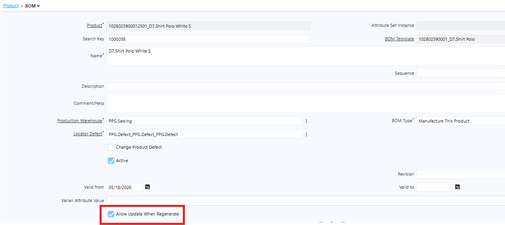
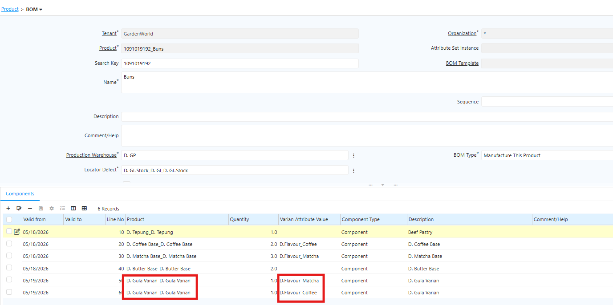

## Regenerate Product Varian

Regenerate Product Varian adalah proses memperbarui data pada produk varian berdasarkan perubahan yang dilakukan di product template. Apabila ada perubahan pada tab **BoM, Purchasing, Routing, Replenish, Replenish RDO, atau UoM Conversion** di product template, jalankan proses Regenerate agar perubahan tersebut otomatis diterapkan ke seluruh produk varian terkait.

Setelah Generate Product Varian pertama kali dijalankan, setiap produk varian akan memiliki konfigurasi **Allow Update When Regenerate** pada tab **BoM, Purchasing, Routing, Replenish, Replenish RDO, dan UoM Conversion**.

 {#Figure61}

Gunakan konfigurasi ini untuk mengontrol produk varian mana yang perlu diperbarui saat Regenerate dijalankan, tanpa harus mengubah konfigurasi sistem:

- Centang (✔) Allow Update When Regenerate → Data pada tab terkait di produk varian tersebut akan diperbarui saat Regenerate dijalankan.
- Hapus centang (✘) Allow Update When Regenerate → Data pada tab terkait di produk varian tersebut tidak akan diperbarui saat Regenerate dijalankan.

Contoh penggunaan, jika ingin memperbarui BoM di semua produk varian kecuali satu varian tertentu, un-check/un-centang/un-thick **Allow Update When Regenerate** pada tab BoM di produk varian tersebut sebelum menjalankan Regenerate.

Jika ingin menambahkan raw material atau komponen hanya untuk varian tertentu, input atribut varian pada material baru satu per satu untuk setiap varian. Sistem tidak dapat menerima input beberapa varian yang sama secara bersamaan.

Contoh: Jika ingin menambahkan material Gula untuk varian Coffee dan Matcha, input komponen Gula untuk varian Coffee dan Matcha secara terpisah.

 {#Figure62}

Ketentuan ini juga berlaku jika setiap varian memiliki komponen atau material dengan gramasi, komposisi, atau quantity yang berbeda. Input setiap varian secara terpisah sesuai detail masing-masing.