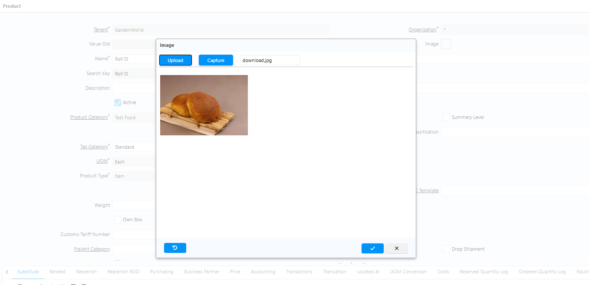
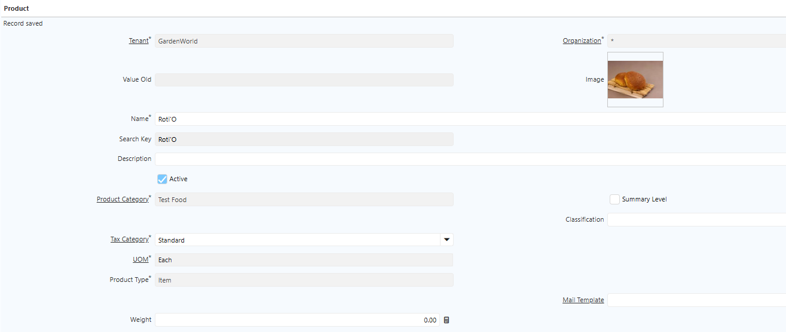
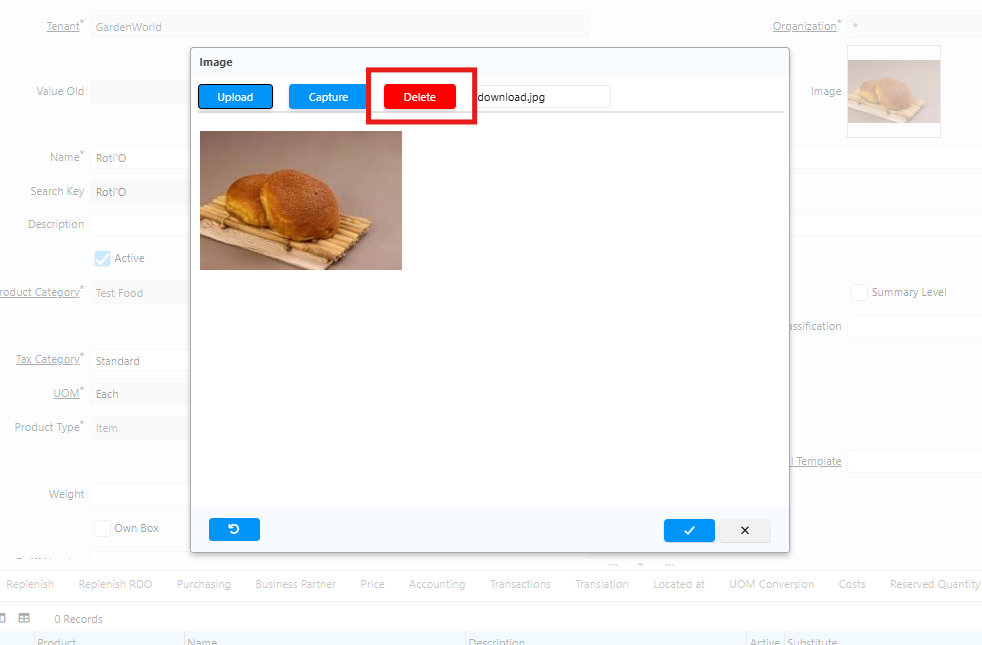

# Product

User dapat menambahkan gambar pada setiap product di master product. Gambar berfungsi sebagai identitas visual produk sehingga memudahkan proses identifikasi saat melakukan transaksi atau melihat informasi produk.

Field **Image** pada Master Product digunakan untuk menyimpan gambar atau foto yang merepresentasikan produk.
### Menambahkan Gambar pada Product

1. Buka menu **Product**.
2. Klik **New**.
3. Klik ikon **Image**.
4. Klik **Upload**.
5. Pilih gambar yang akan diupload.
6. Klik **OK**.

 {#Figure284}

 {#Figure285}

Gambar akan muncul pada ikon Image di master product tersebut.
### Menghapus Gambar pada Product

Jika terdapat perubahan atau pembaruan gambar, ikuti langkah berikut untuk menghapus gambar yang sudah ada:

1. Buka menu **Product**.
2. Pilih product yang akan diproses.
3. Klik ikon **Image**.
4. Klik **Delete**.
5. Klik **OK**.

 {#Figure286}

Gambar dihapus dari product tersebut dan tidak akan muncul lagi di master product.