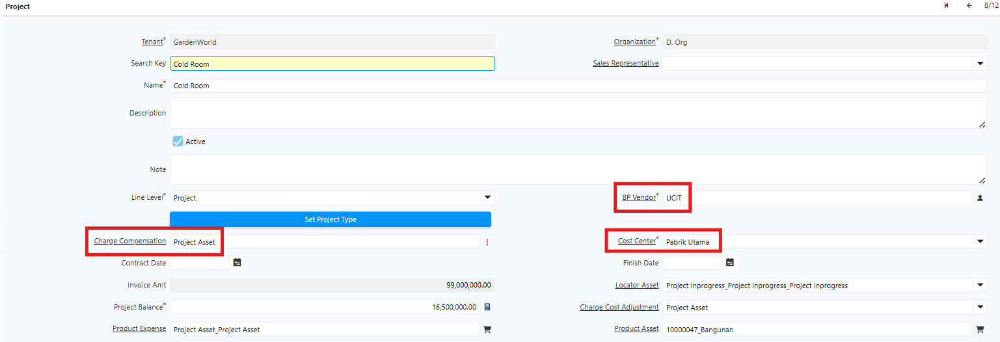
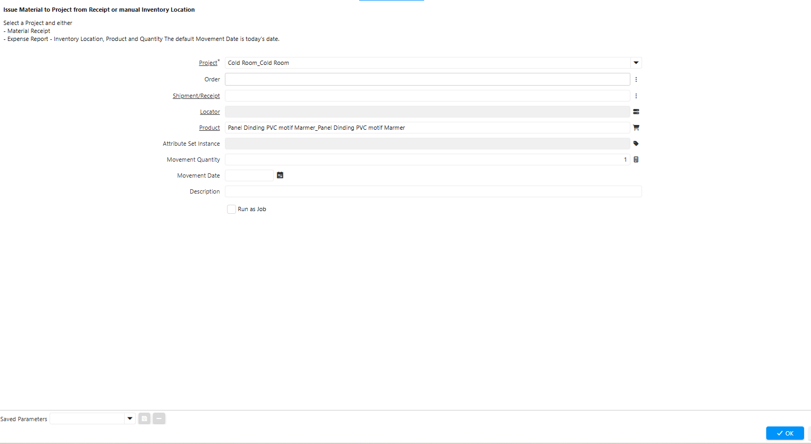
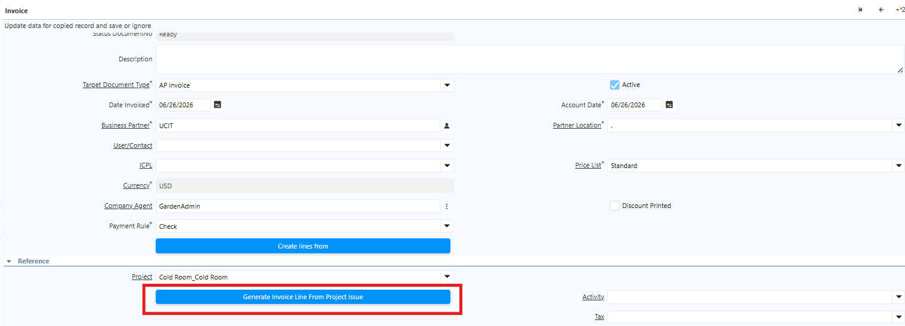
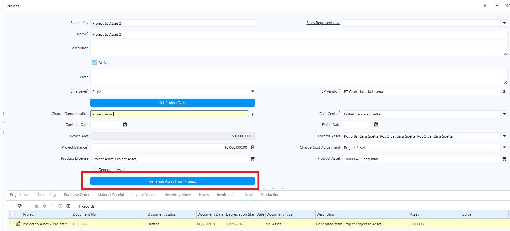

# Project Management

Fitur Project Management digunakan untuk mencatat seluruh aktivitas dan penggunaan barang yang berlangsung dalam suatu project. Sebelum memulai transaksi, siapkan master data berikut:
- Cost Center
- Project
## Langkah Pembuatan Project

1. Buka menu **Project**
2. Isi field berikut pada header:
  - Business Partner
  - Cost Center
  - Charge Compensation

 {#Figure115}

3. Klik save

Setiap project memiliki komponen-komponen pendukung, seperti jasa kontraktor, kabel listrik, dan sebagainya. Komponen-komponen tersebut dicatat melalui **Issue to Project**. Fitur ini digunakan untuk mencatat penggunaan atau pengiriman barang ke project yang sedang dikerjakan.
### Langkah Pembuatan Issue to Project

1. Buka menu **Issue to Project**
2. Isi field berikut:
  - Project — Nama project yang sedang dikerjakan.
  - Order — Nomor dokumen Purchase Order atas produk.
  - Shipment/Receipt — Nomor dokumen Material Receipt.
  - Product — Produk yang akan digunakan di project tersebut.
  - Locator — Lokasi penempatan produk.

 {#Figure116}

3. Klik **ok**
4. Sistem menampilkan notifikasi **Created** — issue atas project berhasil dibuat.

Seluruh issue yang telah dibuat akan muncul di tab **Issue** pada menu Project di master project terkait. Gunakan fitur Issue to Project untuk mencatat penggunaan bahan secara internal dalam project tersebut.
### Invoice atas Project

Untuk men-generate AP Invoice atas project dengan menarik data issue yang belum terkompensasi secara otomatis, gunakan fitur **Generate Invoice Line From Project Issue**. Ikuti langkah berikut:

1. Buka menu **Purchase Invoice dan Credit/Debit Note**
2. Pilih **Project** yang akan diproses
3. Pada header, klik **Generate Invoice Line From Project Issue**.

 {#Figure117}

4. Sistem menampilkan daftar issue yang belum terkompensasi.
5. Klik **Complete** pada dokumen invoice.

Kompensasi hanya dapat dilakukan satu kali dan dapat dipantau melalui **Project Issue**. Harga pada invoice bernilai negatif karena berfungsi sebagai pengurang tagihan vendor — invoice ini merupakan pengurang AP, bukan pengurang nilai project.
## Generate Asset from Project

Project yang telah selesai dapat dijadikan aset, karena perusahaan telah mengeluarkan biaya dalam jumlah besar selama project berlangsung — misalnya untuk pembangunan outlet. Sebelum melakukan generate asset, lakukan konfigurasi berikut terlebih dahulu:

1. **Product Category untuk Project Asset** — Gunakan costing method **Standard Costing** dan costing level **Batch/Lot**. Pada konfigurasi accounting, field **Product Expense** menggunakan akun **Project Asset** atau **Construction In Progress**.
2. **Produk Komponen Project** — Buat produk dengan Product Type **Expense**. Pada konfigurasi accounting produk ini, field **Product Asset** dan **Cost Adjustment** menggunakan akun **Project Asset** atau **Construction In Progress**.
3. **Produk Asset** — Buat produk yang akan dijadikan aset atas project. Sebelumnya, konfigurasi **Attribute Set** terlebih dahulu — Attribute Set ini menyimpan data kode project dan nilai project. Selain itu, konfigurasi **Asset Type** dengan costing method **Average PO** dan costing level **Batch/Lot**. Penggunaan Average PO bertujuan agar nilai Product Expense mengikuti seluruh nilai yang ada di project.
### Langkah Generate Asset from Project

Setelah project selesai atau memasuki tahap closing, jalankan **Generate Asset From Project**. Ikuti langkah berikut:

1. Buka menu **Project**.
2. Pilih project yang sudah selesai.
3. Klik **Generate Asset From Project**.

 {#Figure118}

4. Input jumlah aset yang akan di-generate.
5. Klik **OK**.

Dokumen aset berstatus _Draft_ akan muncul di tab **Asset**. Status dokumen aset yang ter-generate dapat dikonfigurasi di **Asset Type**.
### Mekanisme Pembentukan Asset

Berikut proses yang berjalan di latar belakang saat Generate Asset from Project dijalankan:

1. Konsolidasi nilai project — Sistem mengkonsolidasikan seluruh biaya pada project, yaitu nilai dari invoice ditambah Issue to Project atas persediaan.
2. Cost Adjustment — Sistem memasukkan nilai hasil konsolidasi ke Product Expense berdasarkan ASI.
3. Production aset — Sistem menjalankan production dengan komponen Product Expense. Setelah production selesai, aset ter-generate secara otomatis di tab Production dan nilainya sesuai dengan hasil konsolidasi di project.

> Aset terbentuk melalui mekanisme production, yang mengkonsolidasikan seluruh biaya invoice dan persediaan dalam project menjadi nilai aset akhir.