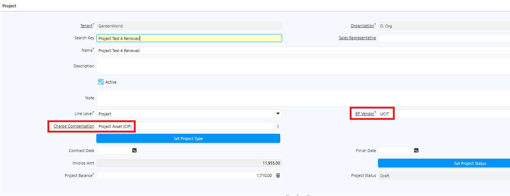
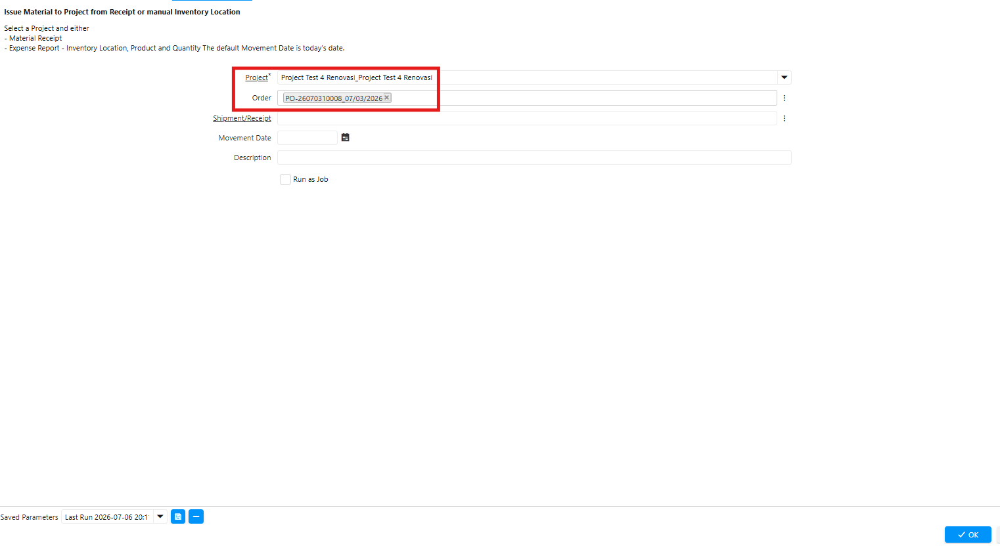
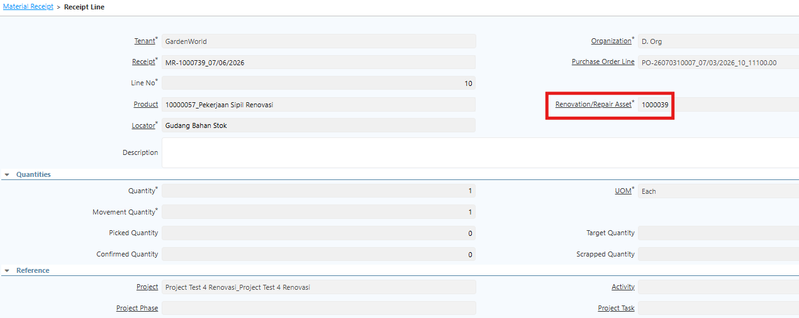
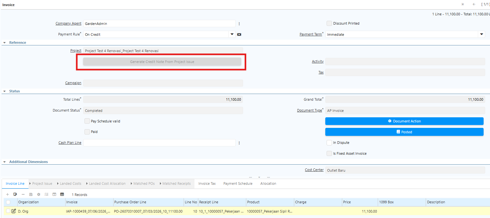

# Project Management

Fitur Project Management digunakan untuk mencatat seluruh aktivitas dan penggunaan barang yang berlangsung dalam suatu project. Sebelum memulai transaksi, siapkan master data berikut:

- **Cost Center**
- **Project**
- **Product/Artikel Project**
- **Charge Project (CIP)** — Sebagai penampung atas penggunaan persediaan dan biaya tambahan.
## Konfigurasi Sistem

Sebelum memulai transaksi project, lakukan konfigurasi sistem terlebih dahulu dengan menambahkan **SIS_CHARGE_ASSET_ADDITION_ID** dengan Configured Value **1000002**. Konfigurasi ini digunakan sebagai charge project untuk penambahan nilai project apabila tidak terdapat Credit Note atas pemakaian persediaan dan biaya tambahan.
## Konfigurasi Artikel Project

1. Buka menu **Product**.
2. Klik **New**.
3. Input Search Key dan Name produk.
4. Input UoM Base untuk produk tersebut.
5. Tentukan **Product Category** sesuai konfigurasi.
6. Tentukan **Attribute Set** sesuai konfigurasi.
7. Tentukan **Asset Type** sesuai konfigurasi.
8. Pada field **Renovation/Repair Asset**, pilih No jika merupakan aset baru, atau Yes jika merupakan renovasi atas aset yang sudah ada.
9. Field Change Project Price digunakan khusus untuk pekerjaan sipil yang menjadi aset. Penerimaan atas artikel berdasarkan persentase progres tetap 1 (full), namun saat invoice nilai tagihan dapat diubah. Sistem otomatis mengkoreksi nilai aset sesuai nilai terbaru di invoice.
10. Klik Save.
## Konfigurasi Charge

Charge digunakan untuk menentukan charge kompensasi pada project. Ikuti langkah berikut untuk membuat master charge project:

1. Buka menu **Charge**.
2. Klik **New**.
3. Isi field **Name** sesuai kebutuhan.
4. Pada field **Tax Category**, tentukan sesuai kebijakan perusahaan.
5. Masuk ke tab **Accounting**.
6. Set **Charge Account** menggunakan akun **Project Asset**.
7. Klik **Save**.
## Langkah Pembuatan Project

1. Buka menu **Project**
2. Isi field berikut pada header:
  - Business Partner
  - Charge Compensation

 {#Figure115}

3. Klik save

Setiap project memiliki komponen-komponen pendukung, seperti jasa kontraktor, kabel listrik, dan sebagainya. Komponen-komponen tersebut dicatat melalui **Issue to Project**. Fitur ini digunakan untuk mencatat penggunaan atau pengiriman barang ke project yang sedang dikerjakan.
### Langkah Purchase Order

Dalam project terdapat dua pendekatan Purchase Order:

- **PO Besar** — PO kepada kontraktor yang tercatat sebagai Business Partner Vendor di project.
- **PO Kecil** — PO kepada supplier di luar project untuk kebutuhan persediaan atau biaya tambahan.

Seluruh PO akan masuk ke nilai project melalui **Issue to Project** yang terfilter berdasarkan project terkait. Ikuti langkah berikut untuk membuat PO Project:

1. Buka menu **Purchase Order**.
2. Tentukan **Business Partner** yang akan diproses.
3. Pada field **Project**, tentukan project yang sedang dikerjakan.
4. Pada field **Cost Center**, tentukan cost center atas project tersebut.
5. Masuk ke tab **PO Line**.
6. Tentukan **produk** yang akan diproses.
7. Tentukan **quantity** produk.
8. Klik **Save**.
9. Klik **Complete** pada dokumen Purchase Order.
10. Masuk ke tab **Material Receipt**, lalu klik **Complete**.
11. Masuk ke **Receipt Line**, kemudian masuk ke tab **Invoice**.
12. Klik **Complete** pada dokumen Invoice.

Setelah Invoice di-complete, sistem otomatis membuat aset yang akan muncul di menu **SIS Asset** dan tab **Asset** pada menu Project. Selain itu, PO, MR, dan Invoice yang telah diproses juga otomatis muncul di tab-tab terkait pada menu Project, sehingga user dapat memantau seluruh transaksi per project.
### Langkah Pembuatan Issue to Project

1. Buka menu **Issue to Project**
2. Isi field berikut:
  - Project — Nama project yang sedang dikerjakan.
  - Order — Nomor dokumen Purchase Order atas produk.

 {#Figure116}

3. Klik **ok**
4. Sistem menampilkan notifikasi **Created** — issue atas project berhasil dibuat.

Seluruh issue yang telah dibuat akan muncul di tab **Issue** pada menu Project di master project terkait. Gunakan fitur Issue to Project untuk mencatat penggunaan bahan secara internal dalam project tersebut.
## Jenis-Jenis Project

Terdapat dua pendekatan project di perusahaan:

1. **Project dengan Credit Note**
2. **Project tanpa Credit Note**

Ketentuan ini berlaku untuk semua jenis project — UCIT, renovasi, cold room, dan lainnya — dengan perlakuan yang sama. Yang membedakan antara project UCIT dan renovasi adalah proses pembentukan aset dan jurnalnya.
### Project Renovasi (Perbaikan) Asset tanpa Credit Note

Untuk project renovasi, buat artikel khusus renovasi dengan mengatur field **Renovation/Repair Asset** di master produk menjadi **Yes**. Pengaturan ini memungkinkan user untuk merelasikan artikel tersebut ke aset yang diperbaiki saat proses MR/BPB, sehingga nilai renovasi dapat ditransfer ke aset existing dan menambah nilainya.

Ikuti langkah berikut untuk memproses PO hingga Invoice untuk artikel renovasi:

1. Buat **Purchase Order** seperti biasa.
2. Masuk ke tab **Material Receipt**, lalu masuk ke **Receipt Line**.
3. Pada field **Renovation/Repair Asset**, tentukan aset yang akan direnovasi.

 {#Figure127}

4. Klik **Save**.
5. Klik **Complete** pada dokumen Material Receipt.
6. Masuk ke tab **Invoice**, lalu klik **Complete**.

Di latar belakang, sistem menjalankan proses **Asset Transfer** ke aset tujuan. Residual Value aset existing bertambah sesuai nilai renovasi, dan sistem otomatis mengkalkulasi ulang nilai depresiasi.
### Project Renovasi (Perbaikan) Asset dengan Credit Note

Project dengan Credit Note hanya dapat dilakukan jika seluruh biaya atau persediaan yang dipakai sudah di-_Issue to Project_. Sistem otomatis mengkalkulasi akumulasi Issue to Project dan membentuk Credit Note, sehingga tagihan project berkurang sesuai akumulasi tersebut.

Ikuti langkah berikut untuk memproses PO hingga Invoice untuk artikel renovasi dengan Credit Note:

1. Buat **Purchase Order** seperti biasa.
2. Masuk ke tab **Material Receipt**, lalu masuk ke **Receipt Line**.
3. Pada field **Renovation/Repair Asset**, tentukan aset yang akan direnovasi.
4. Klik **Save**.
5. Klik **Complete** pada dokumen Material Receipt.
6. Masuk ke tab **Invoice**.
7. Klik tombol **Generate Credit Note from Project Issue**.

 {#Figure128}

8. Klik **Complete** pada dokumen Invoice.

Saat Generate Credit Note from Project Issue dijalankan, sistem otomatis membentuk Invoice Line di project dengan **CIP** untuk membalik Issue to Project dengan nilai minus. Dengan Credit Note, nilai aset tidak bertambah, namun tagihan atas project berkurang senilai CIP.