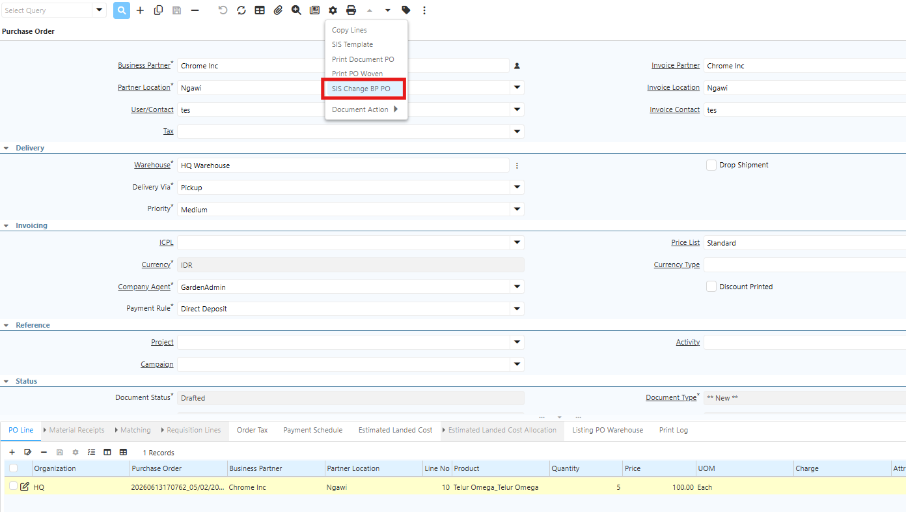
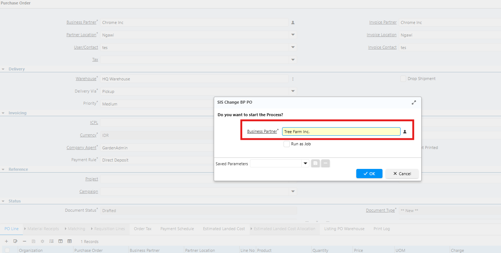
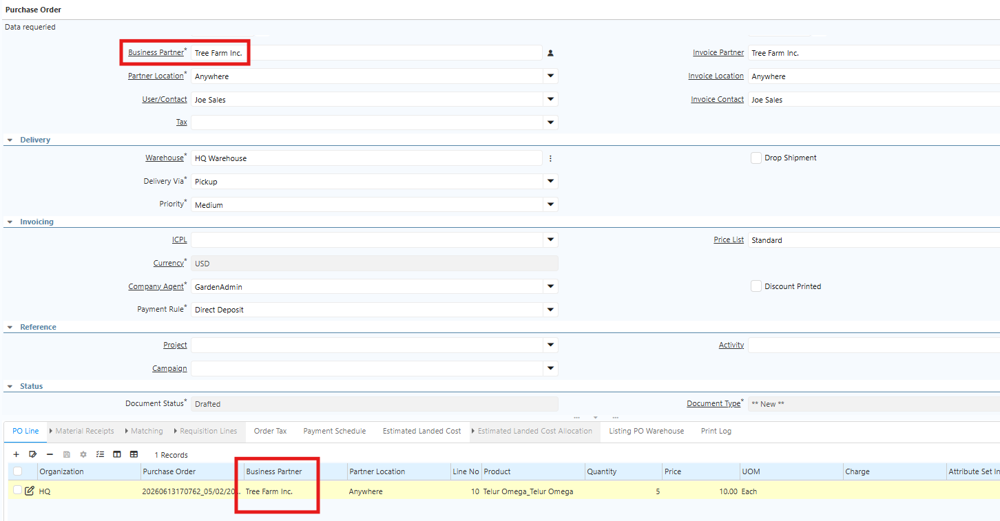
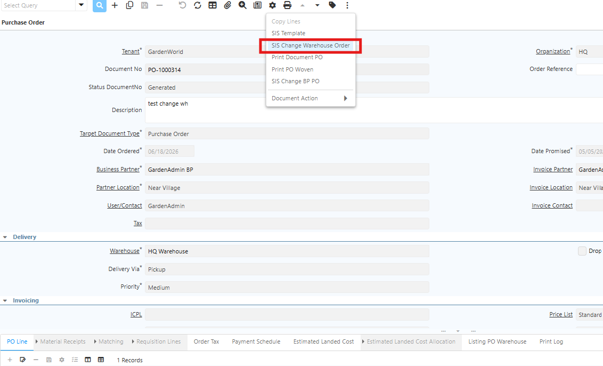
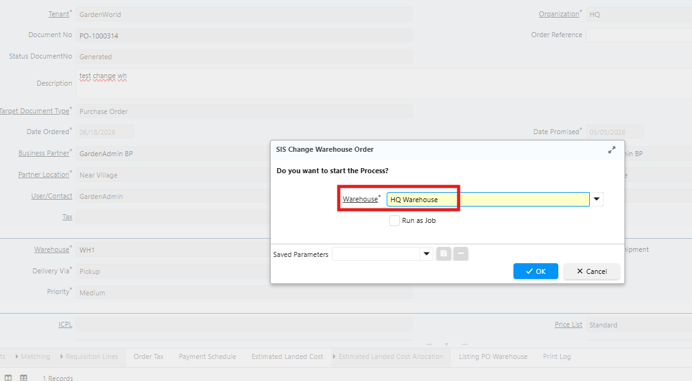
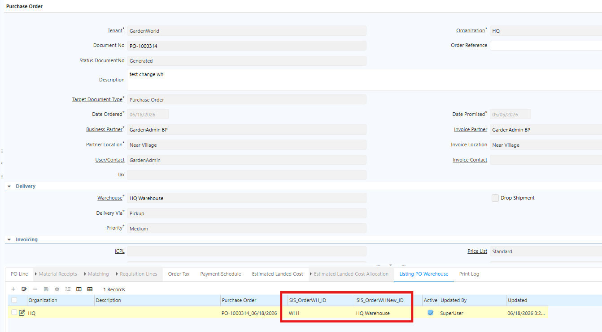
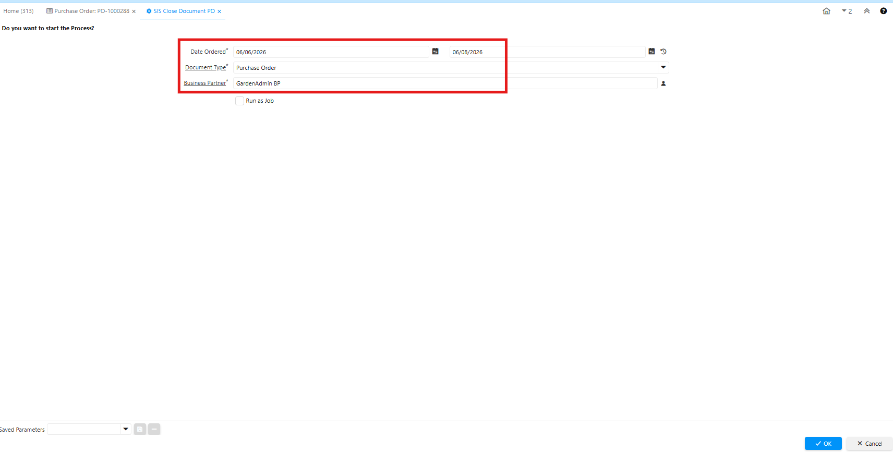
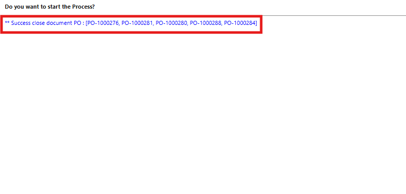
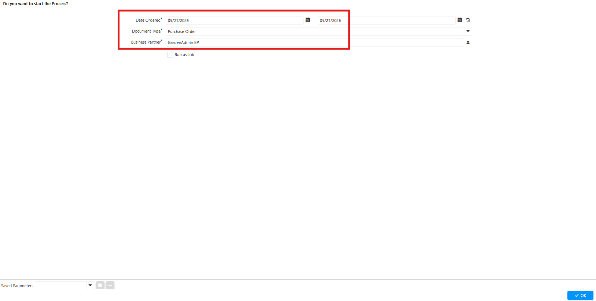
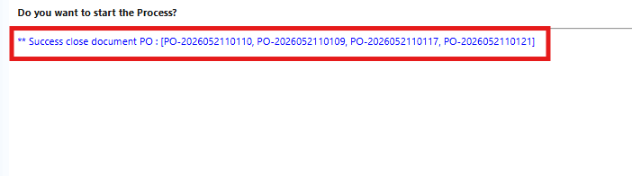

# Purchase Order

Purchase Order adalah dokumen yang digunakan untuk mencatat dan mengelola proses pemesanan barang atau jasa kepada supplier. Dokumen ini memuat informasi mengenai supplier, produk yang dipesan, jumlah, harga, tanggal pemesanan, metode pembayaran, dan informasi pendukung lainnya.

Di iDempiere, Purchase Order berfungsi sebagai dasar proses pengadaan barang — mulai dari pembuatan pesanan hingga penerimaan barang dan penagihan (Invoice). Dengan Purchase Order, perusahaan memastikan seluruh transaksi pembelian terdokumentasi dengan baik dan sesuai proses bisnis yang telah ditetapkan.
## Alur Proses Purchase Order

1. Buka menu **Purchase Order**
2. Input **Business Partner**
3. Input **warehouse** untuk penempatan produk
4. Masuk ke tab **PO Line**
5. Pilih **product** yang akan diproses
6. Input **quantity** product
7. Klik **save**
8. Klik **complete** pada dokumen
## Pengelolaan Purchase Order
### Perubahan Business Partner pada Purchase Order

Apabila terjadi kesalahan pemilihan **Business Partner (Supplier)**, perubahan Business Partner tidak dilakukan secara langsung pada dokumen Purchase Order, melainkan melalui menu **SIS Change BP PO**. Ikuti langkah berikut:

1. Pastikan dokumen PO masih berstatus **Draft**.
2. Pilih dokumen yang akan dilakukan perubahan
3. Klik ikon **Setting** (⚙), kemudian pilih **SIS Change BP PO**. 

 {#Figure93}

4. Input **Business Partner** baru yang akan menggantikan Business Partner sebelumnya.

{#Figure94}

5. Klik **ok**

 {#Figure101}

Sistem otomatis memperbarui informasi Business Partner pada dokumen Purchase Order.

**Catatan:** Perubahan Business Partner hanya dapat dilakukan pada Purchase Order yang masih berstatus **Draft**.
### Perubahan Warehouse pada Purchase Order

Jika terdapat perubahan tujuan gudang pada Purchase Order, lakukan perubahan melalui menu **SIS Change Warehouse Order**. Ikuti langkah berikut:

1. Buka menu Purchase Order
2. Cari dan pilih dokumen PO yang akan diubah warehousenya.
3. Klik ikon **Setting** (⚙), kemudian pilih **SIS Change Warehouse Order** 

 {#Figure96}

4. Pilih **Warehouse** baru sebagai tujuan penerimaan barang.
{#Figure95}

5. Klik **ok**

Sistem otomatis mencatat warehouse baru di tab **Listing PO Warehouse** pada dokumen PO. Tab ini berfungsi sebagai riwayat perubahan warehouse sehingga setiap perubahan dapat terlacak dengan baik.

 {#Figure96}

**Catatan:** Perubahan Warehouse hanya dapat dilakukan pada Purchase Order yang masih berstatus **Complete**.
### Menutup Purchase Order

Purchase Order berstatus **Complete** dapat ditutup (_Close_) jika proses pembelian telah selesai atau tidak ada transaksi lanjutan. Lakukan penutupan melalui menu **SIS Close Document PO**. Ikuti langkah berikut:

1. Buka menu **SIS Close Document PO**
2. Input **Date Order From** dan **To**
3. Input **Document Type** yang akan diproses
4. Input **Business Partner** yang akan diproses

 {#Figure97}

5. Klik **ok**

 {#Figure98}

Setelah berstatus **Closed**, dokumen tidak dapat digunakan untuk transaksi lanjutan dan dinyatakan selesai sesuai proses bisnis yang berlaku.

> **Catatan:** Proses **Close** hanya dapat dilakukan pada Purchase Order yang  berstatus **Complete**.
### Menghapus Purchase Order

Purchase Order dapat dihapus jika dokumen tidak lagi diperlukan, misalnya karena:

- Terjadi kesalahan input data.
- Purchase Order dibuat secara tidak sengaja (duplicate).
- Transaksi dibatalkan sebelum diproses lebih lanjut.
- Alasan operasional lainnya sesuai kebijakan perusahaan.

Lakukan penghapusan melalui menu **SIS Delete Document PO**. Ikuti langkah berikut:

1. Buka menu **SIS Delete Document PO**
2. Input **Date Order From** dan **To**
3. Input **Document Type** yang akan diproses
4. Input **Business Partner** yang akan diproses

 {#Figure99}

5. Klik **ok**

 {#Figure100}

> **Catatan:** Hanya Purchase Order berstatus **Draft** yang dapat dihapus melalui menu ini.