# Purchase Order

Purchase Order adalah dokumen yang digunakan untuk mencatat dan mengelola proses pemesanan barang atau jasa kepada supplier. Dokumen ini memuat informasi mengenai supplier, produk yang dipesan, jumlah, harga, tanggal pemesanan, metode pembayaran, dan informasi pendukung lainnya.

Di iDempiere, Purchase Order berfungsi sebagai dasar proses pengadaan barang — mulai dari pembuatan pesanan hingga penerimaan barang dan penagihan (Invoice). Dengan Purchase Order, perusahaan memastikan seluruh transaksi pembelian terdokumentasi dengan baik dan sesuai proses bisnis yang telah ditetapkan. 

Purchase Order dapat terbentuk dari transaksi **Requisition**. Tim purchasing membuat Requisition yang memuat produk dan quantity yang dibutuhkan, kemudian melakukan **Generate PO From Requisition**.
## Requisition

Requisition adalah dokumen yang digunakan untuk mengajukan kebutuhan pembelian barang atau jasa sebelum proses pembelian dilakukan melalui Purchase Order.

Pada Requisition, user dapat menentukan informasi berikut:

- **Product** atau item yang akan dibeli.
- **Quantity** yang dibutuhkan.
- **Warehouse** atau lokasi tujuan.
- **Business Partner (BP)** yang akan digunakan sebagai vendor.

Satu Requisition dapat memiliki beberapa Requisition Line, sehingga kebutuhan pembelian yang berbeda dapat dicatat dalam satu dokumen. Ikuti langkah berikut untuk membuat Requisition:

1. Buka menu **Requisition**.
2. Input **Warehouse** tujuan.
3. Tentukan **tanggal transaksi**.
4. Masuk ke **Requisition Line**.
5. Tentukan **Business Partner** yang akan digunakan.
6. Tentukan **produk** yang akan diproses.
7. Tentukan **quantity** yang dibutuhkan.
8. Klik **Save**.
9. Klik **Complete** pada dokumen.
## Generate PO From Requisition

Fitur **Generate PO From Requisition** digunakan untuk membuat Purchase Order berdasarkan Requisition Line yang telah dibuat. Proses generate PO dapat dilakukan dengan memilih satu atau beberapa Requisition Line — termasuk dari satu maupun beberapa Requisition.

Sistem mengelompokkan Requisition Line berdasarkan **Business Partner (BP)** dengan ketentuan berikut:

- Jika beberapa Requisition Line memiliki **BP yang sama**, sistem menggabungkan seluruh Requisition Line tersebut ke dalam **satu Purchase Order**.
- Jika Requisition Line memiliki **BP yang berbeda**, sistem membuat **Purchase Order terpisah** untuk masing-masing BP.

Berikut contoh PO yang terbentuk dari beberapa dokumen Requisition dengan BP yang sama dan berbeda:

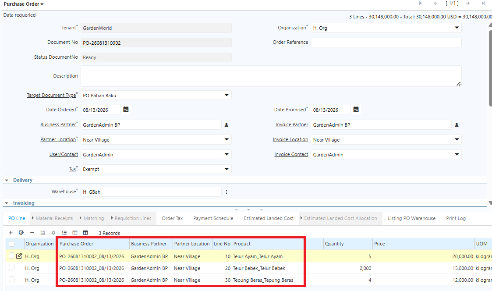 {#Figure230}

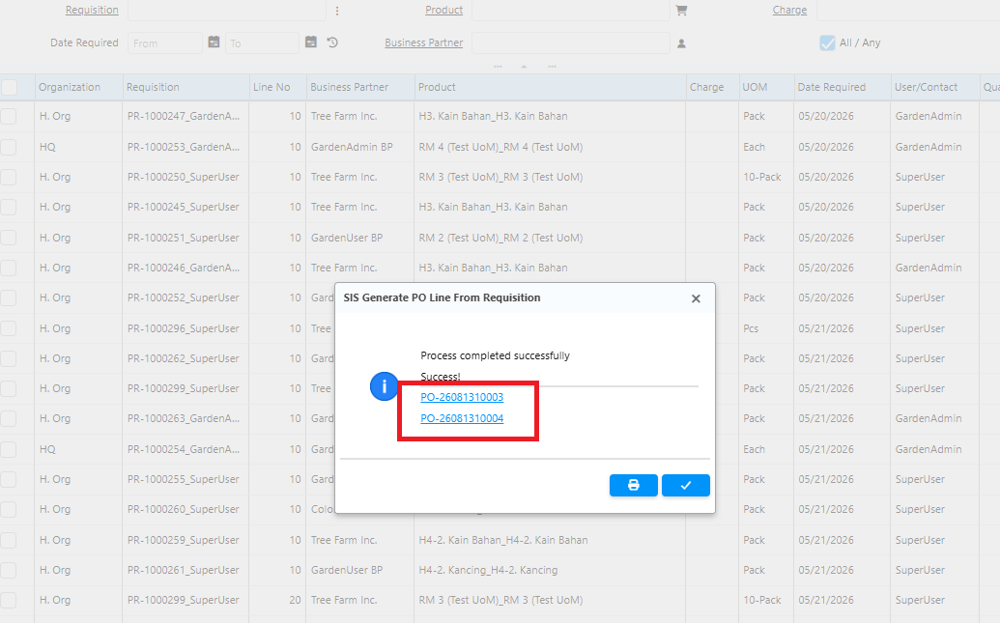 {#Figure231}

Terdapat relasi antara quantity Requisition dan Purchase Order. Saat membuat Requisition, quantity yang diinput otomatis ter-set di Purchase Order pada tab **Requisition Line** sesuai quantity di Requisition. Jika menggunakan UoM Conversion, quantity yang ter-set adalah quantity dalam satuan **UoM Base**.

Berikut contoh relasi quantity Requisition dengan Purchase Order:

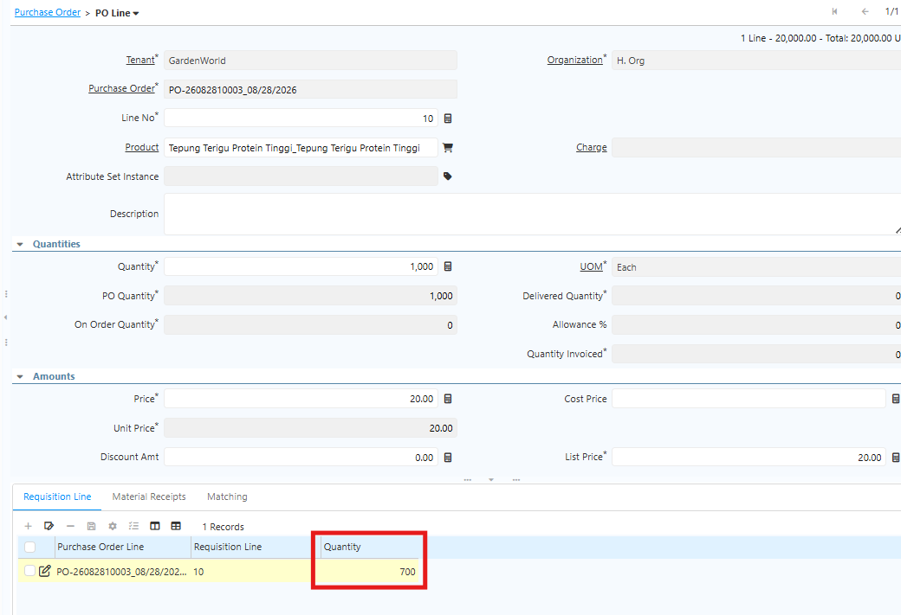 {#Figure275}
## MOQ (Minimum Order Quantity)

Sistem menggunakan **Minimum Order Quantity (MOQ)** untuk menentukan batas minimum quantity yang dapat dipesan pada Purchase Order berdasarkan quantity pada Requisition.
### MOQ Dikonfigurasi

Jika produk memiliki konfigurasi MOQ dan **Qty Requisition < MOQ**, user dapat mengisi **Qty PO Release** lebih besar dari Qty Requisition dengan ketentuan Qty PO Release minimal memenuhi nilai MOQ.

Contoh:

- Qty Requisition = 10
- MOQ = 20
- Qty PO Release = 20 → **Diperbolehkan**, karena Qty Requisition lebih kecil dari MOQ dan Qty PO Release telah memenuhi nilai MOQ.

Namun, jika **Qty Requisition sudah sama dengan atau lebih besar dari MOQ**, Qty PO Release tidak boleh melebihi Qty Requisition.
### MOQ Tidak Dikonfigurasi

Jika produk tidak memiliki konfigurasi MOQ, sistem membatasi **Qty PO Release** agar tidak melebihi Qty Requisition.

Contoh 1:

- Qty Requisition = 10
- MOQ = tidak dikonfigurasi
- Qty PO Release = 10 → **Diperbolehkan**.

Contoh 2:

- Qty Requisition = 10
- MOQ = tidak dikonfigurasi
- Qty PO Release = 15 → **Tidak diperbolehkan**, karena melebihi Qty Requisition.
## Proses Purchase Order Manual

1. Buka menu **Purchase Order**
2. Input **Business Partner**
3. Input **warehouse** untuk penempatan produk
4. Masuk ke tab **PO Line**
5. Pilih **product** yang akan diproses
6. Input **quantity** product
7. Klik **save**
8. Klik **complete** pada dokumen
## Pengelolaan Purchase Order
### Perubahan Business Partner pada Purchase Order

Apabila terjadi kesalahan pemilihan **Business Partner (Supplier)**, perubahan Business Partner tidak dilakukan secara langsung pada dokumen Purchase Order, melainkan melalui menu **SIS Change BP PO**. Ikuti langkah berikut:

1. Pastikan dokumen PO masih berstatus **Draft**.
2. Pilih dokumen yang akan dilakukan perubahan
3. Klik ikon **Setting** (⚙), kemudian pilih **SIS Change BP PO**. 

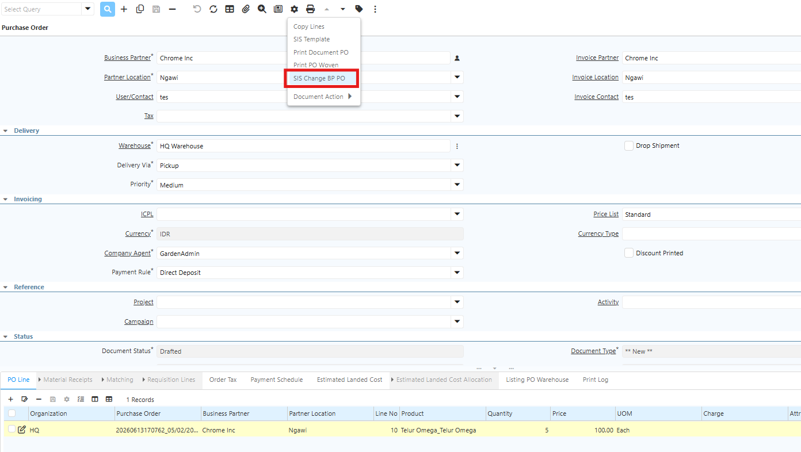 {#Figure93}

4. Input **Business Partner** baru yang akan menggantikan Business Partner sebelumnya.

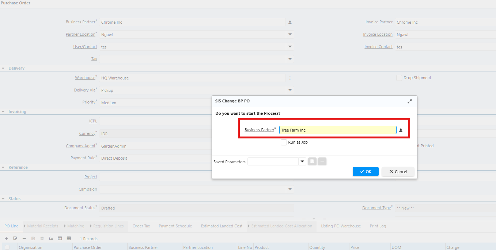{#Figure94}

5. Klik **ok**

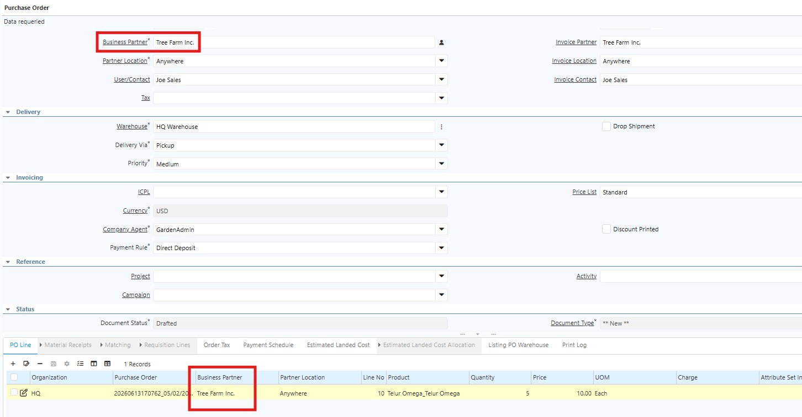 {#Figure101}

Sistem otomatis memperbarui informasi Business Partner pada dokumen Purchase Order.

**Catatan:** Perubahan Business Partner hanya dapat dilakukan pada Purchase Order yang masih berstatus **Draft**.
### Perubahan Warehouse pada Purchase Order

Jika terdapat perubahan tujuan gudang pada Purchase Order, lakukan perubahan melalui menu **SIS Change Warehouse Order**. Ikuti langkah berikut:

1. Buka menu Purchase Order
2. Cari dan pilih dokumen PO yang akan diubah warehousenya.
3. Klik ikon **Setting** (⚙), kemudian pilih **SIS Change Warehouse Order** 

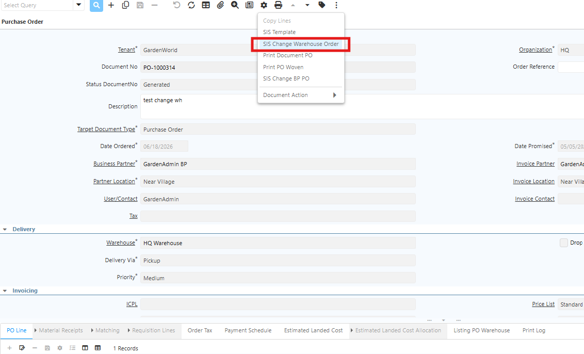 {#Figure96}

4. Pilih **Warehouse** baru sebagai tujuan penerimaan barang.

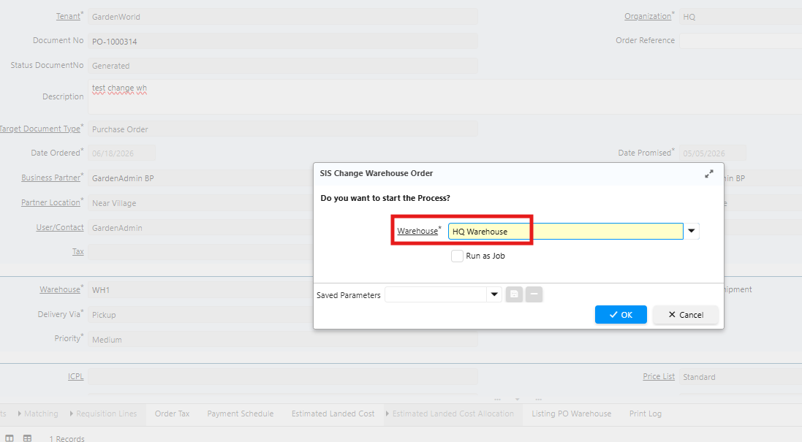{#Figure95}

5. Klik **ok**

Sistem otomatis mencatat warehouse baru di tab **Listing PO Warehouse** pada dokumen PO. Tab ini berfungsi sebagai riwayat perubahan warehouse sehingga setiap perubahan dapat terlacak dengan baik.

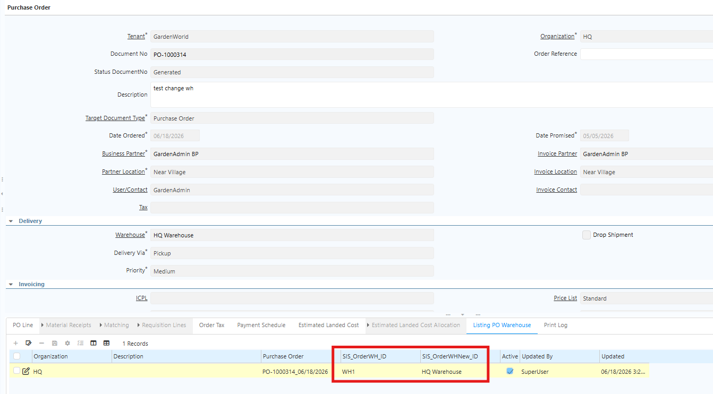 {#Figure96}

**Catatan:** Perubahan Warehouse hanya dapat dilakukan pada Purchase Order yang masih berstatus **Complete**.
### Menutup Purchase Order

Purchase Order berstatus **Complete** dapat ditutup (_Close_) jika proses pembelian telah selesai atau tidak ada transaksi lanjutan. Lakukan penutupan melalui menu **SIS Close Document PO**. Ikuti langkah berikut:

1. Buka menu **SIS Close Document PO**
2. Input **Date Order From** dan **To**
3. Input **Document Type** yang akan diproses
4. Input **Business Partner** yang akan diproses

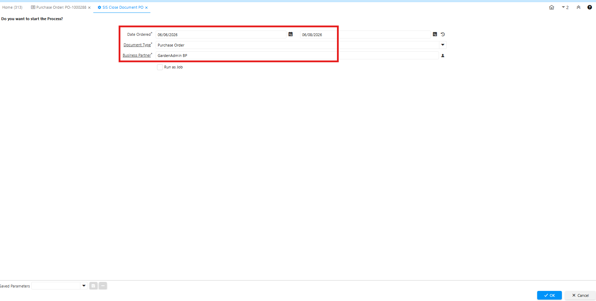 {#Figure97}

5. Klik **ok**

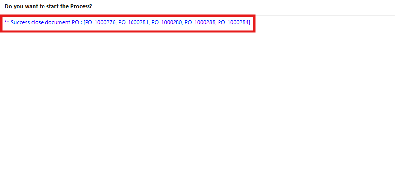 {#Figure98}

Setelah berstatus **Closed**, dokumen tidak dapat digunakan untuk transaksi lanjutan dan dinyatakan selesai sesuai proses bisnis yang berlaku.

> **Catatan:** Proses **Close** hanya dapat dilakukan pada Purchase Order yang  berstatus **Complete**.
### Menghapus Purchase Order

Purchase Order dapat dihapus jika dokumen tidak lagi diperlukan, misalnya karena:

- Terjadi kesalahan input data.
- Purchase Order dibuat secara tidak sengaja (duplicate).
- Transaksi dibatalkan sebelum diproses lebih lanjut.
- Alasan operasional lainnya sesuai kebijakan perusahaan.

Lakukan penghapusan melalui menu **SIS Delete Document PO**. Ikuti langkah berikut:

1. Buka menu **SIS Delete Document PO**
2. Input **Date Order From** dan **To**
3. Input **Document Type** yang akan diproses
4. Input **Business Partner** yang akan diproses

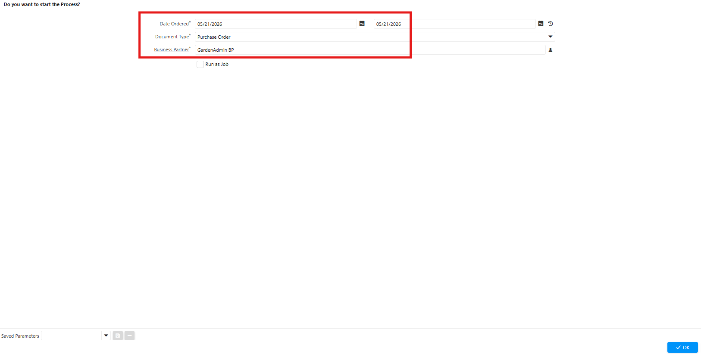 {#Figure99}

5. Klik **ok**

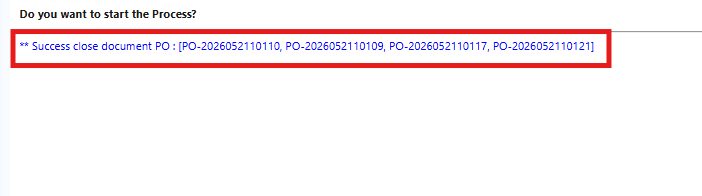 {#Figure100}

> **Catatan:** Hanya Purchase Order berstatus **Draft** yang dapat dihapus melalui menu ini.

## Mekanisme Diskon di Purchase Order

Pada Purchase Order, sistem menggunakan **Price List** sebagai dasar perhitungan harga produk. Oleh karena itu, produk harus memiliki Price List sebelum user dapat menerapkan diskon.

User dapat menginput diskon dengan dua metode:

### Diskon dalam Value  

User menginput nominal diskon langsung pada field **Discount Value**. Sistem mengurangi Price List dengan nilai diskon tersebut untuk mendapatkan **Price Actual**, kemudian otomatis menghitung persentase diskonnya.

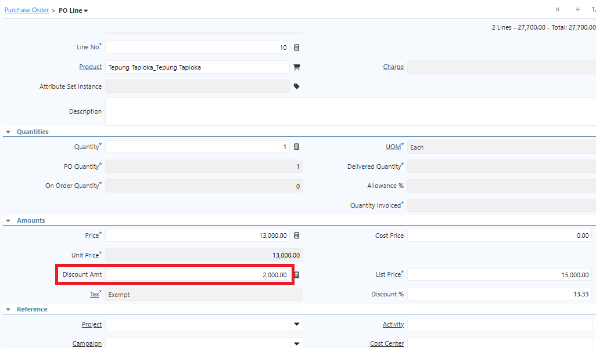 {#Figure256}
### Diskon dalam Persentase  

User menginput diskon dalam bentuk persentase (%) pada field **Discount %**. Sistem menghitung **Discount Value** berdasarkan Price List, kemudian menghitung **Price Actual**. Sistem juga otomatis menghitung nilai diskon dalam bentuk nominalnya.

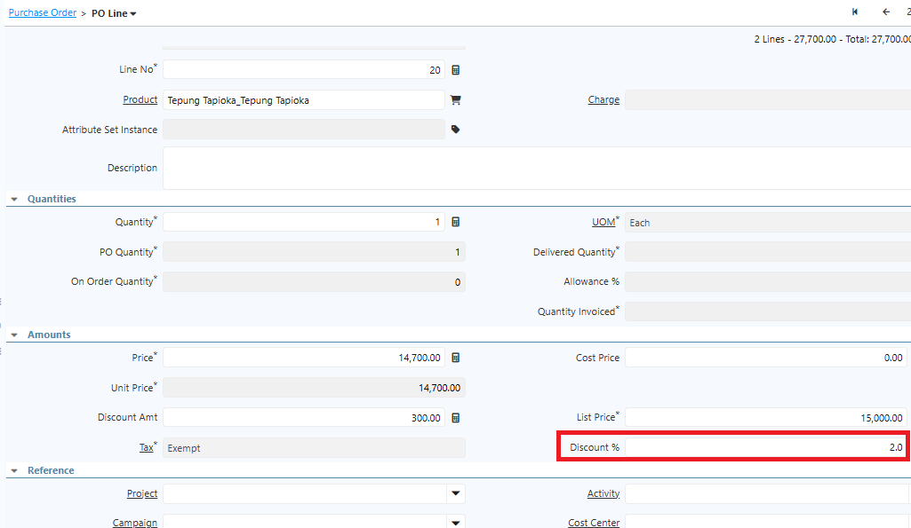 {#Figure257}

Price List merupakan harga dasar, sedangkan diskon digunakan untuk mendapatkan harga setelah diskon (**Price Actual**). Kedua metode input diskon saling mengisi secara otomatis — jika user menginput salah satu, sistem otomatis menghitung yang lainnya.