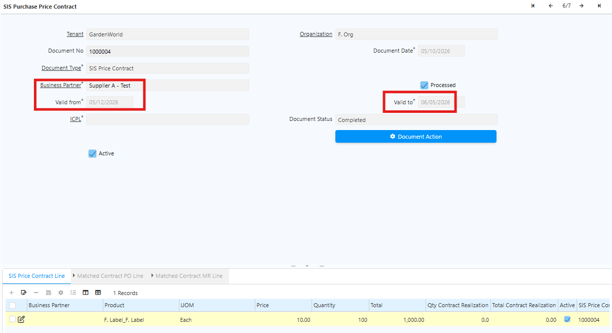
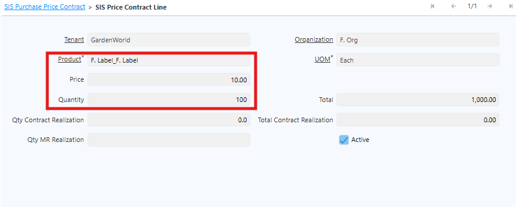

# Purchase Price Contract

Purchase Price Contract adalah mekanisme untuk menetapkan harga pembelian yang telah disepakati antara perusahaan dan Business Partner (vendor) untuk produk tertentu dalam periode waktu tertentu.

Mekanisme ini membantu perusahaan:
- Menjaga konsistensi harga pembelian
- Mengontrol harga sesuai perjanjian
- Menghindari perubahan harga pasar yang tidak sesuai kontrak
## Konfigurasi Awal Purchase Price Contract

Sebelum membuat Purchase Price Contract, lakukan konfigurasi ICPL terlebih dahulu: 
1. Setup Price List di ICPL.
2. Tentukan price list produk yang akan digunakan untuk setiap Business Partner. 
3. Pastikan setiap Business Partner sudah memiliki konfigurasi ICPL sebelum proses Purchase Price Contract dijalankan.

ICPL menjadi dasar harga yang digunakan dalam Purchase Price Contract.

## Langkah Pembuatan Purchase Price Contract

Ikuti langkah berikut untuk membuat Purchase Price Contract:
1. Buka menu **SIS Purchase Price Contract**
2. Input nama **Business Partner**
3. Input **Valid From** dan **Valid To** - tentukan periode waktu kontrak berjalan

	 {#Figure44}

4. Masuk ke tab **SIS Purchase Price Contract Line**

5. Input **Produk**, **Harga Produk** dan **Quantity Produk**

	 {#Figure45}

6. Klik **complete**

Setelah dokumen di-complete, sistem akan menjalankan beberapa proses otomatis:
- Sistem membuat **ICPL Update** dengan status **Complete** pada ICPL yang sudah di-setting di Business Partner.
- Sistem mengacu pada data valid from, product dan price yang terdapat pada **Price Contract Line**
- Sistem memperbarui data **Purchase Price List** berdasarkan price list pada ICPL Base.
- Sistem memperbarui data ICPL sesuai data pada SIS Purchase Price Contract.

## Realisasi di Purchase Order

Sebelum Purchase Order di-complete, pastikan data berikut sesuai dengan Purchase Price Contract:

- Business Partner pada PO sama dengan Business Partner pada Purchase Price Contract.
- Product pada PO sama dengan product pada Price Contract Line.
- Tanggal pembelian masih berada dalam periode kontrak:
  * Valid From
  * Valid To
- Warehouse penerimaan sesuai dengan warehouse pada Purchase Price Contract

Setelah Purchase Order di-complete, sistem akan menjalankan proses berikut:

- Sistem membuat PO Line yang sesuai dengan Price Contract Line.
- Sistem memperbarui nilai:
  * Qty Realization
  * Total Contract Realization

Update ini membantu perusahaan memonitor realisasi pembelian terhadap kontrak yang sudah disepakati.