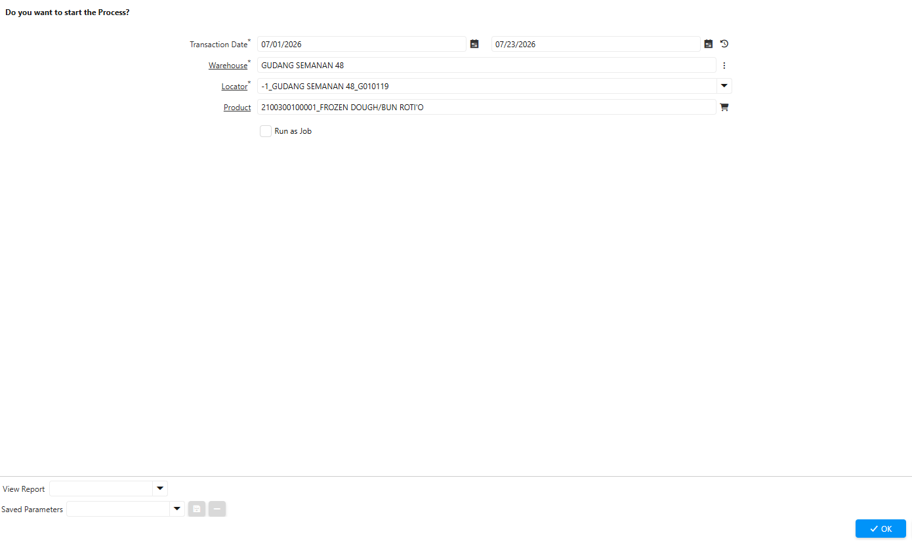
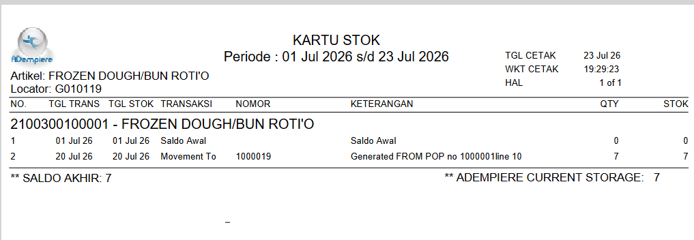

# Report Kartu Stock

Laporan Kartu Stok berfungsi untuk menyajikan riwayat seluruh transaksi yang memengaruhi persediaan suatu produk pada periode tertentu. Setiap transaksi akan memperlihatkan jumlah stok sebelum transaksi, kuantitas yang masuk atau keluar, serta saldo stok setelah transaksi diproses.

## Fungsi Laporan Kartu Stock

- Memantau pergerakan stok
- Mengetahui saldo stok setiap transaksi
- Melakukan penelusuran (traceability)
- Membantu proses rekonsiliasi stok

## Langkah Proses Laporan Kartu Stock

1. Buka menu **SIS Report Kartu Stock**
2. Input parameter berikut:
- Transaction date — Tanggal transaksi.
- Warehouse — Gudang penyimpanan produk.
- Locator — Lokasi penyimpanan produk.
- Product — Produk yang akan diproses.

 {#Figure163}

3. Klik Start.

 {#Figure164}

> **Catatan:** Report Kartu Stock hanya menampilkan transaksi yang telah diproses (Completed) sehingga saldo yang ditampilkan mencerminkan kondisi persediaan yang telah tercatat secara resmi di sistem. Transaksi dengan status Drafted, In Progress, atau Voided tidak memengaruhi saldo stok pada laporan ini.