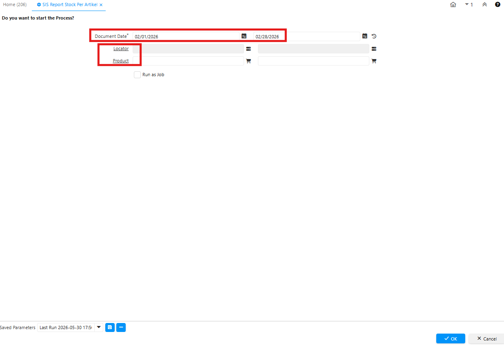
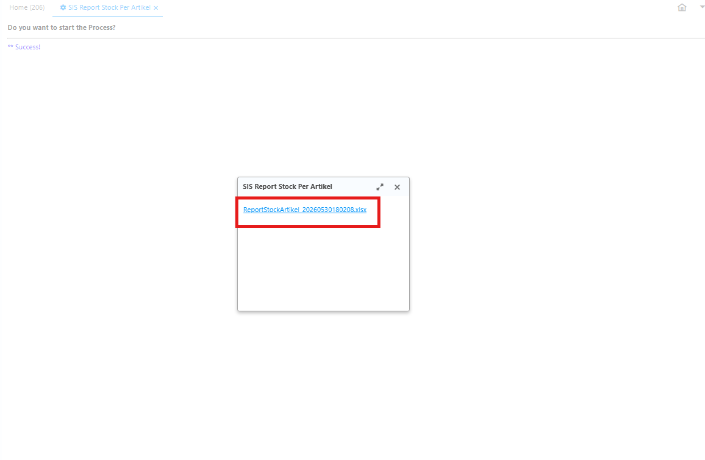
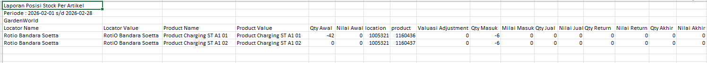

# Report Stock per Artikel

Laporan ini menampilkan posisi stok yang dikelompokkan berdasarkan produk/artikel. Berbeda dengan laporan per warehouse yang berfokus ke lokasi, laporan ini merangkum total stok suatu produk dari semua (atau warehouse tertentu), lengkap dengan nilai dan status replenishment-nya.
## Akses Laporan Stock per Artikel di Sistem

Ikuti langkah berikut untuk mengakses Report Stock per Artikel di iDempiere:
1. Buka menu **SIS Report Stock per Artikel**
2. Input **tanggal pelaporan**, **Locator** & **Product**.

 {#Figure71}

3. Klik **Ok**
4. Sistem menampilkan Report Stock dalam format **Excel**.

 {#Figure72}

 {#Figure73}