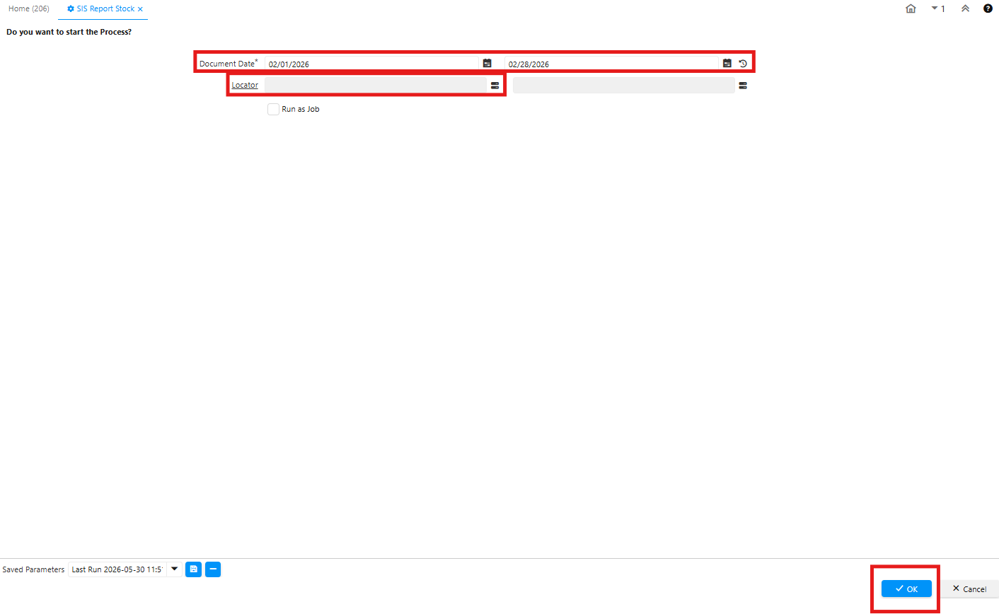
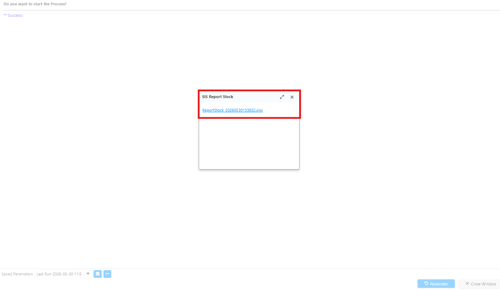
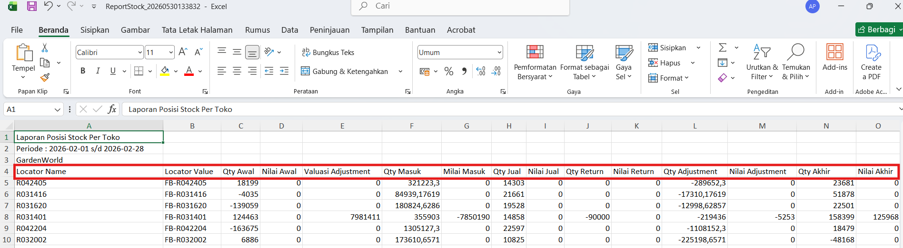

# Report Stock per Warehouse

Laporan ini menampilkan posisi stok yang dikelompokkan berdasarkan gudang (warehouse). Gunakan laporan ini untuk memantau distribusi fisik barang di setiap lokasi penyimpanan dan memastikan ketersediaan stok di masing-masing gudang.
## Akses Laporan Stock per Warehouse di Sistem
Ikuti langkah berikut untuk mengakses Report Stock per Warehouse di iDempiere:
1. Buka menu **SIS Report Stock**
2. Input **tanggal pelaporan** dan **Locator**.

 {#Figure68}

3. Klik **Ok**
4. Sistem menampilkan Report Stock dalam format **Excel**.

 {#Figure69}

 {#Figure70}