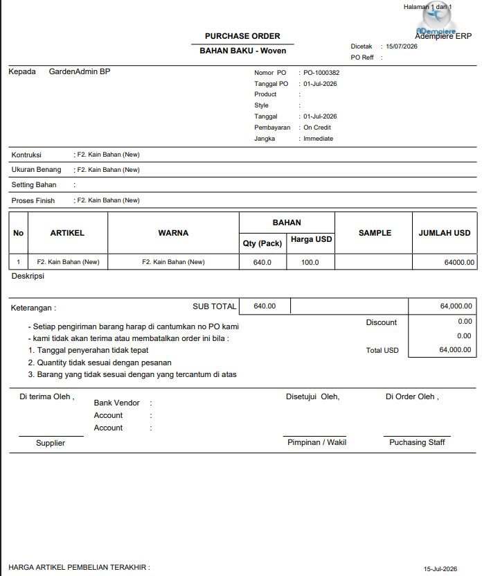
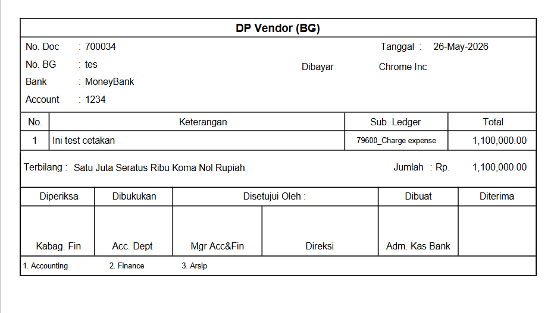
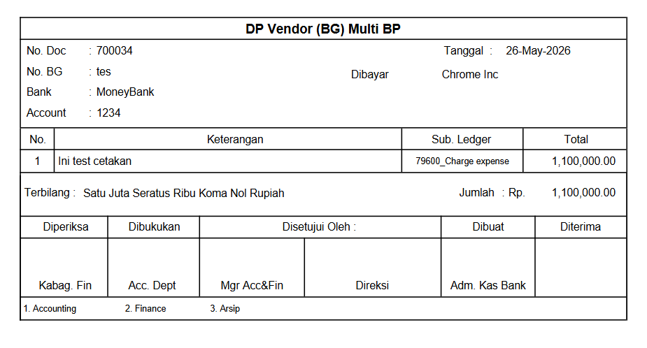
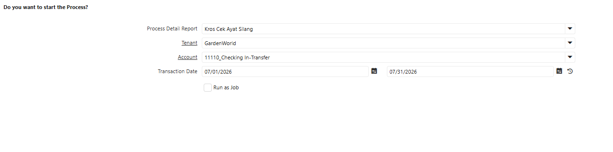
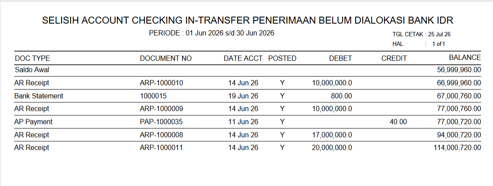

# Report

Terdapat tiga kelompok report utama: **Purchase Order (PO)**, **Material Receipt (MR)**, dan **BG/DP Vendor**. Setiap report memiliki template cetak (_print format_) tersendiri yang disesuaikan dengan kebutuhan proses bisnis masing-masing tim.

Pengelompokan report ini bertujuan agar dokumen yang dihasilkan sesuai dengan format dan informasi yang relevan per tim, sekaligus mempermudah proses approval, pencetakan, dan pengarsipan dokumen.
## Report Purchase Order (PO)

Report PO digunakan untuk mencetak dokumen Purchase Order yang telah dibuat di sistem. Report ini dibedakan menjadi dua template sesuai tim pengguna — **tim SCI** dan **tim PPG** — karena kedua tim memiliki jenis kebutuhan pembelian dan format dokumen yang berbeda.
### Purchase Order (PO) tim SCI

#### PO ATK

Pembelian Alat Tulis Kantor untuk kebutuhan administrasi dan operasional kantor.

 {#Figure136}
#### PO Bahan Mentah

Pembelian bahan baku yang digunakan sebagai input proses produksi.

 {#Figure136}
#### PO Barang Jadi

Pembelian barang jadi dari vendor/pihak ketiga, baik untuk dijual kembali maupun melengkapi kebutuhan produk akhir.

 {#Figure137}
#### PO Belanja Outlet

Pembelian kebutuhan operasional outlet/toko, misalnya perlengkapan display dan kebutuhan harian outlet.

 {#Figure138}
#### PO Biaya

Pembelian yang bersifat jasa atau biaya non-barang, misalnya jasa service, sewa, dan biaya operasional lainnya.

 {#Figure139}
#### PO Inventaris

Pembelian aset atau inventaris kantor/pabrik seperti peralatan kerja dan perlengkapan tetap.

 {#Figure140}
#### PO Barang Kemas

Pembelian bahan/material kemasan (_packaging_) untuk pengemasan produk.

 {#Figure141}
#### PO Perlengkapan

Pembelian perlengkapan penunjang operasional di luar kategori ATK dan inventaris.

 {#Figure142}
### Purchase Order (PO) tim PPG

#### PO ATK

Pembelian Alat Tulis Kantor untuk kebutuhan administrasi tim PPG.

 {#Figure143}
#### PO Aksesoris

Pembelian aksesoris produksi garment seperti kancing, resleting, label, dan material pelengkap lainnya.

 {#Figure144}
#### PO Inventaris

Pembelian aset atau inventaris yang digunakan pada area produksi PPG.

 {#Figure145}
#### PO Kendaraan

Pembelian yang berkaitan dengan kendaraan operasional, misalnya suku cadang, bahan bakar, dan perawatan kendaraan.

 {#Figure145}
#### PO Knitting

Pembelian bahan baku, benang, atau suku cadang mesin untuk kebutuhan proses knitting.

 {#Figure146}
#### PO Umum

Pembelian kebutuhan umum PPG yang tidak termasuk dalam kategori khusus lainnya.

 {#Figure146}
#### PO Woven

Pembelian bahan baku atau material untuk kebutuhan proses woven. 

 {#Figure147}
## Report Material Receipt (MR/BPB)

Report MR digunakan untuk mencetak dokumen permintaan material yang diajukan secara internal oleh divisi produksi ke bagian gudang/persediaan. Permintaan ini diproses lebih lanjut menjadi Purchase Order jika stok tidak mencukupi, atau dipenuhi langsung dari stok gudang. Klasifikasi report MR adalah sebagai berikut:
### MR Aksesoris

Permintaan material aksesoris produksi seperti kancing, resleting, dan label.

 {#Figure148}
### MR Knitting

Permintaan material/bahan baku untuk kebutuhan proses produksi knitting.

 {#Figure149}
### MR Woven

Permintaan material/bahan baku untuk kebutuhan proses produksi woven. 

 {#Figure150}
### MR Sisa Cutting

Pencatatan penggunaan sisa hasil cutting (kain/material sisa potong) untuk dimanfaatkan kembali dalam proses produksi.

 {#Figure151}
### MR FID

Permintaan material terkait proses/divisi FID sesuai klasifikasi internal perusahaan.

 {#Figure151}
### MR FB

Permintaan material terkait proses/divisi FB sesuai klasifikasi internal perusahaan.

 {#Figure152}
## Report BG (DP Vendor)

Report BG digunakan untuk mencetak dokumen uang muka (_Down Payment_/DP) yang diberikan kepada vendor sebagai bagian dari proses pembayaran atas Purchase Order. Report ini terdiri dari dua jenis template:
### DP Vendor BG

Digunakan untuk mencetak dokumen DP kepada satu vendor (Business Partner) dalam satu dokumen transaksi.

 {#Figure153}
### DP Vendor BG Multi BP

Digunakan untuk mencetak dokumen DP yang mencakup lebih dari satu vendor dalam satu dokumen transaksi, misalnya pada pembayaran DP gabungan.

 {#Figure154}

## Report Print Journal Status

**Print Journal Status** adalah laporan yang menampilkan status pencatatan (_posting_) jurnal akuntansi dari seluruh dokumen transaksi. Report ini membantu tim Finance memantau apakah transaksi sudah berhasil diposting ke General Ledger (GL) atau masih terdapat dokumen yang gagal diposting.
### Fungsi Print Journal Status

- **Memantau status posting jurnal** — Mengetahui apakah dokumen sudah berhasil diposting (_Posted = Yes_) atau belum (_Posted = No_).
- **Mendeteksi kegagalan posting** — Mengidentifikasi dokumen yang gagal diposting akibat kesalahan konfigurasi, seperti akun belum tersedia, periode sudah tutup, atau costing belum terbentuk, sehingga dapat segera ditindaklanjuti.
- **Rekonsiliasi transaksi dengan General Ledger** — Memastikan seluruh transaksi operasional telah menghasilkan jurnal di GL dan membantu proses _closing_ bulanan agar tidak ada transaksi yang terlewat.
### Langkah Akses Report Print Journal Status

1. Buka menu **SIS Export Print Journal Status**.
2. Input parameter berikut sesuai kebutuhan:
- **Date Acct** — Tanggal akuntansi.
- **Posted** — Pilih jika ingin menampilkan jurnal yang sudah ter-posting.
- **Posting Error** — Pilih jika ingin menampilkan jurnal yang gagal diposting.
- **Processing** — Status proses dokumen.

 {#Figure161}

3. Klik **Start**.

Sistem menampilkan pop-up hasil export dalam format **Excel**. Klik dokumen tersebut untuk mengunduhnya.

> Jika hanya **Date Acct** yang diisi, sistem menampilkan seluruh jurnal — baik yang sudah ter-posting maupun yang belum — pada hasil export.

#### Informasi yang Ditampilkan pada Hasil Export

 {#Figure162}

| Informasi         | Keterangan                                                       |
| ----------------- | ---------------------------------------------------------------- |
| **Document No**   | Nomor dokumen transaksi                                          |
| **Table**         | Tabel asal transaksi (Invoice, Order, Inventory, Movement, dll.) |
| **Date Account**  | Tanggal akuntansi                                                |
| **Posted**        | Status posting jurnal                                            |
| **Processing**    | Status proses dokumen                                            |
## Laporan Crosscheck Ayat Silang

Laporan Crosscheck Ayat Silang digunakan untuk memverifikasi keseimbangan jurnal akuntansi di iDempiere. Laporan ini memastikan setiap transaksi yang telah diposting ke **General Ledger (GL)** membentuk pasangan ayat jurnal (debet dan kredit) yang benar dan seimbang.

### Fungsi Laporan Kros Cek Ayat Silang

- Memastikan setiap jurnal memiliki total **debet = kredit**.
- Memverifikasi bahwa posting transaksi dari modul operasional (Purchase, Sales, Inventory, Asset, Production, Payment, dan lain-lain) telah menghasilkan jurnal sesuai konfigurasi accounting.
- Membantu proses rekonsiliasi sebelum penutupan periode (_Period Closing_).
- Memudahkan auditor atau tim Finance menelusuri asal jurnal jika ditemukan selisih atau ketidaksesuaian.

### Langkah Akses Laporan Cross Check Ayat Silang

1. Buka menu **SIS Laporan Kros Cek Ayat Silang**.
2. Input parameter berikut sesuai kebutuhan:
- **Process Detail Report** — Report yang akan diproses.
- **Tenant** — Tenant yang akan dilakukan pengecekan.
- **Account** — Akun yang akan dicek.
- **Transaction Date** — Tanggal transaksi.

 {#Figure166}

3. Klik **start**.

 {#Figure167}

Sistem menampilkan informasi berikut pada laporan:

- Tanggal transaksi
- Saldo awal
- Nomor dokumen
- Jenis dokumen
- Nilai debet
- Nilai kredit
- Organization

Laporan Crosscheck Ayat Silang adalah laporan kontrol akuntansi yang memverifikasi hubungan antar akun dalam jurnal, memastikan keseimbangan debet dan kredit, serta membantu analisis asal-usul transaksi sehingga proses rekonsiliasi dan audit dapat dilakukan lebih cepat dan akurat.
## Report Invoice Vendor

Report Invoice Vendor digunakan untuk menampilkan daftar dokumen Invoice Vendor (_Accounts Payable Invoice_) yang telah dibuat di iDempiere. Gunakan report ini untuk memantau transaksi tagihan dari vendor serta memudahkan proses rekonsiliasi dengan Purchase Order, Material Receipt, maupun pembayaran.

Report Invoice Vendor dibagi menjadi dua jenis berdasarkan tipe transaksi:
### Invoice Vendor Lain-Lain

Report ini menampilkan seluruh transaksi invoice pembelian dari vendor yang menambah nilai kewajiban perusahaan kepada vendor (_Accounts Payable_). Ikuti langkah berikut untuk mengaksesnya:

1. Buka menu **Purchase Invoice and Credit/Debit Note**.
2. Klik tombol **Setting (⚙)**.
3. Klik **Print Invoice Lain-Lain**.
4. Klik **OK**.

 {#Figure167}
### Invoice Vendor Credit Note Lain-Lain

Report ini menampilkan transaksi Credit Note Vendor — dokumen yang digunakan untuk mengurangi nilai tagihan vendor akibat kondisi tertentu, seperti:

- Retur barang kepada vendor.
- Koreksi harga pembelian.
- Koreksi kuantitas.
- Pembatalan sebagian nilai invoice.
- Pemberian potongan (_allowance_) dari vendor.

Ikuti langkah berikut untuk mencetak Invoice Vendor Credit Note Lain-Lain:

1. Buka menu **Purchase Invoice and Credit/Debit Note**.
2. Klik tombol **Setting (⚙)**.
3. Klik **Print Invoice Credit Note**.
4. Klik **OK**.

## Report Invoice Buyer

Report Invoice Buyer digunakan untuk menampilkan seluruh transaksi Invoice Penjualan (_Accounts Receivable Invoice_) yang dibuat kepada buyer atau pelanggan. Gunakan report ini untuk memantau transaksi penjualan yang telah ditagihkan, baik berupa invoice penjualan maupun credit note.

Report Invoice Buyer dibagi menjadi dua jenis:
### Invoice Buyer Lain-Lain

Report ini digunakan untuk mencatat tagihan atas transaksi non-reguler, seperti penjualan jasa, biaya administrasi, penggantian biaya (_reimbursement_), atau transaksi lain yang memerlukan penagihan kepada buyer tanpa melalui proses Sales Order.

Ikuti langkah berikut untuk mengaksesnya:

1. Buka menu **Purchase Invoice and Credit/Debit Note**.
2. Klik tombol **Setting (⚙)**.
3. Klik **SIS Printout Invoice Buyer Lain-Lain**.
4. Klik **OK**.

### Invoice Buyer Credit Note

Report ini menampilkan transaksi Credit Note yang diterbitkan kepada buyer — dokumen yang digunakan untuk mengurangi nilai piutang kepada buyer akibat adanya koreksi transaksi.

Ikuti langkah berikut untuk mencetak Invoice Buyer Credit Note:

1. Buka menu **Purchase Invoice and Credit/Debit Note**.
2. Klik tombol **Setting (⚙)**.
3. Klik **SIS Printout Invoice Credit Note Buyer Lain-Lain**.
4. Klik **OK**.

## Export GL Distribution Data

Export GL Distribution Data adalah proses mengekspor hasil distribusi akun (GL Distribution) yang telah diproses sistem menjadi jurnal akuntansi. Fitur ini digunakan untuk mengirimkan hasil distribusi ke sistem lain, melakukan rekonsiliasi, atau menyimpan hasil distribusi dalam format file (Excel atau CSV).
### Tujuan Export GL Distribution Data

- Mengekspor jurnal hasil distribusi ke sistem ERP atau aplikasi keuangan lain.
- Melakukan rekonsiliasi hasil distribusi dengan General Ledger.
- Menyediakan data distribusi sebagai bahan audit.
- Membuat arsip jurnal distribusi dalam format Excel atau CSV.
- Memudahkan analisis alokasi biaya berdasarkan akun atau cost center.
### Langkah Export GL Distribution 

1. Buka menu **SIS Export GL Distribution**.
2. Klik **Start**.
3. Klik file yang muncul.
4. Klik **Download** untuk mengunduh file tersebut.

 {#Figure170}

Sistem menghasilkan file dalam format **Excel** yang memuat informasi akun asal dan akun target yang didistribusikan. Data diambil dari jurnal yang telah diposting dan dipengaruhi oleh aturan GL Distribution.

## Report Account Element

**Export Account Element** adalah fitur di iDempiere yang digunakan untuk mengekspor data Account Element (_Chart of Accounts/COA_) ke dalam file spreadsheet (Microsoft Excel). Laporan ini bertujuan untuk melakukan review, dokumentasi, maupun keperluan migrasi dan sinkronisasi data akun ke sistem lain.

Data yang diekspor memuat seluruh daftar akun beserta atributnya sesuai konfigurasi pada Accounting Schema.
### Langkah Export Account Element

1. Buka menu **SIS Export Account Element**.
2. Klik **Start**.
3. **Download** file yang muncul.

 {#Figure178}

Informasi yang Ditampilkan pada Hasil Export

- **Account** — Kode akun.
- **Name Account** — Nama akun.
- **Description** — Deskripsi akun _(jika tersedia)_.
- **Account Type** — Jenis akun: Asset, Liability, Equity, Revenue, Expense, atau Memo.
- **Document Controlled** — Status kontrol dokumen oleh sistem.
- **Summary Level** — Menunjukkan apakah akun merupakan akun ringkasan (_summary_) atau akun transaksi (_posting_).

Berikut contoh hasil export Account Element:

 {#Figure179}

> **Catatan:** Export Account Element hanya mengekspor data master akun (_Chart of Accounts_) dan tidak menampilkan saldo akun maupun transaksi jurnal. Gunakan laporan ini sebagai referensi konfigurasi, bukan sebagai laporan keuangan.

## Laporan Buku Besar Pembantu

Buku Besar Pembantu adalah laporan yang menampilkan rincian transaksi untuk setiap akun secara lebih detail dibandingkan Buku Besar (_General Ledger_). Gunakan laporan ini untuk menelusuri mutasi transaksi beserta saldo setiap Business Partner, akun, maupun dimensi akuntansi sesuai kebutuhan analisis.

Laporan ini berfungsi sebagai laporan pendukung untuk merekonsiliasi saldo akun pada General Ledger dengan rincian transaksi yang membentuk saldo tersebut.

Data pada Buku Besar Pembantu bersumber dari tabel akuntansi (_Fact_Acct_) yang terbentuk setelah dokumen berhasil diposting (_Posted = Yes_). Dokumen yang masih berstatus _Draft_, _In Progress_, atau belum diposting tidak akan ditampilkan.
### Langkah Export Buku Besar Pembantu

1. Buka menu **SIS Export Buku Besar Pembantu**.
2. Input parameter berikut sesuai kebutuhan:
- **Account Date** — Tanggal akun transaksi.
- **Business Partner** — Opsional, untuk memfilter berdasarkan Business Partner.
- **Cost Center** — Opsional, untuk memfilter berdasarkan Cost Center.
- **Product** — Opsional, untuk memfilter berdasarkan produk yang digunakan dalam transaksi.

 {#Figure180}

3. Klik start

Berikut contoh hasil export Buku Besar Pembantu:

 {#Figure181}

Informasi yang Ditampilkan pada Hasil Export

- **Company** — Tenant.
- **No Reff** — Nomor dokumen.
- **Description** — Deskripsi transaksi _(jika tersedia)_.
- **Date Acct** — Tanggal transaksi.
- **Acc Value** — Kode akun.
- **Acc Name** — Nama akun.
- **Debit** — Nilai debit.
- **Kredit** — Nilai kredit.
- **Saldo Awal** — Saldo awal periode.
- **Saldo Berjalan** — Saldo setelah setiap transaksi diposting.
- **Artikel** — Kode produk.
- **Nama Barang** — Nama produk.
- **Cost Center** — Value cost center.
- **Nama Cost Center** — Nama cost center.
- **BPartner** — Value Business Partner.
- **Nama BPartner** — Nama Business Partner.
- **Warehouse** — Warehouse saat transaksi dilakukan.

Saldo diperbarui secara berurutan berdasarkan tanggal posting, sehingga user dapat memantau perubahan saldo setelah setiap transaksi diposting.

## Report Slip Setoran

**Report Printout Payment AP Bank** adalah laporan yang digunakan untuk mencetak informasi pembayaran vendor yang dilakukan melalui transaksi AP Payment dengan metode **Bank Transfer**. Laporan ini dirancang untuk diintegrasikan dengan Slip Setoran Bank, sehingga informasi pembayaran dari iDempiere dapat digunakan sebagai dokumen pendukung saat melakukan penyetoran atau transfer dana melalui bank.

Laporan ini berfungsi sebagai media verifikasi sebelum transaksi dikirim ke bank, sekaligus sebagai dokumen arsip atas pembayaran yang telah diproses.
### Konfigurasi Report Printout Payment AP Bank

Sebelum mencetak Report Printout Payment AP Bank, lakukan konfigurasi hak akses report dan template report pada masing-masing rekening bank. Konfigurasi ini memastikan sistem menampilkan jenis report yang sesuai dengan metode pembayaran yang digunakan perusahaan.
#### Konfigurasi Report Detail Access pada Role

1. Buka menu **Role**.
2. Pilih role yang akan diberikan akses untuk mencetak report.
3. Buka tab **Report Detail Access**.
4. Tambahkan report **SIS Printout Payment AP Bank**.
5. Pada field **Process Detail Report**, pilih jenis report yang akan digunakan sesuai kebutuhan perusahaan.

 {#Figure182}

Lakukan konfigurasi ini untuk setiap jenis report pembayaran bank yang digunakan, misalnya:

- BCA BG
- BCA Transfer
- BCA Setoran
- Mandiri Transfer
- BNI Transfer
- atau template pembayaran bank lainnya.

Setelah dikonfigurasi, report akan tersedia dan dapat dipilih pada proses pembayaran sesuai hak akses user.
#### Konfigurasi Bank Report Template

Setelah konfigurasi pada Role selesai, hubungkan report dengan masing-masing rekening bank. Ikuti langkah berikut:

1. Buka menu **Bank/Cash**.
2. Pilih rekening bank yang akan digunakan untuk transaksi pembayaran.
3. Buka tab **Bank Report Template**.
4. Tambahkan konfigurasi report baru.
5. Pada field **Process Detail Report**, pilih report yang telah dikonfigurasi sebelumnya, misalnya BCA BG, BCA Transfer, BCA Setoran, atau report lain sesuai kebutuhan.

 {#Figure183}

6. Klik **Save**.

Lakukan konfigurasi ini pada setiap rekening bank yang digunakan untuk transaksi pembayaran. Dengan demikian, setiap rekening bank dapat menggunakan template printout yang berbeda sesuai format Slip Setoran Bank yang dipersyaratkan masing-masing bank.
### Langkah Cetak Report Slip Setoran

1. Buka menu **SIS Printout Payment AP Bank**.
2. Input parameter berikut sesuai kebutuhan:
- **Bank**
- **Process Detail Report**
- **Transaction Date**
- **Bank Account** _(opsional)_
- **Payment** _(opsional)_

 {#Figure184}

3. Klik **Start**.

 {#Figure185}

Data pada laporan diambil dari dokumen AP Payment yang telah dibuat di sistem, meliputi informasi pembayaran, Business Partner, rekening bank, dan nilai pembayaran. Informasi ini digunakan sebagai dasar pengisian atau pencetakan **Slip Setoran Bank** saat proses transfer atau penyetoran ke bank.

Dengan mekanisme ini, perusahaan dapat menggunakan lebih dari satu format printout pembayaran tanpa perlu mengubah report secara manual setiap kali menggunakan rekening bank yang berbeda.