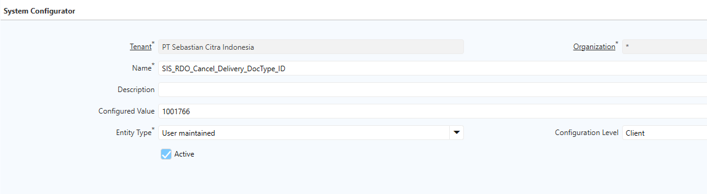
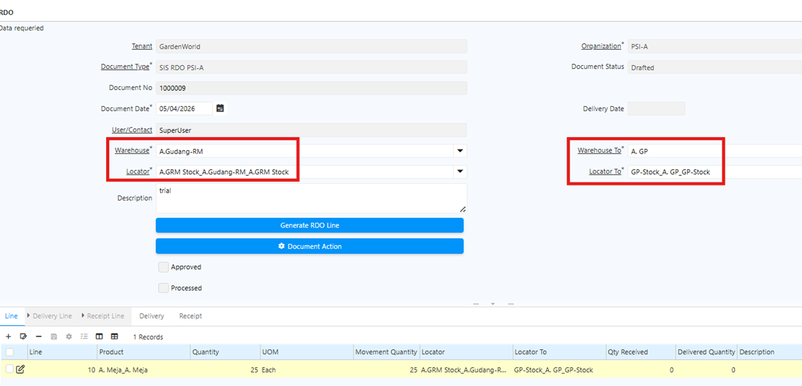
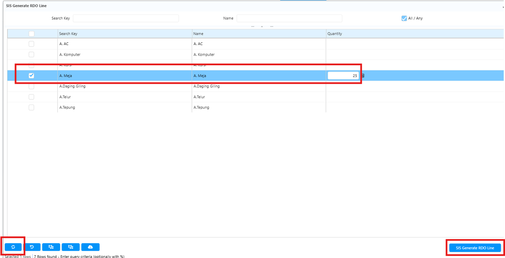
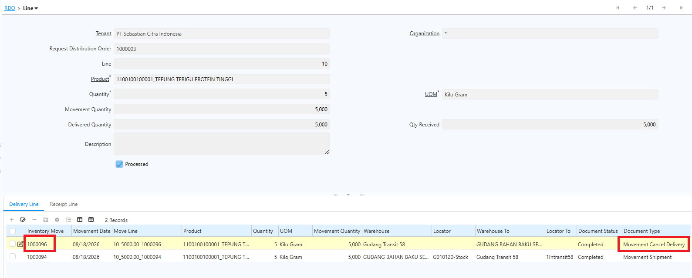
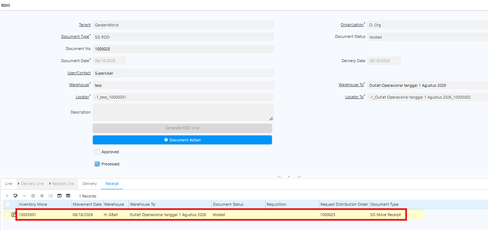
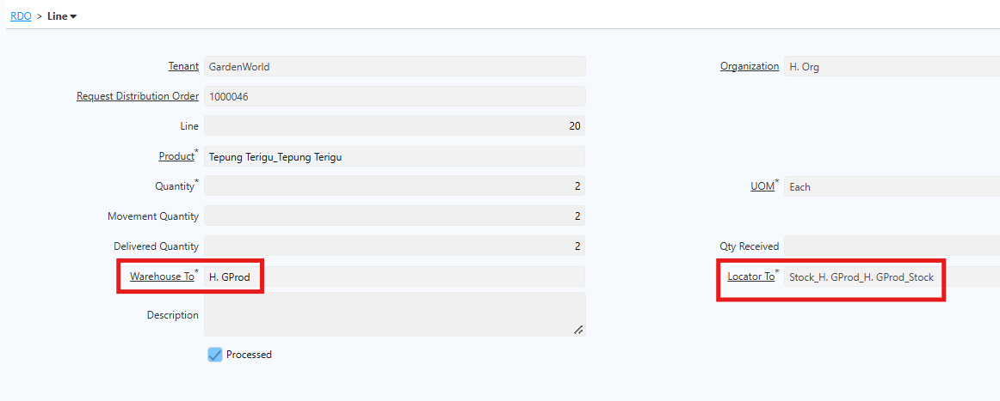
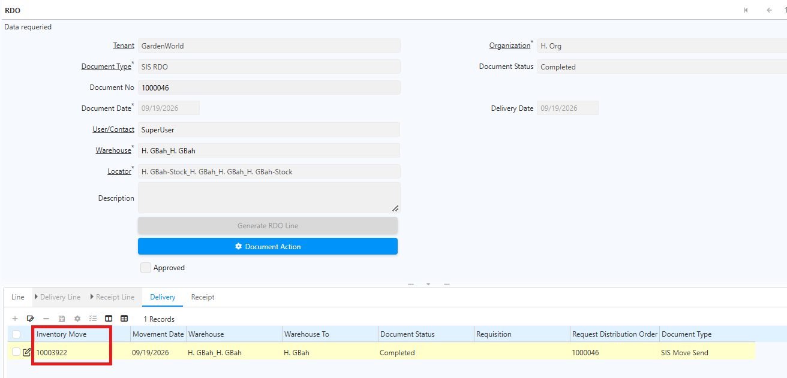
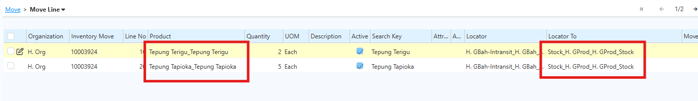

# Request Distribution Order 

Request Distribution Order (RDO) adalah instrumen pengendalian distribusi yang digunakan untuk memonitor, mengalokasikan, dan mendistribusikan barang **non-produksi** ke warehouse tujuan secara terstruktur dan dapat ditelusuri.

## Konfigurasi Request Distribution Order (RDO)

Sebelum proses RDO dijalankan, pastikan konfigurasi berikut sudah diselesaikan:
1. Warehouse dan Locator tujuan sudah didefinisikan dengan jelas.
2. Document Type untuk delivery, receipt dan cancel delivery sudah dikonfigurasi agar sistem dapat mencatat pergerakan barang secara akurat.
3. Produk yang akan didistribusikan sudah diinput melalui menu **Product Access** menggunakan fitur **Generate Product**.
4. Field **Organization** wajib diisi pada seluruh transaksi operasional untuk menjaga integritas data. 

## Konfigurasi Sistem

1. Buka menu **System Configurator**.
2. Klik **New**.
3. Isi field **Name** dengan **SIS_RDO_Cancel_Delivery_DocType_ID**.
4. Isi field **Configured Value** dengan **Doc Type ID** yang akan digunakan sesuai kebijakan perusahaan.

 {#Figure246}

5. Pilih **Configuration Level** = **Client**.
6. Klik **save**.
## Konfigurasi Document Type RDO

Pada konfigurasi Document Type RDO, terdapat beberapa field utama yang wajib diisi:

| Field                        | Keterangan                                                         |
| ---------------------------- | ------------------------------------------------------------------ |
| Document type delivery       | Digunakan untuk mencatat barang keluar dari warehouse asal         |
| Document type receipt        | Digunakan untuk mencatat penerimaan barang di warehouse tujuan     |
| Document type pembatalan RDO | Document type untuk mencatat pembatalan transaksi RDO              |
| Warehouse intransit          | Warehouse transit selama proses distribusi                         |
| Locator Intransit            | Lokasi intransit penerimaan barang                                 |
| Product Access               | **Wajib dicentang** agar filter produk berjalan sesuai konfigurasi |
"Konfigurasi RDO"{#Tabel4}
## Alur Proses Request Distribution Order di Sistem

1. Lakukan assign produk melalui fitur **Generate Product** pada menu **Product Access**.
2. Buka menu **SIS RDO**

	 {#Figure30}

	
3. Jalankan proses **Generate RDO Line** untuk menampilkan daftar produk yang sudah dikonfigurasi.

4. Pilih produk yang akan didistribusikan sesuai kebutuhan.

	 {#Figure31}

5. Validasi **quantity** distribusi.
6. Tentukan **Warehouse dan Locator Tujuan**.
7. Klik **Complete Document** untuk menyelesaikan proses RDO.

Setelah dokumen di-complete, sistem akan otomatis membuat dokumen:

- Inventory Move Delivery
- Inventory Move Receipt

Kedua dokumen tersebut akan terbentuk dalam status **Draft** dan perlu diproses lebih lanjut sesuai alur operasional.
## Back Order Pada RDO

Jika quantity distribusi yang diproses lebih kecil dari quantity permintaan, sistem akan otomatis membuat Back Order untuk sisa quantity yang belum terpenuhi.

Dengan mekanisme ini, proses distribusi tetap dapat dilanjutkan tanpa harus membuat dokumen baru secara manual.

## Mekanisme Pembatalan RDO

Transaksi RDO hanya dapat dibatalkan jika dokumen **Receipt (penerimaan)** belum di-complete. Jika dokumen Receipt sudah di-complete, RDO tidak dapat dibatalkan.

Ikuti langkah berikut untuk membatalkan transaksi RDO:

1. Buka menu **SIS RDO**.
2. Pilih dokumen yang akan diproses.
3. Klik **Document Action Void**.

Berikut ketentuan pembatalan berdasarkan status dokumen Delivery:

- **Jika dokumen Delivery sudah di-complete** — Sistem otomatis membuat dokumen Movement pembalik atas Delivery tersebut dengan status complete.

 {#Figure246}

- **Jika dokumen Delivery belum di-complete** — Status dokumen Receipt yang sebelumnya _In Progress_ otomatis ter-_void_.

 {#Figure247}

## Generate Multi Movement Delivery

Saat melakukan RDO, warehouse tujuan untuk setiap produk dapat berbeda-beda. Untuk mengakomodasi kondisi ini, sistem mendukung **RDO dengan multi warehouse tujuan**.

RDO menggunakan mekanisme **intransit** — sebelum dipindahkan ke warehouse tujuan, sistem terlebih dahulu memindahkan produk dari gudang asal ke warehouse intransit.

Untuk RDO dengan multi warehouse tujuan, sistem membuat **satu dokumen Inventory Move Delivery** yang memuat seluruh produk yang diproses di RDO Line.

Ikuti langkah berikut untuk memproses RDO dengan multi warehouse tujuan:

1. Buka menu **SIS RDO**.
2. Tentukan **warehouse** dan **locator** asal.
3. Klik **Generate RDO Line**.
4. Tentukan **produk** dan **quantity** yang akan diproses.
5. Klik **SIS Generate RDO Line**.
6. Masuk ke tab **Line**.
7. Tentukan **warehouse** dan **locator** tujuan untuk produk yang akan diproses.

 {#Figure306}

8. Klik **Save**.
9. Ulangi langkah 7–8 untuk produk lainnya.
10. Klik **Complete**.

Saat RDO di-complete, sistem otomatis membuat dokumen **Inventory Move Delivery** dan **Inventory Move Receipt**. 

 {#Figure307}

 {#Figure308}

Dokumen Inventory Move Receipt yang ter-create dikonsolidasikan berdasarkan **warehouse tujuan** — jika beberapa produk dalam satu RDO memiliki warehouse tujuan yang sama, sistem menggabungkannya dalam satu dokumen. Dengan demikian, jumlah dokumen Inventory Move yang terbentuk sesuai dengan jumlah warehouse tujuan yang berbeda pada RDO Line.