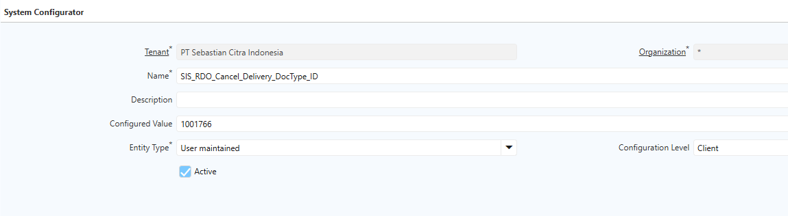
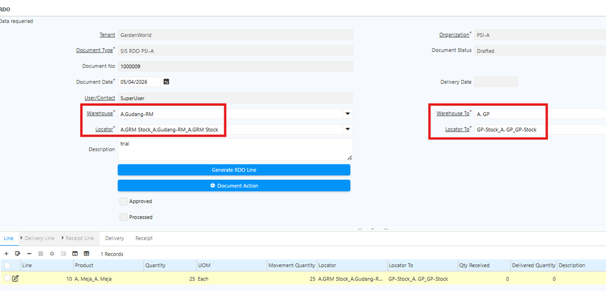
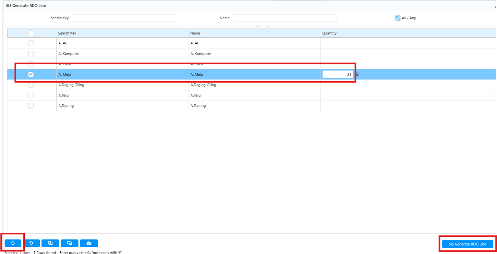
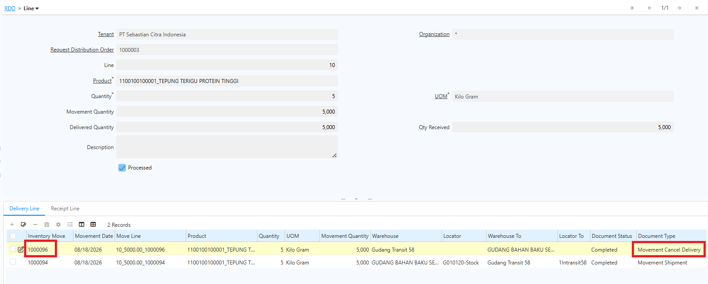
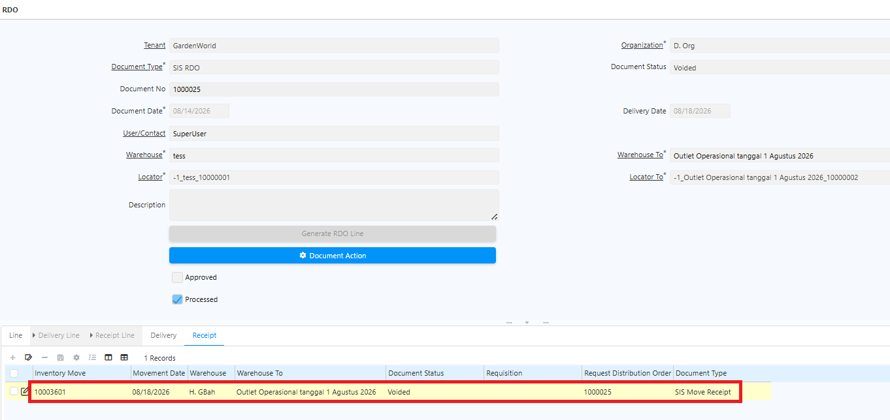
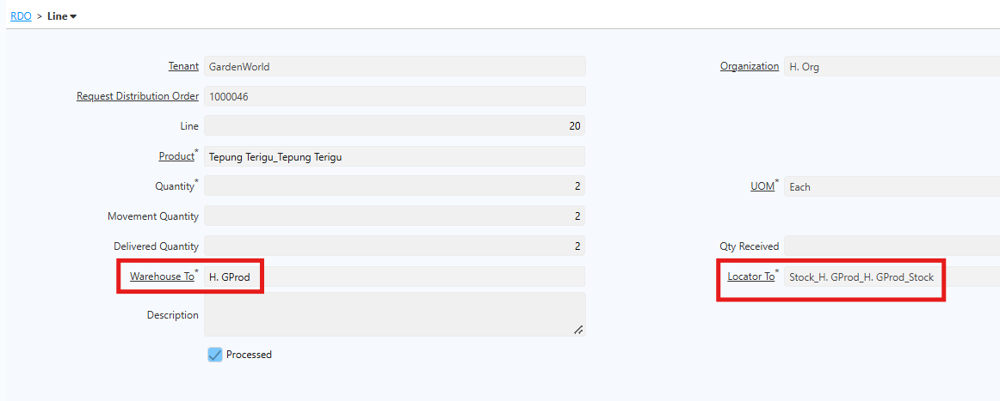
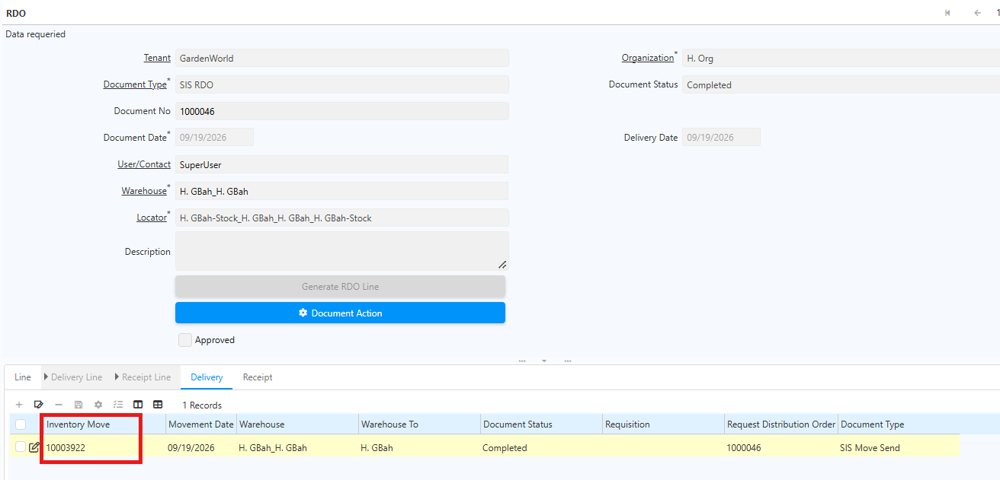
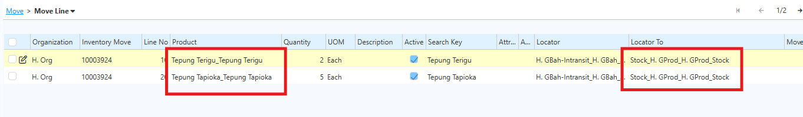

# Request Distribution Order 

Request Distribution Order (RDO) adalah instrumen pengendalian distribusi yang digunakan untuk memonitor, mengalokasikan, dan mendistribusikan barang **non-produksi** ke warehouse tujuan secara terstruktur dan dapat ditelusuri.

## Konfigurasi Request Distribution Order (RDO)

Sebelum proses RDO dijalankan, pastikan konfigurasi berikut sudah diselesaikan:
1. Warehouse dan Locator tujuan sudah didefinisikan dengan jelas.
2. Document Type untuk delivery, receipt dan cancel delivery sudah dikonfigurasi agar sistem dapat mencatat pergerakan barang secara akurat.
3. Produk yang akan didistribusikan sudah diinput melalui menu **Product Access** menggunakan fitur **Generate Product**.
4. Field **Organization** wajib diisi pada seluruh transaksi operasional untuk menjaga integritas data. 

## Konfigurasi Sistem

1. Buka menu **System Configurator**.
2. Klik **New**.
3. Isi field **Name** dengan **SIS_RDO_Cancel_Delivery_DocType_ID**.
4. Isi field **Configured Value** dengan **Doc Type ID** yang akan digunakan sesuai kebijakan perusahaan.

 {#Figure246}

5. Pilih **Configuration Level** = **Client**.
6. Klik **save**.
## Konfigurasi Document Type RDO

Pada konfigurasi Document Type RDO, terdapat beberapa field utama yang wajib diisi:

| Field                        | Keterangan                                                         |
| ---------------------------- | ------------------------------------------------------------------ |
| Document type delivery       | Digunakan untuk mencatat barang keluar dari warehouse asal         |
| Document type receipt        | Digunakan untuk mencatat penerimaan barang di warehouse tujuan     |
| Document type pembatalan RDO | Document type untuk mencatat pembatalan transaksi RDO              |
| Warehouse intransit          | Warehouse transit selama proses distribusi                         |
| Locator Intransit            | Lokasi intransit penerimaan barang                                 |
| Product Access               | **Wajib dicentang** agar filter produk berjalan sesuai konfigurasi |
"Konfigurasi RDO"{#Tabel4}
## Alur Proses Request Distribution Order di Sistem

1. Lakukan assign produk melalui fitur **Generate Product** pada menu **Product Access**.
2. Buka menu **SIS RDO**

	 {#Figure30}

	
3. Jalankan proses **Generate RDO Line** untuk menampilkan daftar produk yang sudah dikonfigurasi.

4. Pilih produk yang akan didistribusikan sesuai kebutuhan.

	 {#Figure31}

5. Validasi **quantity** distribusi.
6. Tentukan **Warehouse dan Locator Tujuan**.
7. Klik **Complete Document** untuk menyelesaikan proses RDO.

Setelah dokumen di-complete, sistem akan otomatis membuat dokumen:

- Inventory Move Delivery
- Inventory Move Receipt

Kedua dokumen tersebut akan terbentuk dalam status **Draft** dan perlu diproses lebih lanjut sesuai alur operasional.
## Back Order Pada RDO

Jika quantity distribusi yang diproses lebih kecil dari quantity permintaan, sistem akan otomatis membuat Back Order untuk sisa quantity yang belum terpenuhi.

Dengan mekanisme ini, proses distribusi tetap dapat dilanjutkan tanpa harus membuat dokumen baru secara manual.

## Mekanisme Pembatalan RDO

Transaksi RDO hanya dapat dibatalkan jika dokumen **Receipt (penerimaan)** belum di-complete. Jika dokumen Receipt sudah di-complete, RDO tidak dapat dibatalkan.

Ikuti langkah berikut untuk membatalkan transaksi RDO:

1. Buka menu **SIS RDO**.
2. Pilih dokumen yang akan diproses.
3. Klik **Document Action Void**.

Berikut ketentuan pembatalan berdasarkan status dokumen Delivery:

- **Jika dokumen Delivery sudah di-complete** — Sistem otomatis membuat dokumen Movement pembalik atas Delivery tersebut dengan status complete.

 {#Figure246}

- **Jika dokumen Delivery belum di-complete** — Status dokumen Receipt yang sebelumnya _In Progress_ otomatis ter-_void_.

 {#Figure247}

## Generate Multi Movement Delivery

Saat melakukan RDO, warehouse tujuan untuk setiap produk dapat berbeda-beda. Untuk mengakomodasi kondisi ini, sistem mendukung **RDO dengan multi warehouse tujuan**.

RDO menggunakan mekanisme **intransit** — sebelum dipindahkan ke warehouse tujuan, sistem terlebih dahulu memindahkan produk dari gudang asal ke warehouse intransit.

Untuk RDO dengan multi warehouse tujuan, sistem membuat **satu dokumen Inventory Move Delivery** yang memuat seluruh produk yang diproses di RDO Line.

Ikuti langkah berikut untuk memproses RDO dengan multi warehouse tujuan:

1. Buka menu **SIS RDO**.
2. Tentukan **warehouse** dan **locator** asal.
3. Klik **Generate RDO Line**.
4. Tentukan **produk** dan **quantity** yang akan diproses.
5. Klik **SIS Generate RDO Line**.
6. Masuk ke tab **Line**.
7. Tentukan **warehouse** dan **locator** tujuan untuk produk yang akan diproses.

 {#Figure306}

8. Klik **Save**.
9. Ulangi langkah 7–8 untuk produk lainnya.
10. Klik **Complete**.

Saat RDO di-complete, sistem otomatis membuat dokumen **Inventory Move Delivery** dan **Inventory Move Receipt**. 

 {#Figure307}

 {#Figure308}

Dokumen Inventory Move Receipt yang ter-create dikonsolidasikan berdasarkan **warehouse tujuan** — jika beberapa produk dalam satu RDO memiliki warehouse tujuan yang sama, sistem menggabungkannya dalam satu dokumen. Dengan demikian, jumlah dokumen Inventory Move yang terbentuk sesuai dengan jumlah warehouse tujuan yang berbeda pada RDO Line.

## Mekanisme Inventory Move Receipt

Pada mekanisme RDO sebelumnya, saat RDO di-complete sistem otomatis membuat dokumen **Inventory Move Delivery** dan **Receipt**. Saat ini telah dilakukan penyesuaian — penerimaan (_receipt_) dapat dilakukan secara manual, sehingga saat RDO di-complete sistem **tidak lagi** otomatis membuat Inventory Move Receipt.

Untuk mengakomodasi hal ini, terdapat tambahan konfigurasi pada **Document Type RDO** melalui field **Auto Create Receipt Movement Doc**:

- **Auto Create Receipt Movement Doc = Y** — Saat RDO di-complete, sistem otomatis membuat Inventory Move Delivery dan Receipt.
- **Auto Create Receipt Movement Doc = N** — Saat RDO di-complete, sistem hanya membuat Inventory Move Delivery. Inventory Move Receipt dibuat secara manual.

### Langkah Membuat Inventory Move Receipt Manual

Ikuti langkah berikut untuk membuat Inventory Move Receipt secara manual yang mereferensikan Inventory Move Delivery:

1. Buka menu **Inventory Move**.
2. Klik **New**.
3. Tentukan **Document Type**.
4. Tentukan **Warehouse** asal dan **Warehouse** tujuan.
5. Centang field **Receipt**.
6. Input dokumen **Inventory Move Delivery** pada field **Movement Reference**.
7. Informasi RDO otomatis tersalin ke Inventory Move Receipt.
8. Klik **Generated Movement Line**.
9. Klik **OK**.

Sistem otomatis menyalin Move Line dari Inventory Move Delivery, dengan **Locator tujuan** sesuai RDO Line.

10. Verifikasi **produk**, **quantity**, serta **Locator** asal dan tujuan.
11. Klik **Save**.
12. Klik **Complete** pada dokumen.

Untuk memproses Inventory Move Receipt dari Generate RDO, user dapat memproses Inventory Move seperti mekanisme sebelumnya — seluruh informasi pada Inventory Move bersumber dari RDO dan RDO Line.
## RDO Sub Brand

Pada proses Inventory Move, terdapat kebutuhan untuk mendistribusikan produk berdasarkan kategori **Sub Brand** tanpa perlu menentukan produk satu per satu. Setiap produk sudah memiliki kategori Sub Brand yang telah diidentifikasi oleh perusahaan, sehingga user cukup menentukan Sub Brand yang akan diproses.

### Mekanisme RDO Sub Brand

1. Buka menu **SIS RDO**.
2. Tentukan **Document Type**.
3. Tentukan **Warehouse** dan **Locator** tujuan.
4. Tentukan **Sub Brand**.
5. Klik **Save**.
6. Masuk ke tab **RDO Line**.
7. Tentukan **quantity** yang akan diproses.
8. Tentukan **Warehouse** dan **Locator** tujuan.
9. Klik **Save**.
10. Klik **Complete** pada dokumen.

Saat RDO di-complete, sistem otomatis membuat **Inventory Move Delivery** dengan mekanisme intransit — warehouse dan locator tujuan dari pengiriman adalah **intransit**.

Karena distribusi dilakukan berdasarkan kategori Sub Brand, user menginput produk satu per satu melalui **scan barcode**. Ikuti langkah berikut:

1. Buka menu **Inventory Move**.
2. Tentukan dokumen **Inventory Move** yang ter-create dari RDO.
3. Pada field **Product Value**, lakukan scan barcode atau input manual kode produk.
4. Tentukan **Qty Barcode**.
5. Klik **Enter**.

Setelah Enter diklik, sistem otomatis membuat **Move Line** dengan ketentuan berikut:

- **Locator asal dan tujuan** — sesuai konfigurasi header (_intransit_).
- **Quantity** — sesuai Qty Barcode yang diinput.

6. Verifikasi **produk** dan **quantity** yang diproses.
7. Klik **Save**.
8. Klik **Complete** pada dokumen.

> **Catatan:** Quantity yang diproses tidak boleh melebihi quantity yang dikonfigurasi di RDO Line. Jika melebihi, Inventory Move Delivery tidak dapat di-complete.

### Langkah Inventory Move Receipt (Penerimaan) Manual — RDO Sub Brand

Setelah Inventory Move Delivery selesai diproses, lakukan penerimaan secara manual:

1. Buka menu **Inventory Move**.
2. Klik **New**.
3. Tentukan **Document Type**.
4. Tentukan **Warehouse** asal dan **Warehouse** tujuan.
5. Centang field **Receipt**.
6. Input dokumen **Inventory Move Delivery** sebelumnya pada field **Movement Reference**.
7. Informasi RDO otomatis tersalin ke Inventory Move Receipt.
8. Klik **Generated Movement Line**.
9. Klik **OK**.

Sistem otomatis menyalin Move Line dari Inventory Move Delivery, dengan **Locator tujuan** sesuai RDO Line.

10. Verifikasi **produk**, **quantity**, serta **Locator** asal dan tujuan.
11. Klik **Save**.
12. Klik **Complete** pada dokumen.