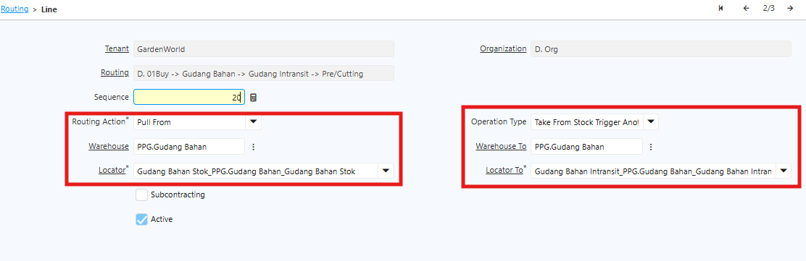
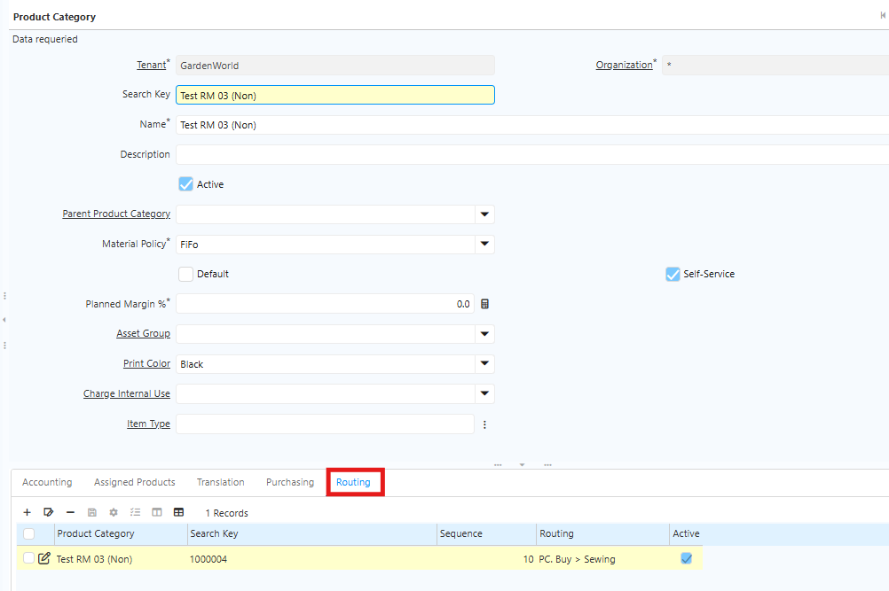
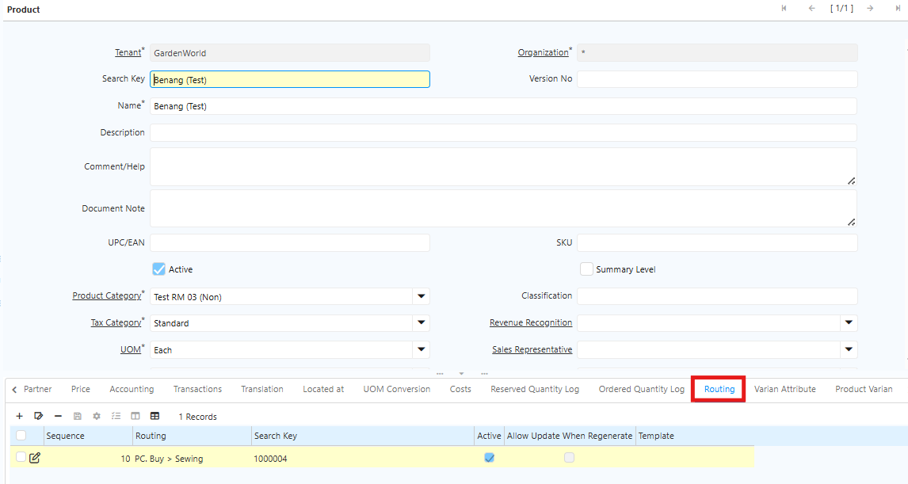
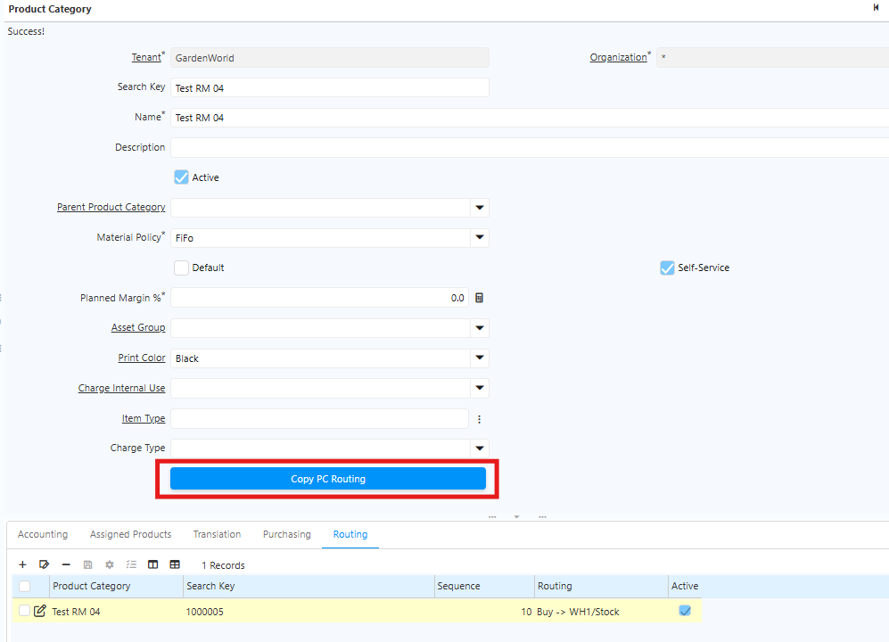
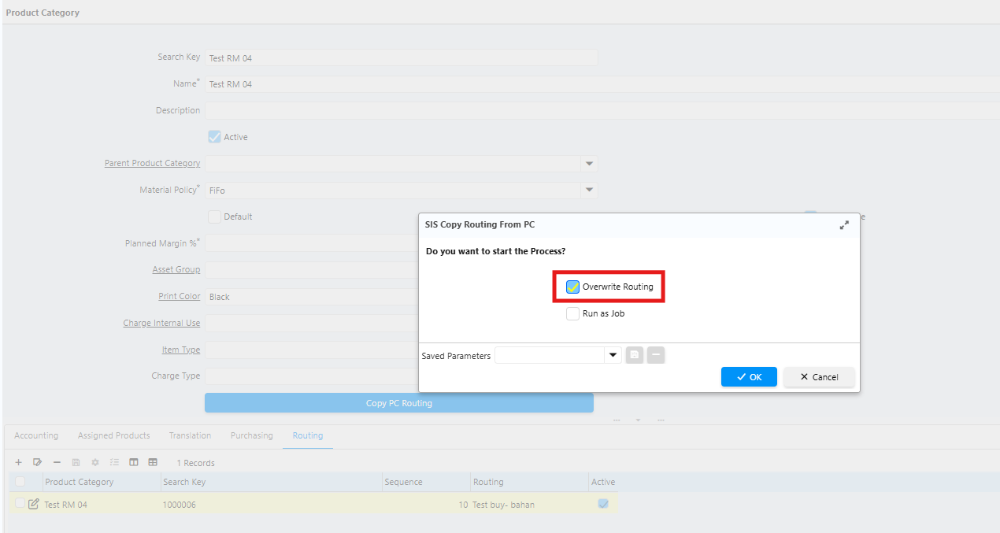

# Routing

Routing adalah konfigurasi yang menentukan alur proses suatu produk, mulai dari bahan baku, tahapan produksi, hingga menjadi produk jadi. Routing juga mengatur lokasi setiap proses dijalankan dan lokasi penyimpanan hasil proses tersebut.

Tanpa routing, proses produksi tetap dapat berjalan, tetapi perpindahan stok tidak tercatat secara otomatis dan alurnya menjadi tidak terstruktur. Kondisi ini dapat menyebabkan bahan baku tersimpan di lokasi yang salah dan hasil produksi tidak tercatat dengan benar.
## Pengaturan Warehouse & Locator

Sebelum membuat routing, pastikan konfigurasi **Warehouse** dan **Locator** sudah sesuai.

Warehouse merepresentasikan area penyimpanan fisik produk atau gudang. Di dalam warehouse terdapat struktur lokasi yang disebut Locator untuk menentukan posisi penyimpanan secara lebih detail, seperti rak, baris, atau bin.
### Langkah Pengaturan Warehouse & Locator

1. Buka Menu **Warehouse & Locator**
2. Klik **New**
3. Isi data Warehouse:
  - **Nama Warehouse**, contoh: WH-Bahan Baku
  - **Alamat Warehouse**, contoh: Jakarta

Di dalam warehouse terdapat line bernama Locator. Locator harus dibuat terlebih dahulu sebelum digunakan pada routing.  Ikuti langkah dibawah untuk mengatur locator:

  - Klik tab **Line Locator**
  - Klik **New**
  - Isi nama locator gudang
  - Isi field X, Y, Z sesuai kebutuhan operasional:
    * X untuk kolom rak
    * Y untuk baris rak
    * Z untuk slot dalam satu baris
  - Centang **Default** untuk locator utama gudang

4. Isi field berikut sesuai locator yang digunakan
  - Locator Stock
  - Locator Pre Manufacture
  - Locator Post Manufacture
  - Reservation Locator
5. Klik **Save**

Jika satu produk diproduksi di lebih dari satu gudang, misalnya Jakarta dan Surabaya, buat konfigurasi BoM (Bill of Material) terpisah sesuai lokasi produksi masing-masing. Routing nantinya akan mengikuti konfigurasi BoM tersebut.
## Jenis Action Routing
 
Routing memiliki beberapa jenis action yang digunakan untuk menentukan alur perpindahan barang.

| Action      | Fungsi                                              |
| ----------- | --------------------------------------------------- |
| Buy         | Proses pengadaan material melalui pembelian         |
| Manufacture | Proses memproduksi artikel                          |
| Pull From   | Menarik barang dari gudang sebelumnya (alur mundur) |
| Push To     | Mengirim barang ke gudang berikutnya (alur maju)    |
"Action Routing"{#Tabel4}

**Penggunaan Action Berdasarkan Jenis Produk**
- Raw Material dan Semi Finished Goods. Menggunakan action **Pull From**, dimulai dari proses pembelian atau proses sebelumnya hingga ke area pre-production.
- Finished Goods. Menggunakan action **Push To** dengan tujuan gudang induk atau gudang penjualan.
## Jenis Operation Routing

Routing memiliki tiga jenis operation:

| Operation Type                        | Fungsi                                                                      |
| ------------------------------------- | --------------------------------------------------------------------------- |
| Take from stock                       | Mengambil langsung dari stok yang tersedia                                  |
| Take from stock Trigger another rules | Mengambil dari stok, lalu menjalankan aturan lain jika stok tidak mencukupi |
| Trigger another rules                 | Langsung menjalankan aturan lain tanpa pengecekan stok                      |
"Operation Routing"{#Tabel5}
## Langkah Pengaturan Routing di Sistem

1. Buka Menu **SIS Routing**
2. Klik **New**
3. Isi Field **Search Key** dan **Nama** pada Header
4. Simpan header terlebih dahulu sebelum menambahkan line routing
5. Klik tab **Line**
6. Isi setiap field sesuai konfigurasi berikut:

 {#Figure64}

	Berikut field yang harus dikonfigurasi:

| Field          | Keterangan                                      |
| -------------- | ----------------------------------------------- |
| Routing Action | Aksi yang dijalankan sistem pada tahap tertentu |
| Warehouse      | Gudang asal material atau komponen              |
| Locator        | Lokasi pengambilan material atau komponen       |
| Operation Type | Jenis operasi yang menentukan logika proses     |
| Warehouse To   | Gudang tujuan hasil produksi                    |
| Locator To     | Lokasi penyimpanan hasil produksi               |
"Field Routing Line"{#Tabel6}

7. Ulangi untuk setiap tahapan proses dan pastikan **Line No** berurutan
8. Simpan setiap line sebelum menambahkan ke line berikutnya
9. Klik **Save**
## Implementasi Routing

Setiap jenis produk, seperti Raw Material, Semi Finished Goods, dan Finished Goods, umumnya memiliki routing yang berbeda karena proses produksinya dilakukan di warehouse yang berbeda.

Sebelum menjalankan produksi, lakukan konfigurasi routing pada level Product Category. Pastikan routing setiap produk sudah sesuai dengan alur produksi yang berlaku.

Satu routing dapat digunakan untuk beberapa produk selama proses produksi dan perpindahan barang menggunakan warehouse serta locator yang sama.
### Langkah Implementasi Routing di Product Category

1. Buka Menu **Product Category**

	 {#Figure65}

2. Pada Tab **Routing**, lakukan konfigurasi sesuai dengan alur produksi.
3. Klik **Save**

Routing juga dapat dikonfigurasi langsung pada level **Product**. Berikut langkah implementasi routing di Product:

1. Buka Menu **Product**

	 {#Figure66}

2. Pada Tab **Routing**, konfigurasi sesuai dengan alur produksi. 
3. Klik **Save**

### Field "Copy Routing"

Field **Copy Routing** berfungsi untuk menyalin routing yang telah dikonfigurasi di level Product Category ke produk-produk yang menggunakan kategori tersebut. Jika Product Category belum memiliki konfigurasi routing, user dapat menambahkan routing terlebih dahulu, kemudian menyalinnya ke produk yang sudah ada (_existing_).

Ikuti langkah berikut untuk menjalankan Copy Routing di Product Category:

1. Buka menu **Product Category**
2. Pada Tab **Routing**, lakukan konfigurasi sesuai dengan alur produksi.
3. Klik tombol **Copy Routing**

 {#Figure67}

4. Klik **ok**
5. Klik **save**

Di belakang layar, sistem memperbarui routing pada seluruh produk yang menggunakan Product Category tersebut. Namun, jika produk sudah memiliki konfigurasi routing sebelumnya, sistem mempertahankan routing yang ada dan tidak menimpanya.

> **Catatan:** Copy Routing hanya berfungsi untuk menyalin, bukan memperbarui. Produk yang sudah memiliki routing tidak akan ter-update meskipun Copy Routing dijalankan.

Field **Copy PC Routing** memiliki pilihan **Overwrite** dengan ketentuan berikut:

- **Jika Overwrite dicentang** — Sistem menghapus routing yang ada di product, kemudian menyalin konfigurasi routing dari Product Category ke product tersebut.
- **Jika Overwrite tidak dicentang** _(default)_ — Sistem mempertahankan routing yang sudah ada di product dan tidak menyalin konfigurasi routing dari Product Category.

 {#Figure68}
### Manufacturing Order

Manufacturing Order adalah dokumen perintah produksi yang terhubung langsung dengan routing.

Saat manufacturing order dibuat, sistem akan membaca routing dan otomatis menyiapkan seluruh tahapan operasi sesuai urutan proses produksi.

Ketika Production Order Planning dibuat, sistem otomatis menghasilkan manufacturing order berdasarkan urutan operasi yang sudah dikonfigurasi. Dengan routing yang tepat:

- Perpindahan stok tidak perlu dilakukan secara manual.
- Lokasi barang dapat dipantau secara real-time.
- Sistem mencatat seluruh perpindahan produk secara otomatis.
- Laporan produksi menjadi lebih akurat karena setiap proses tercatat di sistem.