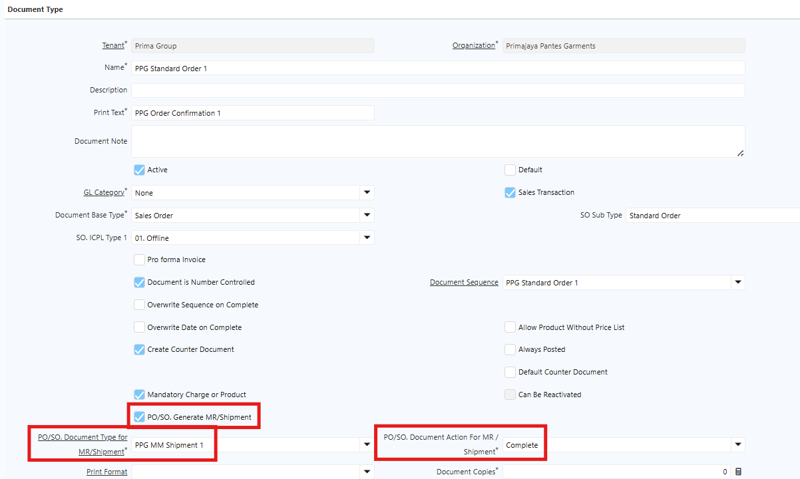
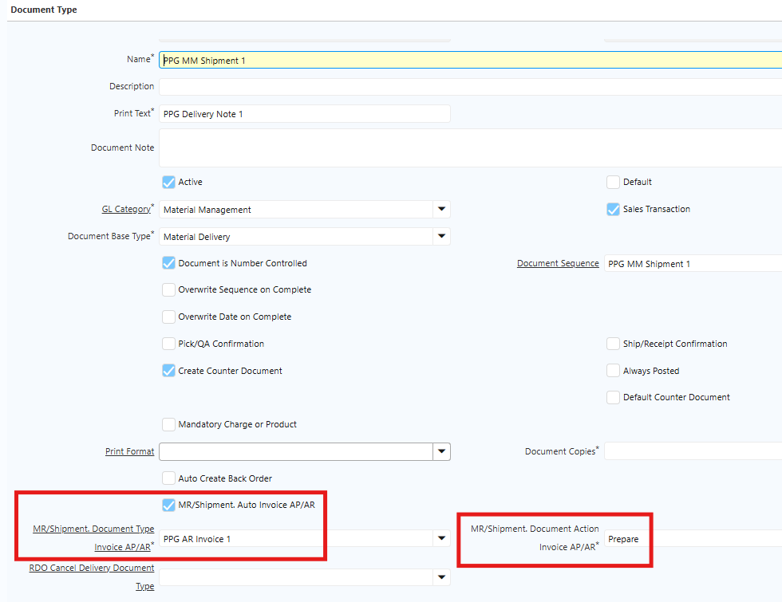
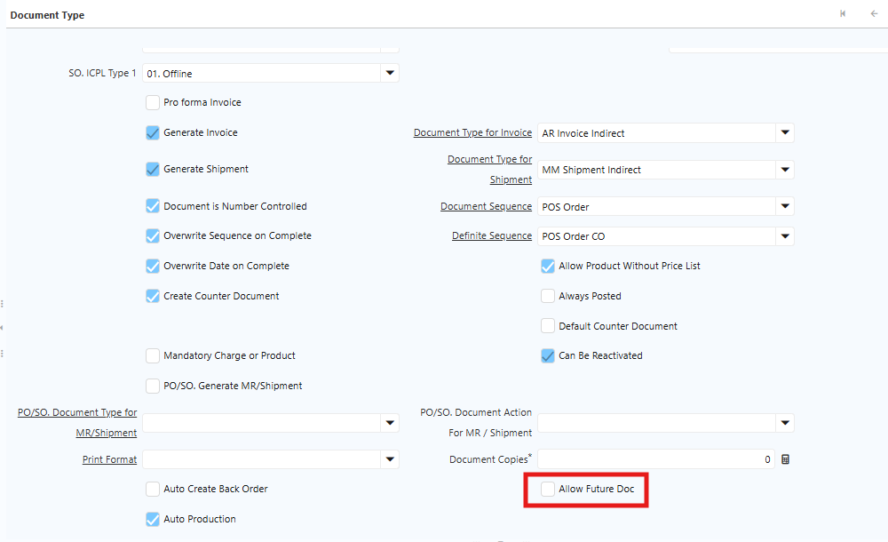
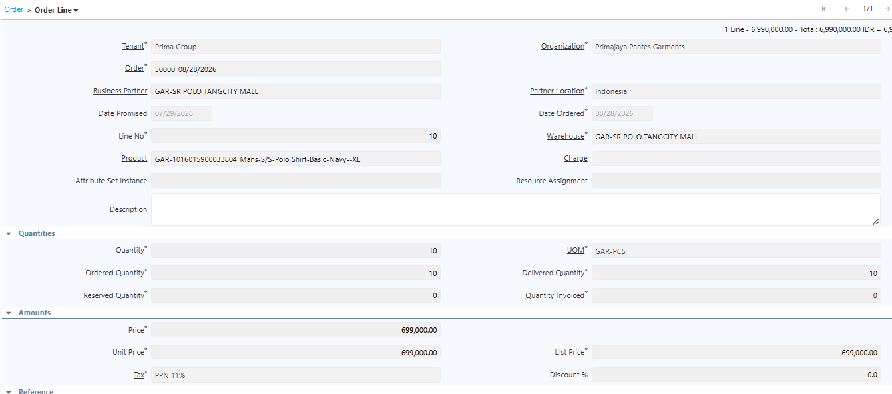
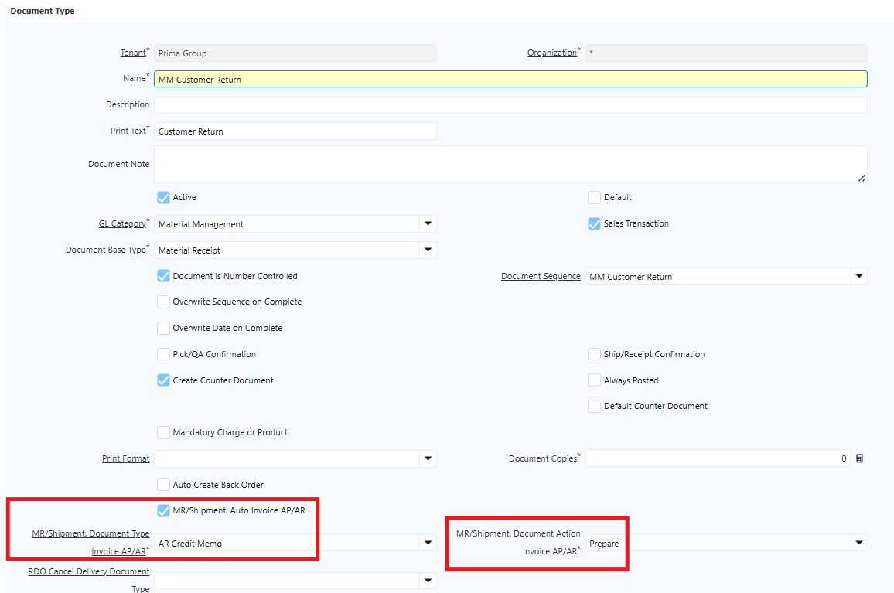

# Sales Order

**Sales Order** merupakan dokumen yang digunakan untuk mencatat dan mengelola pesanan customer sebelum barang diproses untuk pengiriman. Sales Order menjadi dasar dalam proses pemenuhan pesanan, termasuk proses **Shipment** dan pembuatan **Sales Invoice**.
## Konfigurasi Document Type Sales Order

Sebelum melakukan transaksi Sales Order, perlu dilakukan konfigurasi pada **Document Type Sales Order**. Konfigurasi ini digunakan untuk menentukan jenis order, sumber ICPL, serta proses otomatis yang dijalankan setelah Sales Order di-complete. Field yang perlu dikonfigurasi meliputi:

- **SO ICPL Type 1** — Digunakan untuk menentukan jenis ICPL yang digunakan pada Sales Order, yaitu ICPL Offline, Online, Intercompany, atau Stock Opname.
- **SO Sub Type**  — Dipilih Standard Order untuk transaksi Sales Order reguler.
- **PO/SO Generate MR/Shipment**  — Digunakan untuk mengaktifkan proses auto generate Shipment berdasarkan Sales Order saat dokumen di-complete.

 {#Figure279}

- **Document Action Shipment**  — Digunakan untuk menentukan status dokumen Shipment yang dihasilkan secara otomatis, sesuai dengan proses operasional yang diterapkan.
## Konfigurasi ICPL pada Warehouse

ICPL yang digunakan pada Sales Order ditentukan berdasarkan konfigurasi **Document Type** dan **Warehouse**. Document Type Sales Order akan mengambil informasi ICPL yang telah dikonfigurasi pada Warehouse.

Pada Warehouse, user perlu melakukan konfigurasi ICPL sesuai kebutuhan operasional, meliputi:

- ICPL Offline
- ICPL Online
- ICPL Stock Opname
- ICPL Intercompany

Setelah konfigurasi dilakukan, informasi ICPL yang sesuai akan terisi secara otomatis pada saat user membuat Sales Order berdasarkan Warehouse yang dipilih.
## Konfigurasi Auto Generate Sales Invoice

Fitur **Auto Invoice AP/AR** digunakan untuk membentuk Sales Invoice secara otomatis setelah dokumen Shipment di-complete. Dengan konfigurasi ini, user tidak perlu membuat Sales Invoice secara manual.

Konfigurasi dilakukan pada **Document Type MM Shipment** dengan langkah berikut:

1. Buka menu **Document Type**.
2. Pilih **MM Shipment** yang digunakan untuk transaksi Sales Order.
3. Centang **Auto Invoice AP/AR** untuk mengaktifkan proses auto generate invoice.
4. Pada field **Document Type Invoice AP/AR**, pilih Document Type invoice yang akan digunakan.
5. Pada field **Document Action Invoice AP/AR**, tentukan status invoice yang dihasilkan secara otomatis, yaitu **Prepare** atau **Complete**.

 {#Figure280}

6. Klik **Save**.

## Validasi Tanggal Transaksi

Allow Future Doc merupakan fitur yang digunakan untuk menentukan apakah Date Ordered pada transaksi dapat menggunakan tanggal di masa mendatang (_future date_).

 {#Figure279}

- Jika Allow Future Doc dicentang (_checked_), transaksi diperbolehkan menggunakan _future date_ pada Date Ordered.
- Jika Allow Future Doc tidak dicentang (_unchecked_), transaksi tidak diperbolehkan menggunakan _future date_ pada Date Ordered.
## Proses Sales Order

1. Buka menu **Sales Order**.
2. Pilih **Document Type** sesuai kebutuhan transaksi.
3. Input informasi pada bagian **Header**.
4. Pilih **Warehouse** yang digunakan untuk transaksi.
5. Sistem akan mengisi informasi **ICPL** dan **Price List** secara otomatis berdasarkan konfigurasi Warehouse.
6. Buka tab **Order Line**.
7. Input **Product** dan **Quantity**.

 {#Figure281}

8. Klik **Save**.
9. Klik **Complete** dokumen.

Setelah Sales Order di-complete, sistem akan membentuk **Shipment** secara otomatis apabila konfigurasi **PO/SO Generate MR/Shipment** telah diaktifkan pada Document Type Sales Order.
## Proses Shipment

Shipment merupakan dokumen yang digunakan untuk mencatat proses pengiriman barang kepada customer. Informasi Shipment yang terbentuk secara otomatis akan mengacu pada Sales Order, termasuk **Product, Quantity, Price**, dan informasi terkait lainnya. Proses Shipment:

1. Buka dokumen **Shipment** yang terbentuk dari Sales Order.
2. Periksa informasi shipment.
3. Klik **Save** apabila terdapat perubahan yang diperlukan.
4. Klik **Complete** untuk menyelesaikan dokumen Shipment.

Apabila konfigurasi **Auto Invoice AP/AR** telah diaktifkan pada Document Type Shipment, sistem akan membentuk **Sales Invoice** secara otomatis setelah Shipment di-complete.
## Proses Sales Invoice

Sales Invoice yang terbentuk secara otomatis akan mengacu pada informasi transaksi sebelumnya, termasuk **Product, Quantity, Price**, dan informasi terkait lainnya. Proses Sales Invoice:

1. Buka **Sales Invoice** yang terbentuk dari Shipment.
2. Periksa informasi invoice.
3. Klik **Save** apabila diperlukan.
4. Klik **Complete** untuk menyelesaikan Sales Invoice.

Status Sales Invoice setelah terbentuk akan mengikuti konfigurasi **Document Action Invoice AP/AR** pada Document Type Shipment.
## Customer Return

**Customer Return** merupakan transaksi yang digunakan untuk mencatat pengembalian barang dari customer. Proses Customer Return diawali dengan pembuatan **Customer RMA** sebagai dokumen referensi pengembalian barang.
### Konfigurasi Document Type Customer Return

Sebelum melakukan transaksi Customer Return, perlu dilakukan konfigurasi **Document Type** yang digunakan untuk proses penerimaan barang retur dari customer.

Langkah konfigurasi:

1. Buka menu **Document Type**.
2. Klik **New**.
3. Isi **Name** sesuai kebutuhan operasional.
4. Pada field **Document Base Type**, pilih **Material Receipt**.
5. Centang **Document Number Is Controlled**.
6. Centang **MR. Auto Invoice AP/AR** untuk mengaktifkan pembentukan invoice secara otomatis.
7. Pada field **MR. Document Type Invoice AP/AR**, pilih Document Type **AR Credit Memo** yang telah dikonfigurasi.
8. Pada field **MR. Document Action Invoice AP/AR**, tentukan status Credit Memo yang terbentuk secara otomatis, yaitu **Prepare** atau **Complete**.

 {#Figure282}

9. Klik **Save**.
### Proses Customer Return

#### Customer RMA

**Customer RMA** merupakan dokumen yang digunakan sebagai dasar dan referensi pengembalian barang dari customer. Customer RMA perlu dibuat terlebih dahulu sebelum transaksi Customer Return diproses. Langkah pembuatan Customer RMA:

1. Buka menu **Customer RMA**.
2. Input **Document Type**, **RMA Type**, dan referensi **Shipment** yang akan dikembalikan.
3. Klik **Create Lines From**.
4. Pilih Shipment yang menjadi dasar pengembalian.
5. Buka tab **RMA Line**.
6. Tentukan **Quantity** produk yang akan di-return.
7. Klik **Save**.
8. Klik **Complete**.
#### Customer Return

Setelah Customer RMA dibuat, user dapat melanjutkan proses penerimaan barang retur melalui Customer Return. Langkah proses Customer Return:

1. Buka menu **Customer Return**.
2. Pilih **Document Type** yang telah dikonfigurasi.
3. Tentukan **Movement Date**.
4. Pilih **Business Partner** customer.
5. Pilih **Warehouse** yang digunakan untuk menerima barang retur.
6. Klik **Create Lines From**.
7. Pilih dokumen **Customer RMA** yang telah dibuat.
8. Sistem akan mengisi **Customer Return Line** berdasarkan informasi pada RMA Line.
9. Periksa kembali Product dan Quantity yang akan diterima.
10. Klik **Save**
11. Klik **Complete**.

### Pembentukan AR Credit Memo

Saat **Customer Return** di-complete, sistem akan membentuk **AR Credit Memo** secara otomatis apabila konfigurasi **MR. Auto Invoice AP/AR** telah diaktifkan pada Document Type Customer Return.

AR Credit Memo yang terbentuk akan menggunakan **Document Type AR Credit Memo** dan **Document Action** sesuai dengan konfigurasi pada field **MR. Document Type Invoice AP/AR** dan **MR. Document Action Invoice AP/AR**.
