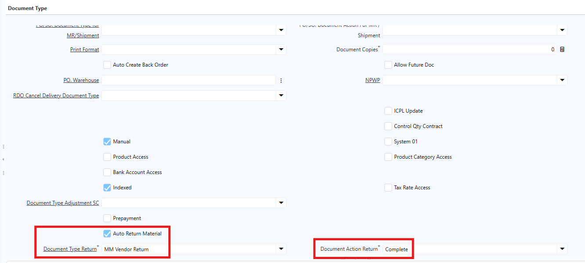
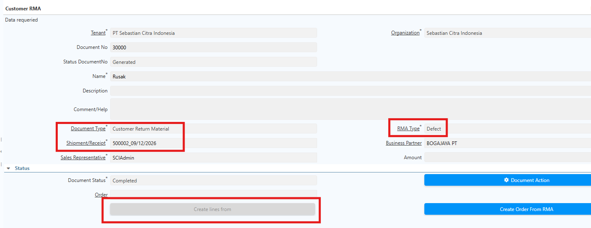
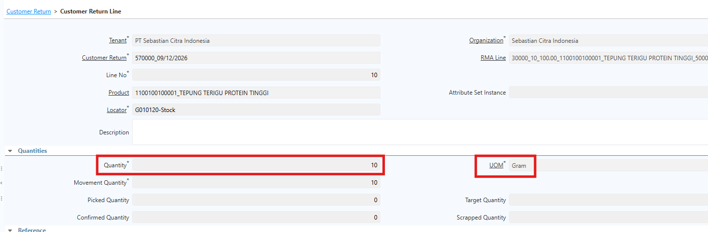
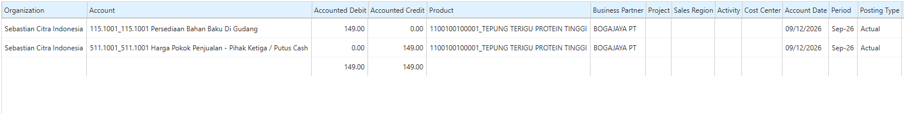
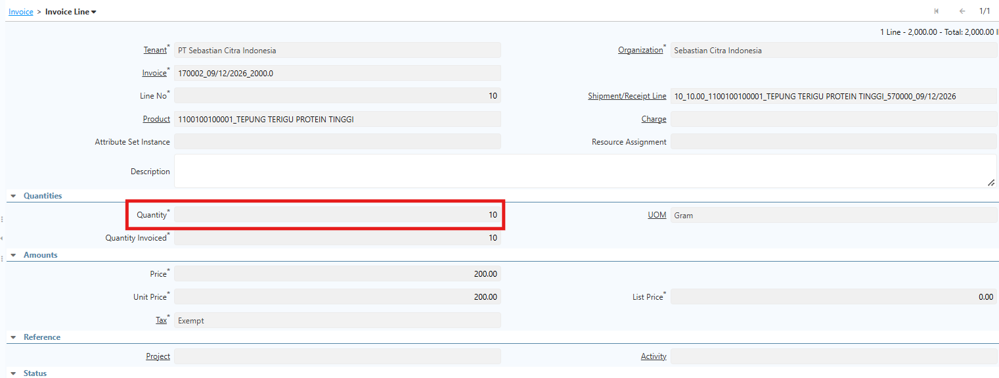
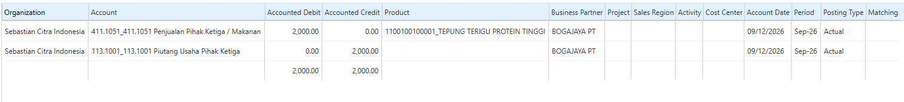
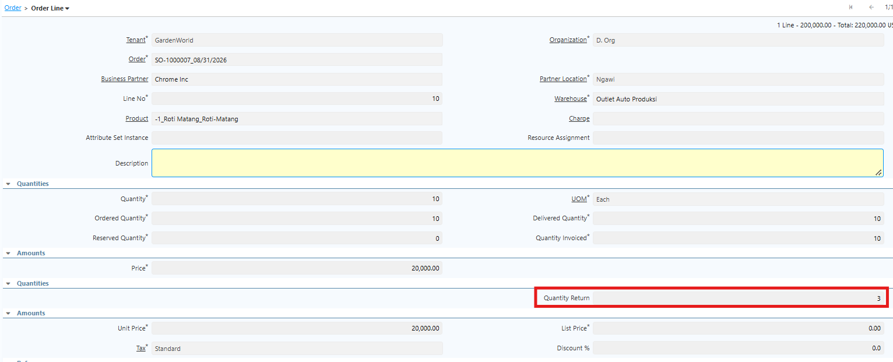
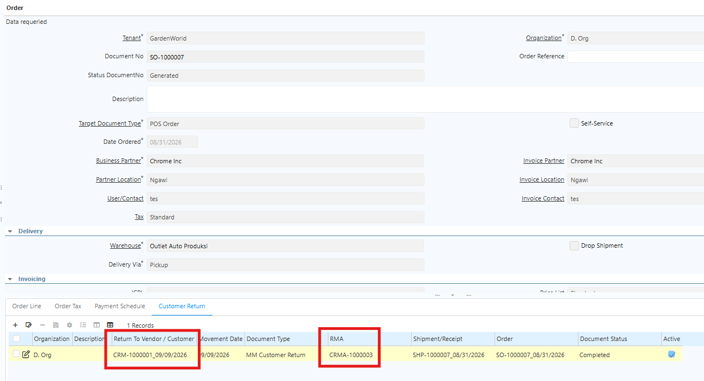

# Sales Order

**Sales Order** merupakan dokumen yang digunakan untuk mencatat dan mengelola pesanan customer sebelum barang diproses untuk pengiriman. Sales Order menjadi dasar dalam proses pemenuhan pesanan, termasuk proses **Shipment** dan pembuatan **Sales Invoice**.
## Konfigurasi Document Type Sales Order

Sebelum melakukan transaksi Sales Order, perlu dilakukan konfigurasi pada **Document Type Sales Order**. Konfigurasi ini digunakan untuk menentukan jenis order, sumber ICPL, serta proses otomatis yang dijalankan setelah Sales Order di-complete. Field yang perlu dikonfigurasi meliputi:

- **SO ICPL Type 1** — Digunakan untuk menentukan jenis ICPL yang digunakan pada Sales Order, yaitu ICPL Offline, Online, Intercompany, atau Stock Opname.
- **SO Sub Type**  — Dipilih Standard Order untuk transaksi Sales Order reguler.
- **PO/SO Generate MR/Shipment**  — Digunakan untuk mengaktifkan proses auto generate Shipment berdasarkan Sales Order saat dokumen di-complete.

 {#Figure279}

- **Document Action Shipment**  — Digunakan untuk menentukan status dokumen Shipment yang dihasilkan secara otomatis, sesuai dengan proses operasional yang diterapkan.
## Konfigurasi ICPL pada Warehouse

ICPL yang digunakan pada Sales Order ditentukan berdasarkan konfigurasi **Document Type** dan **Warehouse**. Document Type Sales Order akan mengambil informasi ICPL yang telah dikonfigurasi pada Warehouse.

Pada Warehouse, user perlu melakukan konfigurasi ICPL sesuai kebutuhan operasional, meliputi:

- ICPL Offline
- ICPL Online
- ICPL Stock Opname
- ICPL Intercompany

Setelah konfigurasi dilakukan, informasi ICPL yang sesuai akan terisi secara otomatis pada saat user membuat Sales Order berdasarkan Warehouse yang dipilih.
## Konfigurasi Auto Generate Sales Invoice

Fitur **Auto Invoice AP/AR** digunakan untuk membentuk Sales Invoice secara otomatis setelah dokumen Shipment di-complete. Dengan konfigurasi ini, user tidak perlu membuat Sales Invoice secara manual.

Konfigurasi dilakukan pada **Document Type MM Shipment** dengan langkah berikut:

1. Buka menu **Document Type**.
2. Pilih **MM Shipment** yang digunakan untuk transaksi Sales Order.
3. Centang **Auto Invoice AP/AR** untuk mengaktifkan proses auto generate invoice.
4. Pada field **Document Type Invoice AP/AR**, pilih Document Type invoice yang akan digunakan.
5. Pada field **Document Action Invoice AP/AR**, tentukan status invoice yang dihasilkan secara otomatis, yaitu **Prepare** atau **Complete**.

 {#Figure280}

6. Klik **Save**.

## Validasi Tanggal Transaksi

Allow Future Doc merupakan fitur yang digunakan untuk menentukan apakah Date Ordered pada transaksi dapat menggunakan tanggal di masa mendatang (_future date_).

 {#Figure279}

- Jika Allow Future Doc dicentang (_checked_), transaksi diperbolehkan menggunakan _future date_ pada Date Ordered.
- Jika Allow Future Doc tidak dicentang (_unchecked_), transaksi tidak diperbolehkan menggunakan _future date_ pada Date Ordered.
## Proses Sales Order

1. Buka menu **Sales Order**.
2. Pilih **Document Type** sesuai kebutuhan transaksi.
3. Input informasi pada bagian **Header**.
4. Pilih **Warehouse** yang digunakan untuk transaksi.
5. Sistem akan mengisi informasi **ICPL** dan **Price List** secara otomatis berdasarkan konfigurasi Warehouse.
6. Buka tab **Order Line**.
7. Input **Product** dan **Quantity**.

 {#Figure281}

8. Klik **Save**.
9. Klik **Complete** dokumen.

Setelah Sales Order di-complete, sistem akan membentuk **Shipment** secara otomatis apabila konfigurasi **PO/SO Generate MR/Shipment** telah diaktifkan pada Document Type Sales Order.
## Proses Shipment

Shipment merupakan dokumen yang digunakan untuk mencatat proses pengiriman barang kepada customer. Informasi Shipment yang terbentuk secara otomatis akan mengacu pada Sales Order, termasuk **Product, Quantity, Price**, dan informasi terkait lainnya. Proses Shipment:

1. Buka dokumen **Shipment** yang terbentuk dari Sales Order.
2. Periksa informasi shipment.
3. Klik **Save** apabila terdapat perubahan yang diperlukan.
4. Klik **Complete** untuk menyelesaikan dokumen Shipment.

Apabila konfigurasi **Auto Invoice AP/AR** telah diaktifkan pada Document Type Shipment, sistem akan membentuk **Sales Invoice** secara otomatis setelah Shipment di-complete.
## Proses Sales Invoice

Sales Invoice yang terbentuk secara otomatis akan mengacu pada informasi transaksi sebelumnya, termasuk **Product, Quantity, Price**, dan informasi terkait lainnya. Proses Sales Invoice:

1. Buka **Sales Invoice** yang terbentuk dari Shipment.
2. Periksa informasi invoice.
3. Klik **Save** apabila diperlukan.
4. Klik **Complete** untuk menyelesaikan Sales Invoice.

Status Sales Invoice setelah terbentuk akan mengikuti konfigurasi **Document Action Invoice AP/AR** pada Document Type Shipment.
## Customer Return

Customer Return digunakan untuk memproses pengembalian barang dari customer atas barang yang sebelumnya dikirim melalui proses penjualan. Saat proses ini dijalankan, sistem menambah stok, mencatat transaksi pengembalian, dan menjaga konsistensi data inventory serta transaksi penjualan.

Proses Customer Return dimulai dari **Sales Order**, kemudian dilanjutkan dengan pembuatan **RMA Type**, **Customer RMA**, **Customer Return**, dan **AR Credit Memo**. Proses dari Customer RMA hingga AR Credit Memo dapat dilakukan dalam satu rangkaian proses.
### Konfigurasi Document Type Customer RMA

Sebelum melakukan proses Customer RMA, lakukan konfigurasi pada Document Type Customer RMA:

1. Buka menu **Document Type**.
2. Klik **New**.
3. Isi **Name** sesuai kebutuhan operasional.
4. Pada field **Document Base Type**, pilih **Sales Order**.
5. Centang field **Auto Return Material**.
6. Tentukan **Document Type** dan **Document Action** atas return.

 {#Figure294}

7. Klik **Save**.
### Konfigurasi Document Type Customer Return

Sebelum melakukan transaksi Customer Return, perlu dilakukan konfigurasi **Document Type** yang digunakan untuk proses penerimaan barang retur dari customer. Langkah konfigurasi:

1. Buka menu **Document Type**.
2. Klik **New**.
3. Isi **Name** sesuai kebutuhan operasional.
4. Pada field **Document Base Type**, pilih **Material Receipt**.
5. Centang **Document Number Is Controlled**.
6. Centang **MR. Auto Invoice AP/AR** untuk mengaktifkan pembentukan invoice secara otomatis.
7. Pada field **MR. Document Type Invoice AP/AR**, pilih Document Type **AR Credit Memo** yang telah dikonfigurasi.
8. Pada field **MR. Document Action Invoice AP/AR**, tentukan status Credit Memo yang terbentuk secara otomatis, yaitu **Prepare** atau **Complete**.

 {#Figure282}

9. Klik **Save**.
### Proses Customer Return

#### Customer RMA

Customer RMA berfungsi sebagai dokumen otorisasi pengembalian barang dari customer dan menghubungkan proses Customer Return dengan Shipment yang menjadi referensi. UoM yang dikonfigurasi di Customer RMA otomatis disalin ke dokumen **Customer Return** dan **AR Credit Memo**, sehingga UoM pada ketiga dokumen tetap selaras. Ikuti langkah berikut untuk membuat Customer RMA:

1. Buka menu **Customer RMA**.
2. Pilih **Document Type**.
3. Tentukan **RMA Type**.
4. Pada field **Shipment**, pilih dokumen **Shipment** yang akan direferensikan.
5. Klik **Create Lines From**.

 {#Figure295}

6. Tentukan **quantity** produk yang akan di-return.
7. Klik **Create Line From RMA**.
8. Sistem otomatis membuat RMA Line berdasarkan line yang dipilih.
9. Verifikasi **quantity** dan **UoM** di RMA Line.
10. Klik **Save**.
11. Klik **Complete**.

Saat Customer RMA di-complete, sistem otomatis membuat dokumen **Customer Return** dengan status sesuai konfigurasi Document Type Customer RMA.
#### Customer Return

1. Buka menu **Customer Return**.
2. Cari dokumen Customer Return yang ter-create dengan menginput nomor dokumen **Customer RMA**.
3. Informasi dari Customer RMA — termasuk quantity, price, UoM, dan informasi Business Partner — otomatis tersalin ke **Customer Return Line**.

 {#Figure296}

4. Klik **Complete**.

 {#Figure297}
### Pembentukan AR Credit Memo

Saat **Customer Return** di-complete, sistem akan membentuk **AR Credit Memo** secara otomatis apabila konfigurasi **MR. Auto Invoice AP/AR** telah diaktifkan pada Document Type Customer Return.

AR Credit Memo yang terbentuk akan menggunakan **Document Type AR Credit Memo** dan **Document Action** sesuai dengan konfigurasi pada field **MR. Document Type Invoice AP/AR** dan **MR. Document Action Invoice AP/AR**.

 {#Figure298}

 {#Figure299}
## Informasi Customer Return di Sales Order

Saat customer melakukan return produk berdasarkan Shipment yang berasal dari Sales Order, informasi return tersebut otomatis tercatat di **Order Line**. Field **Qty Return** pada Order Line terisi otomatis sesuai quantity produk yang di-return. Jika tidak ada return, nilai Qty Return akan tetap **0**.

 {#Figure285}

Informasi dokumen Customer Return juga ditampilkan pada tab **Customer Return** di Sales Order. Tab ini muncul secara otomatis dan menampilkan detail dokumen return jika terdapat produk yang dikembalikan oleh customer.

 {#Figure286}