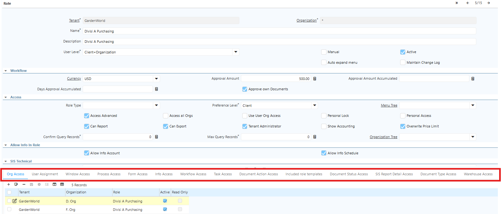
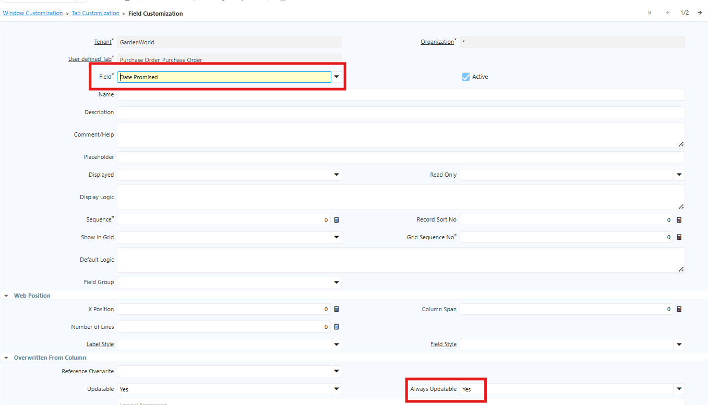
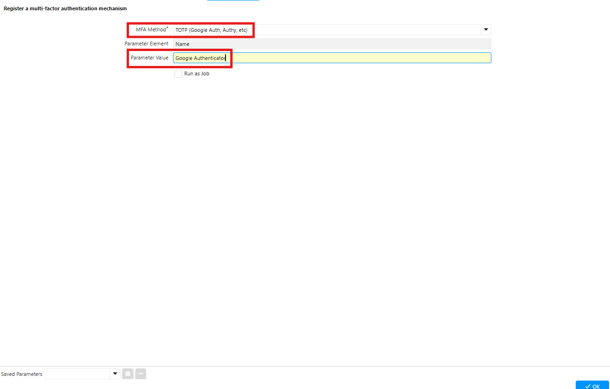
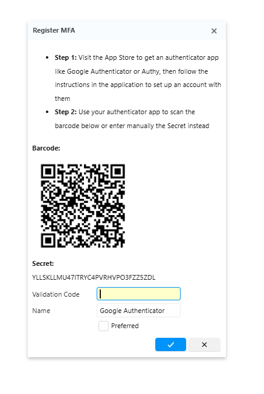

# Security di iDempiere

iDempiere menerapkan mekanisme keamanan berbasis **Role-Based Access Control (RBAC)**. Hak akses setiap pengguna ditentukan berdasarkan **Role** yang dimiliki. Selain itu, sistem mendukung **audit trail** untuk mencatat perubahan data pada field tertentu sehingga proses audit dapat dilakukan dengan lebih mudah dan terkontrol.

Hierarki keamanan di iDempiere terdiri dari:

- **Client (Tenant)** → Mewakili perusahaan atau entitas bisnis tertinggi.
- **Organization (Org)** → Mewakili unit bisnis di bawah Client, seperti cabang, divisi, atau departemen.
- **Role** → Mendefinisikan hak akses terhadap window, form, process, report, task, dan komponen sistem lainnya.
- **User** → Mewakili pengguna sistem yang memiliki satu atau lebih Role.

Setiap User memiliki **username** dan **password** untuk mengakses sistem. Seorang User dapat memiliki lebih dari satu Role, namun saat login hanya dapat mengaktifkan satu Role. Role yang dipilih akan menentukan menu, proses, laporan, dan fitur yang dapat diakses selama sesi login tersebut.
## Konfigurasi di Level Sistem

Sebelum mengonfigurasi User dan Role, lakukan konfigurasi parameter sistem berikut:

- **Parameter** : `SIS_ActivateAccessDocBasedOnDocTypeAccess`
- **Configured Value** : `Y`

Parameter ini mengaktifkan mekanisme pembatasan **Document Type Access** berdasarkan konfigurasi pada Role. Dengan konfigurasi ini, setiap Role hanya dapat menggunakan Document Type yang telah diberikan hak akses.
## Membuat Master Data User

Buat terlebih dahulu master data User sebelum membuat Role. Setiap pengguna yang akan mengakses sistem harus memiliki akun tersendiri agar hak akses dapat dikelola secara terpisah.

Langkah-langkah membuat User adalah sebagai berikut:

1. Buka menu **User**.
2. Isi **Search Key** dan **Name**.
3. Tentukan **Username** dan **Password** yang akan digunakan untuk login.
4. Simpan data dengan klik **Save**.

Autentikasi password mengikuti kebijakan keamanan masing-masing perusahaan. Sistem juga mendukung **Two-Factor Authentication (2FA)** untuk meningkatkan keamanan proses login. Salah satu aplikasi autentikator yang dapat digunakan adalah **Google Authenticator**.
## Membuat Role dan Implementasi User

Setelah master data User tersedia, buat Role sesuai kebutuhan masing-masing divisi atau fungsi bisnis. Seluruh konfigurasi hak akses, mulai dari menu hingga Document Type, dilakukan pada Role.

Langkah-langkah membuat Role adalah sebagai berikut:

1. Buka menu **Role**.
2. Lengkapi seluruh field pada bagian header sesuai kebutuhan.
3. Centang **Maintain Change Log** untuk mengaktifkan pencatatan riwayat perubahan (audit trail) pada transaksi dan data yang diproses oleh Role tersebut.
4. Lakukan konfigurasi pada tab-tab berikut:
  - **Org Access** → Menentukan Organization yang dapat diakses oleh Role.
  - **User Assignment** → Menetapkan User yang menggunakan Role tersebut.
  - **Window Access** → Menentukan menu (window) yang dapat diakses.
  - **Process Access** → Menentukan process yang dapat dijalankan.
  - **Document Action Access** → Menentukan aksi yang dapat dilakukan terhadap suatu dokumen, seperti **Complete**, **Void**, **Reverse Correct**, atau **Reactivate**.
  - **Document Type Access** → Menentukan Document Type yang dapat digunakan oleh Role pada saat membuat transaksi. Konfigurasi ini juga membatasi pilihan Document Type yang muncul pada header transaksi di setiap window.

 {#Figure130}

5. Setelah seluruh konfigurasi selesai, klik **Save**.

Dengan konfigurasi tersebut, setiap User hanya dapat mengakses Organization, menu, process, dan Document Type sesuai hak akses yang diberikan melalui Role. Pendekatan ini membantu menjaga keamanan data, membatasi akses berdasarkan tanggung jawab pengguna, serta memastikan setiap aktivitas dalam sistem berjalan sesuai dengan otorisasi yang telah ditetapkan.
## Window Customization

Menu **Window Customization** di iDempiere digunakan untuk menyesuaikan tampilan (_user interface_) suatu window tanpa mengubah struktur inti (_core_) aplikasi. Fitur ini memungkinkan administrator mengatur tampilan window sesuai kebutuhan bisnis, role, atau preferensi perusahaan.

Window Customization umumnya digunakan untuk meningkatkan kemudahan penggunaan (_usability_), menyederhanakan tampilan, dan mengurangi risiko kesalahan input. Namun, memberikan akses perubahan data krusial kepada pengguna yang tidak berwenang dapat menimbulkan risiko operasional — mulai dari kesalahan transaksi hingga terhentinya proses bisnis. Oleh karena itu, hak akses harus dikelola secara ketat, setiap perubahan harus melalui proses persetujuan dan pengujian, serta didukung **audit trail** agar seluruh perubahan dapat dipantau dan dipertanggungjawabkan.

Ikuti langkah berikut untuk melakukan konfigurasi Window Customization:

1. Buka menu **Window Customization**.
2. Tentukan **window** yang akan dikonfigurasi.
3. Tentukan **role** yang akan diberikan akses.
4. Masuk ke tab **Customization**.
5. Masuk ke tab **Field Customization**.
6. Tambahkan field-field yang perlu diakses oleh role tersebut.
7. Pada field **Always Updatable**, pilih **Yes**.

 {#Figure129}

8. Klik **Save**.
## Autentikasi Two-Factor (2FA)

Konfigurasi **Multi-Factor Authentication (MFA)** atau **Two-Factor Authentication (2FA)** di iDempiere bertujuan menambahkan lapisan keamanan saat user melakukan login. Selain memasukkan **username** dan **password**, user juga harus melakukan verifikasi kedua menggunakan **OTP (One-Time Password)** melalui aplikasi authenticator.

Secara default, iDempiere belum menyediakan fitur MFA secara bawaan (_native_). Implementasi MFA dilakukan melalui pengembangan (_customization_) atau integrasi dengan penyedia layanan autentikasi eksternal. Untuk implementasi di iDempiere, metode **TOTP** merupakan pilihan paling aman karena tidak bergantung pada layanan pihak ketiga setelah proses registrasi.
### Konfigurasi di Sistem

Untuk mengimplementasikan MFA, administrator perlu mengkonfigurasi parameter sistem berikut:

| Parameter                             | Keterangan                                                                                                           |
| ------------------------------------- | -------------------------------------------------------------------------------------------------------------------- |
| MFA_REGISTERED_DEVICE_EXPIRATION_DAYS | Menentukan masa berlaku trusted device yang telah terdaftar untuk proses autentikasi MFA. Nilai default: **30 hari** |
| ZK_SESSION_TIMEOUT_IN_SECONDS         | Menentukan durasi timeout selama berada di sistem.                                                                   |

### Registrasi MFA

Sebelum mengaktifkan MFA, user perlu melakukan registrasi di sistem dan menginstall aplikasi **Google Authenticator** untuk menerima kode OTP. Ikuti langkah berikut untuk registrasi MFA:

1. Buka menu **Register MFA**.
2. Pilih metode MFA yang akan digunakan — disarankan menggunakan **TOTP**.
3. Input **Parameter Value** dengan **Google Authenticator**.

 {#Figure127}

4. Klik **OK**.
5. Sistem menampilkan **QR Code**.

 {#Figure128}

6. Pindai QR Code menggunakan aplikasi **Google Authenticator**.
7. Masukkan **OTP** untuk proses aktivasi.
8. Klik **OK**.
9. Jika OTP valid, MFA dinyatakan **aktif**.

Setelah MFA aktif, user wajib memasukkan kode OTP dari aplikasi Google Authenticator setiap kali login. Kode OTP berubah setiap menit, sehingga akun tidak dapat diakses oleh pihak lain. Jika kode yang dimasukkan salah, percobaan login akan gagal.