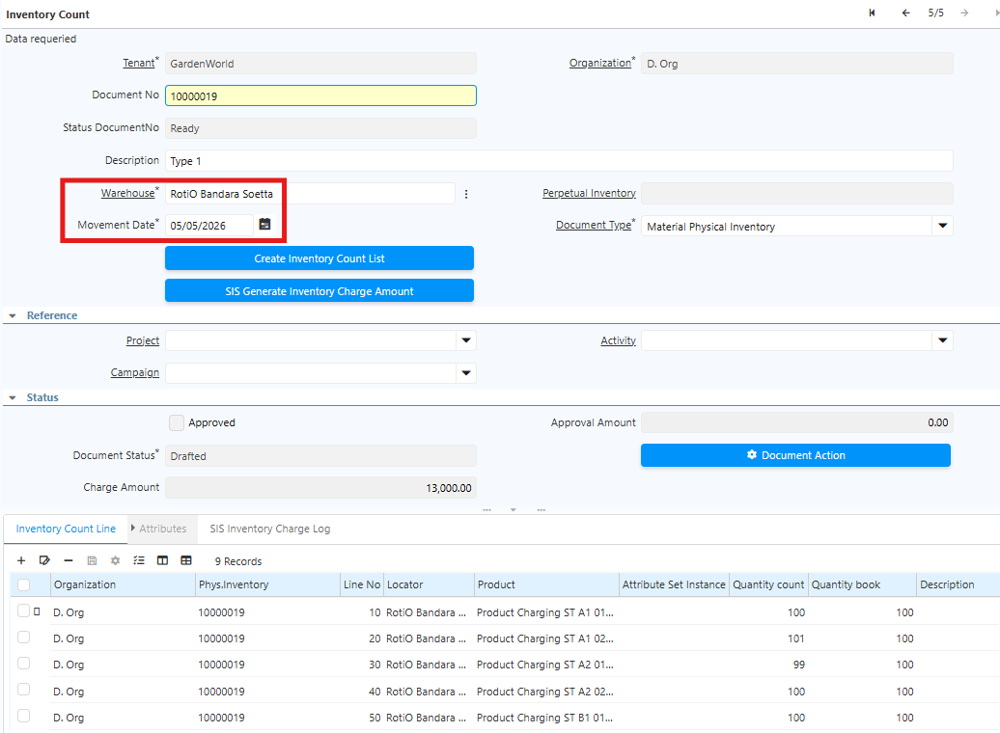
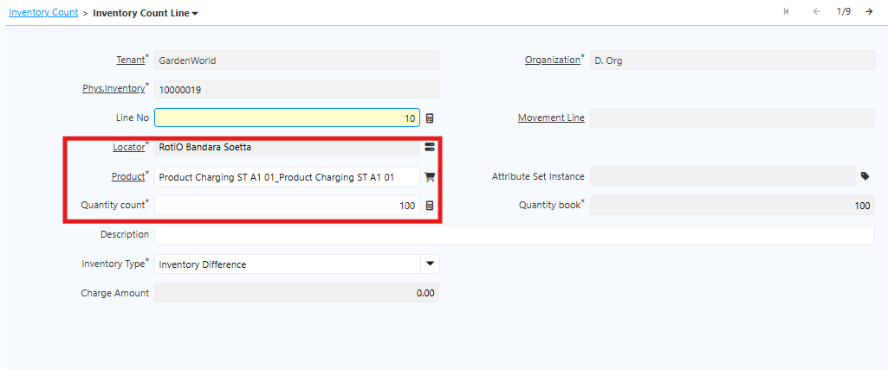

# Stock Opname Charging

Stock opname charging adalah proses perhitungan dan verifikasi fisik stock material charging — yaitu bahan atau komponen yang digunakan dalam proses produksi. Hasil perhitungan fisik kemudian disesuaikan dengan data yang ada di sistem.

## Tipe Charging untuk Stock Opname

Di SCI, terdapat 4 tipe charging untuk stock opname:

1. **Tipe 1** — Stock Opname Charge Induk Non UoM

	- Sistem merangkum (summary) selisih quantity per category charge.

	- Sub category charge membedakan harga di masing-masing sub category.

	- Pastikan konfigurasi sub category charge sesuai ketentuan: harga tertinggi dalam category yang sama harus memiliki sequence terkecil.

	
	- Set charge multiply rate pada artikel yang memiliki faktor pengali

2. **Tipe 2** — Stock Opname Charge Induk dengan UoM

	- Category charge mereferensikan UoM yang digunakan untuk konversi dalam kelompok kategori. UoM yang digunakan adalah UoM terbesar dalam kelompok tersebut.

	
	- Artikel dengan Base UoM yang berbeda dari UoM referensi di category charge harus memiliki UoM Conversion ke UoM referensi tersebut.

3. **Tipe 3** — Stock Opname Charge Asosiasi Berdasarkan Bill of Material (BoM)

	- Category charge mereferensikan Bill of Material yang diasosiasikan ke masing-masing artikel dalam BoM tertentu untuk perhitungan charge.

	- Konfigurasi sequence harus mengikuti urutan berikut: **Raw Material → Barang Jual → Barang Kemas**.

4. **Tipe 4** — Stock Opname Charge Minus Mutlak Berdasarkan Kategori

	- Category charge dibedakan menjadi dua: **Dibebankan** dan **Tidak Dibebankan**.

	- Konfigurasi sequence harus mengikuti urutan berikut: **Charge → Non Charge**.

## Proses Stock Opname di Sistem

Ikuti langkah-langkah berikut untuk membuat dokumen stock opname:

1. Buka menu **Physical Inventory**
2. Klik **New**
3. Input **Warehouse** yang akan diopname
4. Input **Movement Date** — masukkan tanggal pelaksanaan opname

	 {#Figure51}

5. Klik **Save**
6. Masuk ke tab **Inventory Count Line**
7. Klik **New**
8. Input **Produk Charging** yang akan dihitung
9. Input **Locator** — pilih lokasi penyimpanan produk
10. Input **Quantity Count** — masukkan jumlah fisik hasil perhitungan aktual

	 {#Figure52}

	
11. Sistem otomatis menampilkan **Quantity Book**

12. Ulangi langkah 7-11 untuk setiap produk
13. Klik **Save**
14. Jalankan **SIS Generate Inventory Charge Amount** — sistem menghitung dan menampilkan kalkulasi charge amount untuk seluruh produk.
15. Klik **Complete**