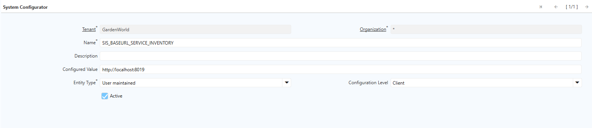
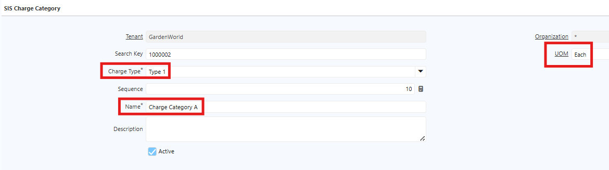
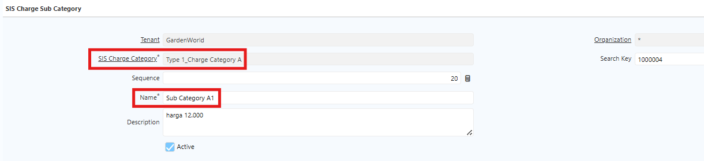
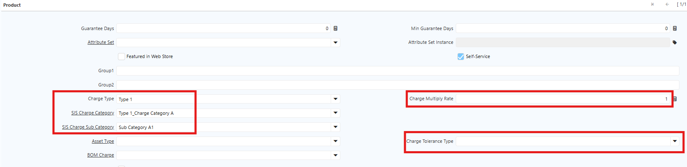

# Stock Opname Charging

Stock opname charging adalah proses perhitungan dan verifikasi fisik stock material charging — yaitu bahan atau komponen yang digunakan dalam proses produksi. Hasil perhitungan fisik kemudian disesuaikan dengan data yang ada di sistem.

## Tipe Charging untuk Stock Opname

Di SCI, terdapat 4 tipe charging untuk stock opname:

1. **Tipe 1** — Stock Opname Charge Induk Non UoM
  - Sistem merangkum (summary) selisih quantity per category charge.
  - Sub category charge membedakan harga di masing-masing sub category.
  - Pastikan konfigurasi sub category charge sesuai ketentuan: harga tertinggi dalam category yang sama harus memiliki sequence terkecil.
  - Set charge multiply rate pada artikel yang memiliki faktor pengali

2. **Tipe 2** — Stock Opname Charge Induk dengan UoM
  - Category charge mereferensikan UoM yang digunakan untuk konversi dalam kelompok kategori. UoM yang digunakan adalah UoM terbesar dalam kelompok tersebut.
  - Artikel dengan Base UoM yang berbeda dari UoM referensi di category charge harus memiliki UoM Conversion ke UoM referensi tersebut.

3. **Tipe 3** — Stock Opname Charge Asosiasi Berdasarkan Bill of Material (BoM)
  - Category charge mereferensikan Bill of Material yang diasosiasikan ke masing-masing artikel dalam BoM tertentu untuk perhitungan charge.
  - Konfigurasi sequence harus mengikuti urutan berikut: **Raw Material → Barang Jual → Barang Kemas**.

4. **Tipe 4** — Stock Opname Charge Minus Mutlak Berdasarkan Kategori
  - Category charge dibedakan menjadi dua: **Dibebankan** dan **Tidak Dibebankan**.
  - Konfigurasi sequence harus mengikuti urutan berikut: **Charge → Non Charge**.
5. **Tipe 5** — Stock Opname Charge Khusus Brand (PPG). Tipe ini adalah tipe charging khusus untuk Brand yang diterapkan untuk tim PPG. Mekanisme perhitungannya adalah sebagai berikut:
  - Perhitungan 1 — Jumlahkan seluruh selisih Total Bruto (ICPL). Nilai bruto diambil dari ICPL.
  - Perhitungan 2 — Kurangi hasil perhitungan 1 dengan Total Bruto tertinggi.
  - Perhitungan 3 — Kalikan hasil perhitungan 2 dengan 50% untuk menentukan varian selisih.
  - Perhitungan 4 — Jika hasil perhitungan 3 bernilai **minus (negatif)**, tambahkan Total Netto tertinggi. Jika bernilai **positif**, penambahan Total Netto tertinggi tidak diperlukan.
  - Nilai hilang barang diambil dari **Total Netto tertinggi**.
  
## Konfigurasi API

Konfigurasi API ini bertujuan untuk mengambil data harga netto produk yang digunakan dalam stock opname, bersumber dari aplikasi Sky. Ikuti langkah berikut untuk melakukan konfigurasi API di System Configurator:
1. Buka menu **System Configurator**
2. Klik **New**
3. Input nama configurator: **SIS_BASEURI_SERVICE_INVENTORY**
4. Pada field **Configured Value**, input: http://localhost:8019
5. Klik **save**

 {#Figure77}

Setelah konfigurasi selesai, sistem akan menampilkan data harga netto produk melalui API di tab **SIS Inventory Charge Log** setiap kali stock opname charging dijalankan. Jika produk tidak memiliki harga netto, sistem otomatis menggunakan harga default sebesar 75% dari ICPL.
## Konfigurasi Product untuk Stock Opname

Tidak semua product dilakukan stock opname — hanya product tertentu yang telah dipilah oleh perusahaan. Sebelum menjalankan stock opname, lakukan konfigurasi product beserta charge type-nya terlebih dahulu.

Perusahaan menggunakan 5 tipe charge. Sebelum mengkonfigurasi product charge stock opname, pastikan Charge Category dan Charge Sub Category sudah dikonfigurasi terlebih dahulu.
### Konfigurasi Master Charge Category

1. Buka menu **SIS Charge Category**
2. Klik New
3. Tentukan **Charge Type** sesuai kebutuhan
4. Input nama **Charge Category**
5. Tentukan UoM sesuai kebutuhan
6. Klik save

 {#Figure91}

### Konfigurasi Master Charge Sub Category

Charge Sub Category digunakan untuk perhitungan charge stock opname **Tipe 1**. Ikuti langkah berikut:

1. Buka menu **SIS Charge Sub Category**
2. Klik New
3. Tentukan **Charge Category**
4. Input nama **Charge Sub Category**
5. Klik save

{#Figure92}

### Konfigurasi Charge Type pada Product

Setelah Charge Category dan Charge Sub Category selesai dikonfigurasi, lakukan konfigurasi charge type pada masing-masing product. Ikuti langkah berikut:

1. Buka menu Product
2. Isi field-field yang dibutuhkan
3. Pada field **Charge Type** tentukan tipe sesuai kebijakan
4. Pada field **SIS Charge Category** pilih kategory sesuai kebijakan
5. Pada field **SIS Charge Sub Category** pilih sub kategori sesuai kebijakan
6. Pada field **Charge Multiply Rate** tentukan nilai sesuai kebijakan
7. Pada field **Charge Tolerance** tentukan nilai sesuai kebijakan
8. Klik save

 {#Figure93}

Product yang telah dikonfigurasi siap digunakan untuk charge stock opname sesuai kebutuhan operasional perusahaan.
## Proses Stock Opname di Sistem

Ikuti langkah-langkah berikut untuk membuat dokumen stock opname:
1. Buka menu **Physical Inventory**
2. Klik **New**
3. Input **Warehouse** yang akan diopname
4. Input **Movement Date** — masukkan tanggal pelaksanaan opname

	 {#Figure51}

5. Klik **Save**
6. Masuk ke tab **Inventory Count Line**
7. Klik **New**
8. Input **Produk Charging** yang akan dihitung
9. Input **Locator** — pilih lokasi penyimpanan produk
10. Input **Quantity Count** — masukkan jumlah fisik hasil perhitungan aktual

	 {#Figure52}

	
11. Sistem otomatis menampilkan **Quantity Book**

12. Ulangi langkah 7-11 untuk setiap produk
13. Klik **Save**
14. Jalankan **SIS Generate Inventory Charge Amount** — sistem menghitung dan menampilkan kalkulasi charge amount untuk seluruh produk.
15. Klik **Complete**

Setelah dokumen stock opname selesai dibuat, gunakan tab **SIS Inventory Charge Log** untuk melihat detail perhitungan charge amount per tipe. Ikuti langkah berikut:

1. Buka menu **Physical Inventory**
2. Pilih **warehouse** sesuai konfigurasi
3. Tentukan tanggal stock opname pada field **Movement Date**
4. Masuk ke Tab **Inventory Count Line**
5. Pilih produk yang akan diproses
6. Tentukan quantity produk yang akan diproses
7. Pada field **Inventory Type** tentukan sesuai kebutuhan
8. Klik **save**
9. Jalankan **SIS Generate Inventory Charge Amount**
10. Masuk ke tab S**IS Inventory Charge Log**
11. Pilih Log sequence pertama
12. Sistem akan menampilkan perhitungan charge stock opname untuk masing-masing tipe

Sistem juga menampilkan harga netto untuk produk yang dilakukan stock opname. Harga netto produk bersumber dari aplikasi **Sky** dan dapat dilihat melalui tab **SIS Inventory Charge Log** di iDempiere. Ikuti langkah berikut:

1. Buka menu **Physical Inventory**
2. Pilih **warehouse** sesuai konfigurasi
3. Tentukan tanggal stock opname pada field **Movement Date**
4. Masuk ke tab **Inventory Count Line**
5. Pilih produk yang akan diproses
6. Tentukan quantity produk yang akan diproses
7. Pada field **Inventory Type** tentukan sesuai kebutuhan
8. Klik **save**
9. Jalankan **SIS Generate Inventory Charge Amount**
10. Masuk ke tab **SIS Inventory Charge Log**
11. Pilih Log sequence kedua
12. Sistem akan menampilkan harga netto untuk artikel yang dipilih

Jika produk tidak memiliki harga netto, sistem otomatis menggunakan harga default sebesar **75% dari ICPL**.