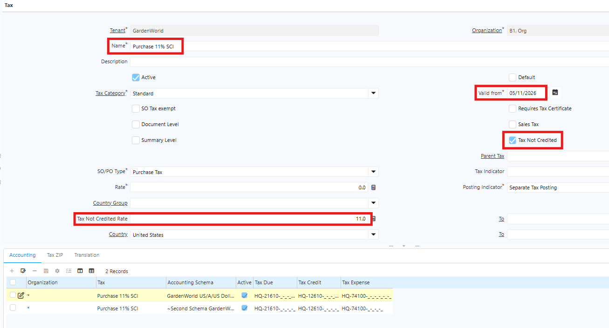
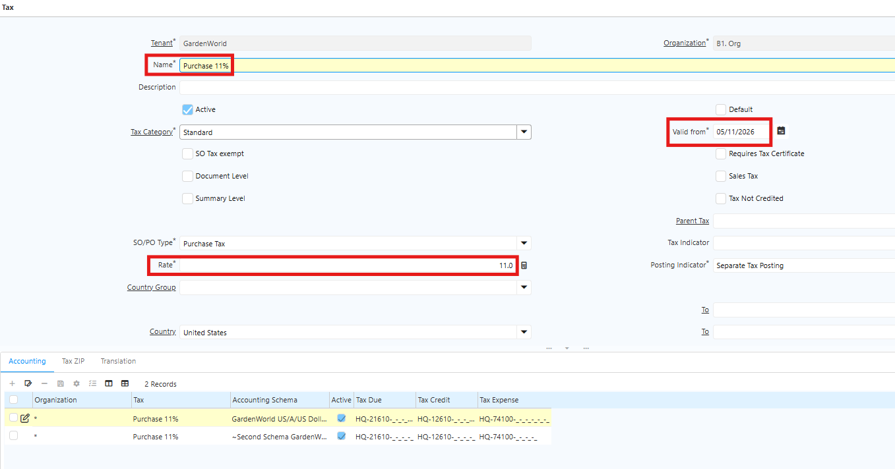

# Tax

Sistem iDempiere mendukung konfigurasi Pajak Pertambahan Nilai (PPN) sebesar 11% dengan dua skenario sesuai kebutuhan masing-masing tim:

- Tim SCI — PPN 11% yang bersifat Non Creditable
- Tim PPG — PPN 11% yang bersifat Regular

Masing-masing skenario memiliki konfigurasi akun dan dampak pelaporan yang berbeda. 
## Tax tim SCI

Ikuti langkah berikut untuk mengkonfigurasi tax rate tim SCI:
1. Buka menu **Tax Rate**
2. Klik **new**
3. Isi field berikut:
  - Name
  - Tax Category
  - Valid from
  - Centang field **Tax Not Credited**
  - Tax Not Credited Rate
  
   {#Figure94}
  
4. Masuk ke tab **Accounting**
5. Pada field **Tax Expense** dan **Tax Credit**, tentukan akun sesuai kebijakan tim Accounting.
6. Klik **save**
## Tax tim PPG

Ikuti langkah berikut untuk mengkonfigurasi tax rate tim PPG:
1. Buka menu **Tax Rate**
2. Klik **new**
3. Isi field berikut:
  - Name
  - Tax Category
  - Valid from
  - Input Rate tax sesuai kebutuhan 

 {#Figure95}

4. Masuk ke tab **Accounting**
5. Pada field **Tax Expense** dan **Tax Credit**, tentukan akun sesuai kebijakan tim Accounting.
6. Klik **save**

## Implementasi Tax di Purchase Order

Ikuti langkah berikut untuk menerapkan tax pada transaksi Purchase Order:
1. Buka menu **Purchase Order**
2. Input **Business Partner**
3. Input **warehouse** untuk penempatan produk
4. Tentukan **tax** yang akan digunakan

!(90%)[Tax](../Tax_PO.png "Tax") {#Figure91}

5. Masuk ke tab **PO Line**
6. Pilih **product** yang akan diproses
7. Input **qty** product
8. Klik **save**
9. Klik **complete** dokumen

Berikut report Purchase Order untuk masing-masing skenario PPN:
- Report Tim PPG

!(70%)[Report PO](../Report_PO_PPG.png "Report PO PPG") {#Figure92}

- Report Tim SCI

!(70%)[Report PO](../Report_PO_SCI.png "Report PO PPG") {#Figure93}