# Tax

Sistem iDempiere mendukung konfigurasi **Pajak Pertambahan Nilai (PPN) 11%** dengan dua skenario sesuai kebutuhan masing-masing tim:

- **Tim SCI** — PPN 11% bersifat _Non Creditable_.
- **Tim PPG** — PPN 11% bersifat _Regular_.

Masing-masing skenario memiliki konfigurasi akun dan dampak pelaporan yang berbeda.

Selain PPN, terdapat pajak **PPh 23 sebesar 2%** yang dapat dikombinasikan dengan PPN 11% dalam satu transaksi. Perlu diperhatikan bahwa harga produk dapat sudah termasuk pajak (_include tax_) atau belum (_exclude tax_), sehingga perhitungan di invoice akan berbeda untuk setiap kondisi.
## Tax PPN tim SCI (Not Credited)

Ikuti langkah berikut untuk mengkonfigurasi tax rate tim SCI:
1. Buka menu **Tax Rate**
2. Klik **new**
3. Isi field berikut:
  - Name
  - Tax Category
  - Valid from
  - Posting Indicator, pilih **Distribute Tax with Relevant Expense**.
  
  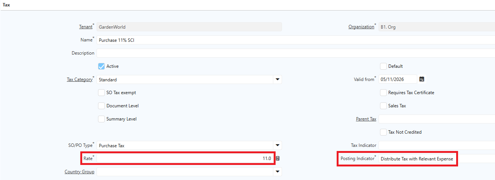 {#Figure94}
  
4. Masuk ke tab **Accounting**
5. Pada field **Tax Expense**, tentukan akun sesuai kebijakan tim Accounting.
6. Klik **save**
## Tax Credited

Ikuti langkah berikut untuk mengkonfigurasi tax rate tim PPG:
1. Buka menu **Tax Rate**
2. Klik **new**
3. Isi field berikut:
  - Name
  - Tax Category
  - Valid from
  - Input Rate tax sesuai kebutuhan 
4. Centang kolom **Document Level**.

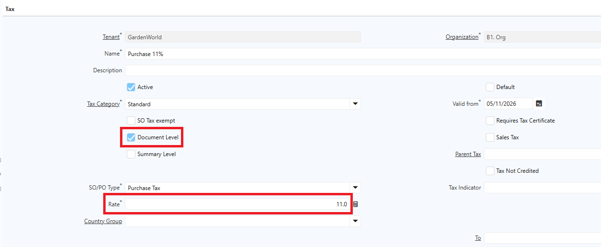 {#Figure95}

5. Masuk ke tab **Accounting**
6. Pada field **Tax Expense** dan **Tax Credit**, tentukan akun sesuai kebijakan tim Accounting.
7. Klik **save**

## Tax PPh 23

PPh Pasal 23 adalah pajak yang dipotong oleh pihak pembeli atas pembayaran jasa atau jenis penghasilan tertentu kepada vendor. Nilai PPh bukan merupakan tambahan biaya, melainkan potongan atas nilai yang dibayarkan kepada vendor.

Di iDempiere, PPh 23 diimplementasikan menggunakan konfigurasi **Negative Tax** dan diakui sebagai **Charge**. Ikuti langkah berikut untuk membuat Charge PPh 23:

1. Buka menu **Charge**.
2. Input **name** charge.

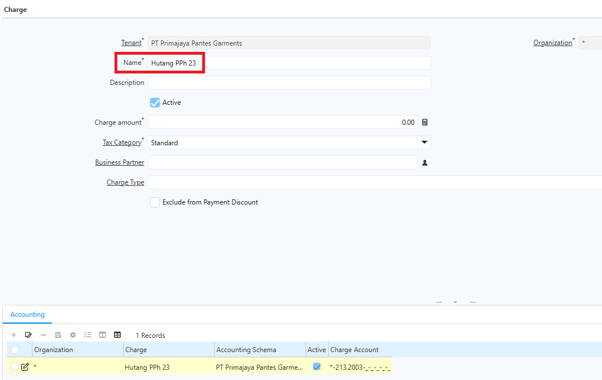 {#Figure210}

3. Klik **Save**.
4. Masuk ke tab **Accounting**.
5. Pada field **Charge Account**, tentukan akun atas charge tersebut.

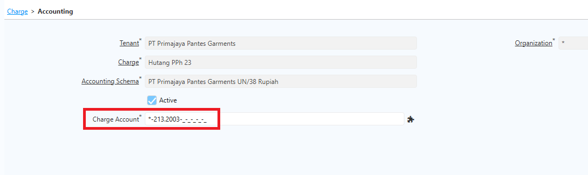 {#Figure211}

6. Klik **Save**.

Ikuti langkah berikut untuk mengkonfigurasi tax rate PPh 23:

1. Buka menu **Tax Rate**.
2. Klik **New**.
3. Isi field berikut:
- **Name**
- **Tax Category**
- **Valid From**
- **Rate** — Input rate pajak sesuai kebutuhan.

4. Centang kolom **Document Level**.
5. Pada field **Charge**, input charge PPh 23 yang telah dikonfigurasi sebelumnya.

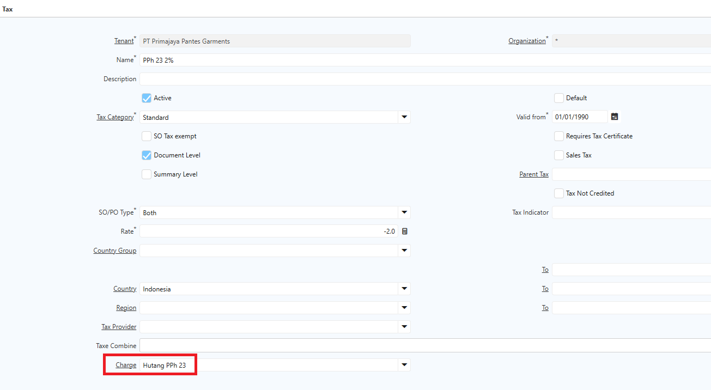 {#Figure212}

5. Masuk ke tab **Accounting**.
6. Pada field **Tax Expense** dan **Tax Credit**, tentukan akun sesuai kebijakan tim Accounting.
7. Klik **Save**.

## Tax Combination

**Tax Combination** adalah konfigurasi untuk menggabungkan beberapa jenis pajak dalam satu transaksi. Dengan konfigurasi ini, sistem menghitung lebih dari satu pajak secara otomatis tanpa user perlu memilih masing-masing pajak secara terpisah. Tax Combination umumnya digunakan ketika suatu transaksi dikenakan lebih dari satu jenis pajak, misalnya **PPN** dan **PPh**.

Ikuti langkah berikut untuk mengkonfigurasi Tax Combination:

1. Buka menu **Tax Rate**.
2. Klik **New**.
3. Isi field berikut:
- **Name**
- **Tax Category**
- **Valid From**
- **Rate** — Input rate pajak sesuai kebutuhan.

4. Centang kolom **Document Level**.
5. Pada field **Tax Combination**, input pajak yang akan dikombinasikan, contoh: PPh 23.

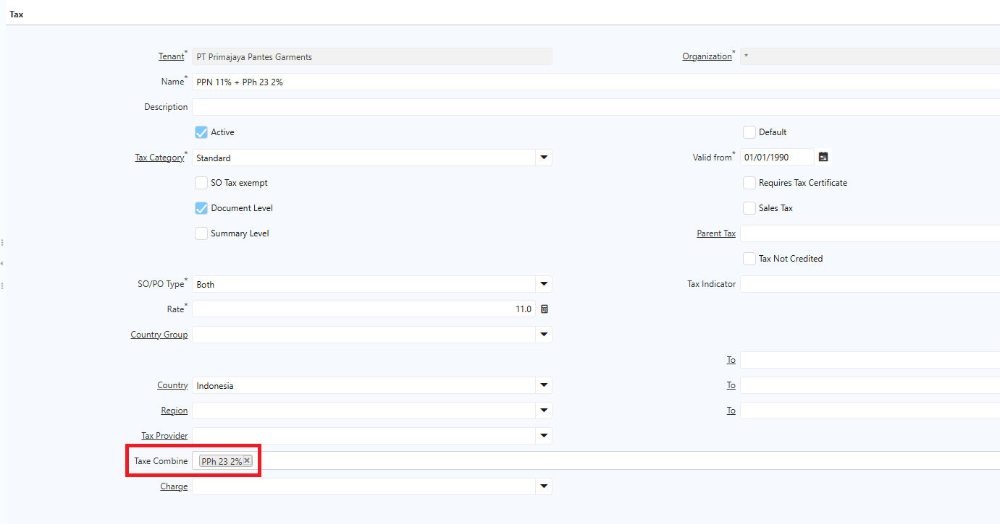 {#Figure213}

5. Masuk ke tab **Accounting**.
6. Pada field **Tax Expense** dan **Tax Credit**, tentukan akun sesuai kebijakan tim Accounting.
7. Klik **Save**.
## Implementasi Tax di Purchase Order

### Tax PPN 11%

Ikuti langkah berikut untuk menerapkan tax pada transaksi Purchase Order:
1. Buka menu **Purchase Order**
2. Input **Business Partner**
3. Input **warehouse** untuk penempatan produk
4. Tentukan **tax** yang akan digunakan

!(90%)[Tax](../Tax_PO.png "Tax") {#Figure91}

5. Masuk ke tab **PO Line**
6. Pilih **product** yang akan diproses
7. Input **qty** product
8. Klik **save**
9. Klik **complete** dokumen

Berikut report Purchase Order untuk masing-masing skenario PPN:
- Report Tim PPG

!(70%)[Report PO](../Report_PO_PPG.png "Report PO PPG") {#Figure92}

- Report Tim SCI

!(70%)[Report PO](../Report_PO_SCI.png "Report PO PPG") {#Figure93}

### Tax Combination

#### Price Not Include Tax

1. Buka menu **Purchase Invoice and Credit/Debit Note**.
2. Tentukan **Target Document Type**.
3. Tentukan **Business Partner**.
4. Tentukan **Price List Standard** yang digunakan.
5. Tentukan **Payment Rule**.
6. Tentukan **Tax Combination**.
7. Masuk ke **Invoice Line**.
8. Tentukan **Charge** atau biaya yang akan diproses.
9. Tentukan **Qty** _(default 1)_.
10. Tentukan **Price** untuk tagihan tersebut.
11. Klik **Save**.
12. Klik **Complete**.

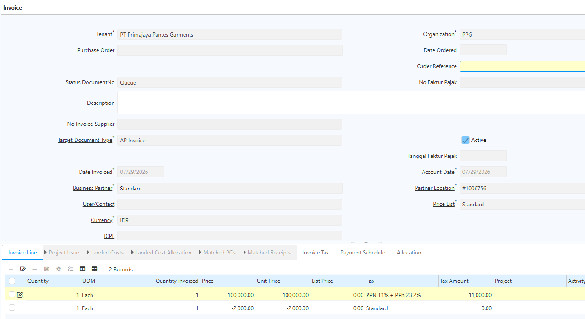 {#Figure214}

Berikut contoh jurnal invoice dengan Tax Combination (_Price Not Include Tax_):

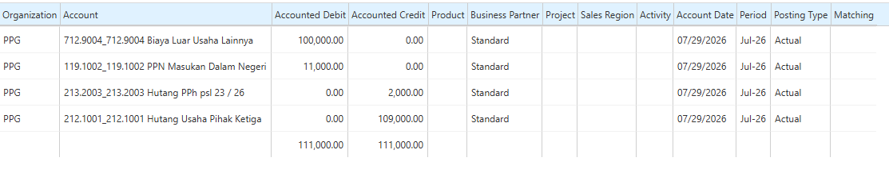 {#Figure215}
#### Price Include Tax

1. Buka menu **Purchase Invoice and Credit/Debit Note**.
2. Tentukan **Target Document Type**.
3. Tentukan **Business Partner**.
4. Tentukan **Price List Include Tax** yang digunakan.
5. Tentukan **Payment Rule**.
6. Tentukan **Tax Combination**.
7. Masuk ke **Invoice Line**.
8. Tentukan **Charge** atau biaya yang akan diproses.
9. Tentukan **Qty** _(default 1)_.
10. Tentukan **Price** untuk tagihan tersebut.
11. Klik **Save**.
12. Klik **Complete**.

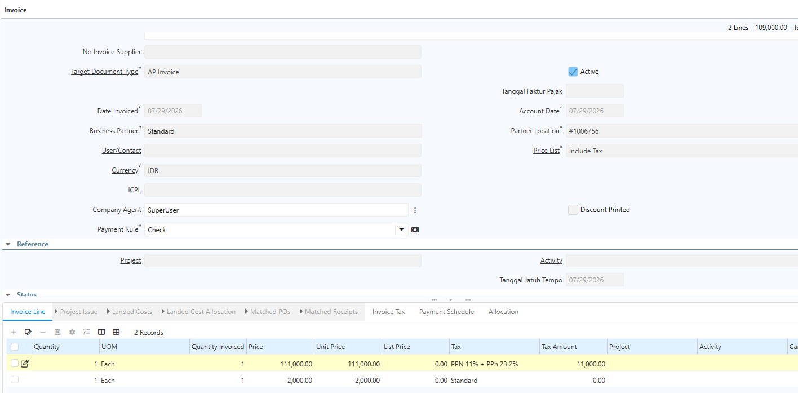 {#Figure216}

Berikut contoh jurnal invoice dengan Tax Combination (_Price Include Tax_):

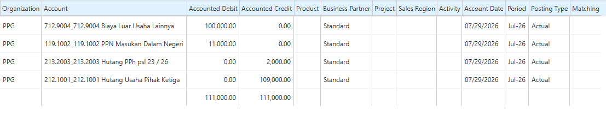 {#Figure217}

## Konfigurasi Tax Access di Document Type

1. Buka menu **Document Type**.
2. Tentukan document type yang akan dikonfigurasi.
3. Centang field **Tax Rate Access** pada header untuk mengaktifkan pembatasan tax rate.
4. Klik **Generate Tax Rate Access**, kemudian input tax rate yang akan diproses.

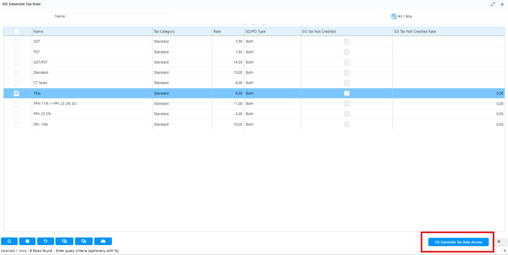 {#Figure275}

5. Klik **SIS Generate Tax Rate Access**.
6. Tab **Tax Rate Access** akan menampilkan daftar tax rate yang telah dikonfigurasi.

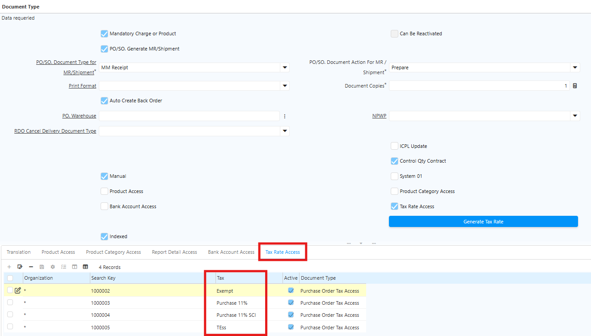 {#Figure276}

Ulangi langkah di atas untuk setiap document type lain yang memerlukan konfigurasi. Jika transaksi tidak memerlukan pembatasan tax rate, konfigurasi ini tidak perlu dilakukan.

### Implementasi Tax Access

1. Buka menu **Purchase Order**.
2. Pilih **Document Type** yang telah dikonfigurasi.
3. Input **Business Partner**.
4. Input **Warehouse** untuk penempatan produk.
5. Tentukan **tax rate** yang akan digunakan — sistem hanya menampilkan tax rate yang sesuai konfigurasi Tax Rate Access.

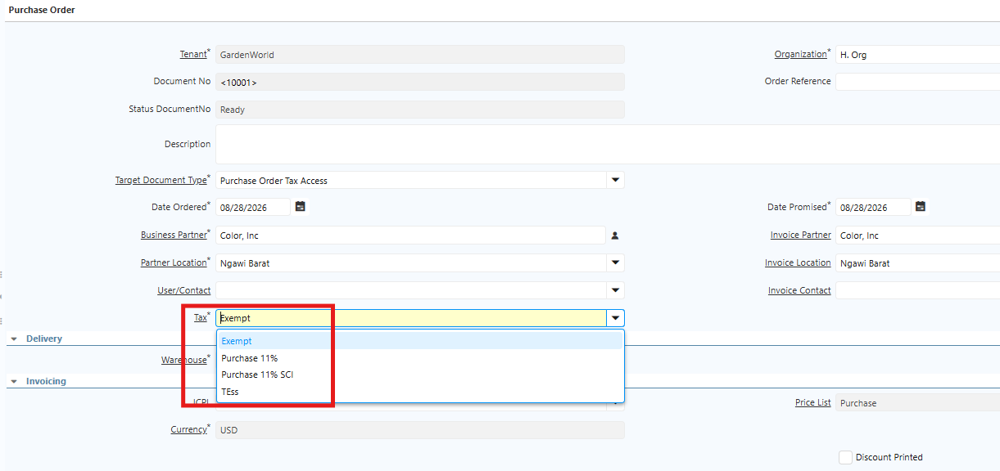 {#Figure277}

6. Klik **Save**.