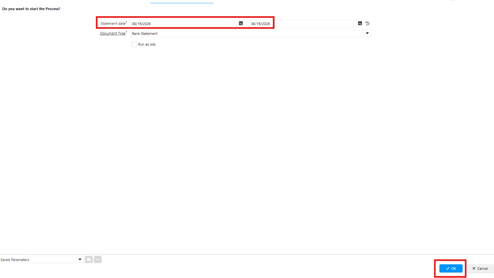
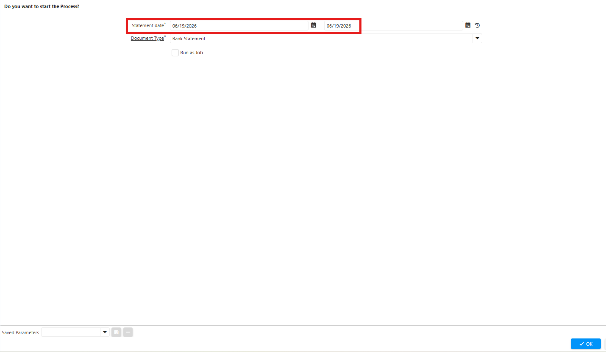

# Tools
## Complete Bank Statement

Jika perlu meng-complete dokumen Bank Statement dalam jumlah banyak — puluhan bahkan ratusan — gunakan tools **SIS Complete Bank Statement**. Ikuti langkah berikut:

1. Buka menu **SIS Complete Bank Statement**
2. Input **date statement**
3. Pilih **Document Type** "Bank Statement"

 {#Figure100}

4. Klik **ok**

 {#Figure102}

Sistem otomatis meng-complete seluruh dokumen dalam rentang waktu yang dikonfigurasi.
## Delete Bank Statement

Jika perlu menghapus dokumen Bank Statement yang tidak diperlukan atau merupakan duplikat, gunakan tools **SIS Delete Bank Statement**. Ikuti langkah berikut:

1. Buka menu **SIS Delete Bank Statement**
2. Input **date statement**
3. Pilih **Document Type** "Bank Statement"

 {#Figure101}

4. Klik **ok**

 {#Figure103}

Sistem otomatis menghapus seluruh dokumen dalam rentang waktu yang dikonfigurasi.

>**Catatan:** Proses Delete hanya dapat dilakukan pada Bank/Cash Statement berstatus **Draft**.