# Tools
## Bank Statement
### Complete

Jika perlu meng-complete dokumen Bank Statement dalam jumlah banyak — puluhan bahkan ratusan — gunakan tools **SIS Complete Bank Statement**. Ikuti langkah berikut:

1. Buka menu **SIS Complete Bank Statement**
2. Input **date statement**
3. Pilih **Document Type** "Bank Statement"
4. Pilih **Bank Account** yang akan diproses

 {#Figure100}

5. Klik **ok**

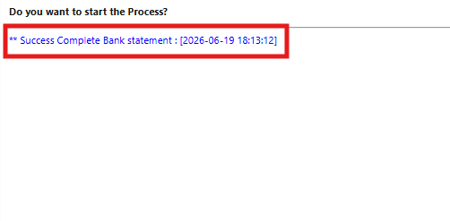 {#Figure102}

Sistem otomatis meng-complete seluruh dokumen dalam rentang waktu yang dikonfigurasi.
### Delete

Jika perlu menghapus dokumen Bank Statement yang tidak diperlukan atau merupakan duplikat, gunakan tools **SIS Delete Bank Statement**. Ikuti langkah berikut:

1. Buka menu **SIS Delete Bank Statement**
2. Input **date statement**
3. Pilih **Document Type** "Bank Statement"
4. Pilih **Bank Account** yang akan diproses

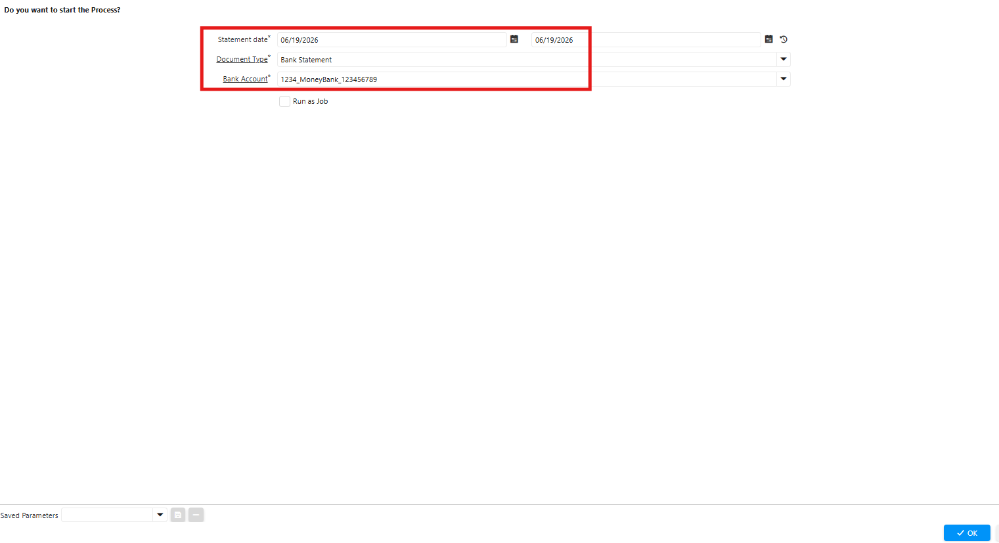 {#Figure101}

5. Klik **ok**

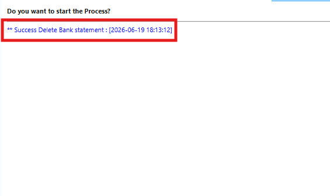 {#Figure103}

Sistem otomatis menghapus seluruh dokumen dalam rentang waktu yang dikonfigurasi.

>**Catatan:** Proses Delete hanya dapat dilakukan pada dokumen Bank/Cash Statement berstatus **Draft**.

## Movement
### Complete

Jika perlu meng-complete dokumen Inventory Move dalam jumlah banyak gunakan tools **SIS Complete Inventory Move**. Ikuti langkah berikut:

1. Buka menu **SIS Complete Inventory Move**
2. Input **Movement Date**
3. Pilih **Document Type**

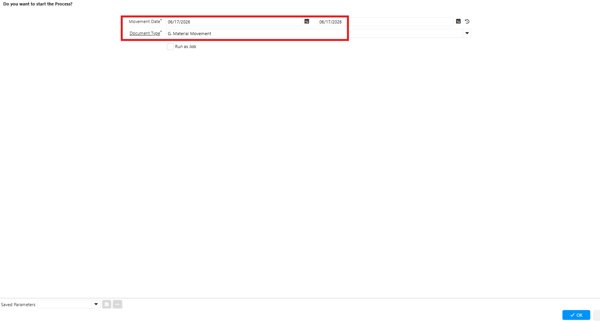 {#Figure103}

4. Klik ok

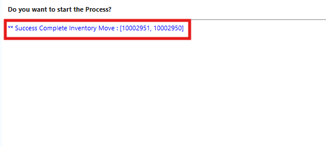 {#Figure104}

Sistem otomatis meng-complete seluruh dokumen dalam rentang waktu yang dikonfigurasi.
### Delete

Jika perlu menghapus dokumen Inventory Move yang tidak diperlukan atau merupakan duplikat, gunakan tools **SIS Delete Inventory Move**. Ikuti langkah berikut:

1. Buka menu **SIS Delete Inventory Move**
2. Input **Movement Date**
3. Pilih **Document Type**

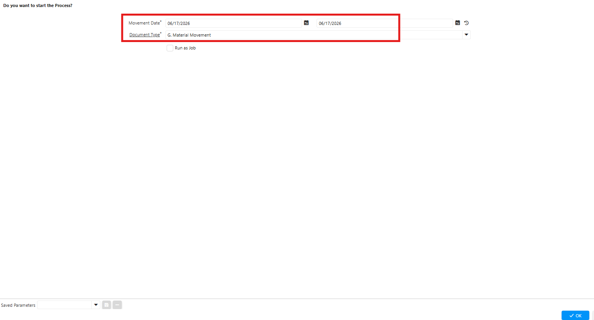 {#Figure105}

4. Klik ok

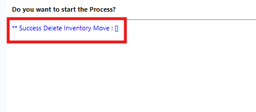 {#Figure106}

Sistem otomatis menghapus seluruh dokumen dalam rentang waktu yang dikonfigurasi.

>**Catatan:** Proses Delete hanya dapat dilakukan pada dokumen Inventory Move berstatus **Draft**.
## Physical Inventory
### Complete
Jika perlu meng-complete dokumen Physical Inventory dalam jumlah banyak gunakan tools **SIS Complete Physical Inventory**. Ikuti langkah berikut:

1. Buka menu **SIS Complete Physical Inventory**
2. Input **Movement Date**
3. Pilih **Document Type**

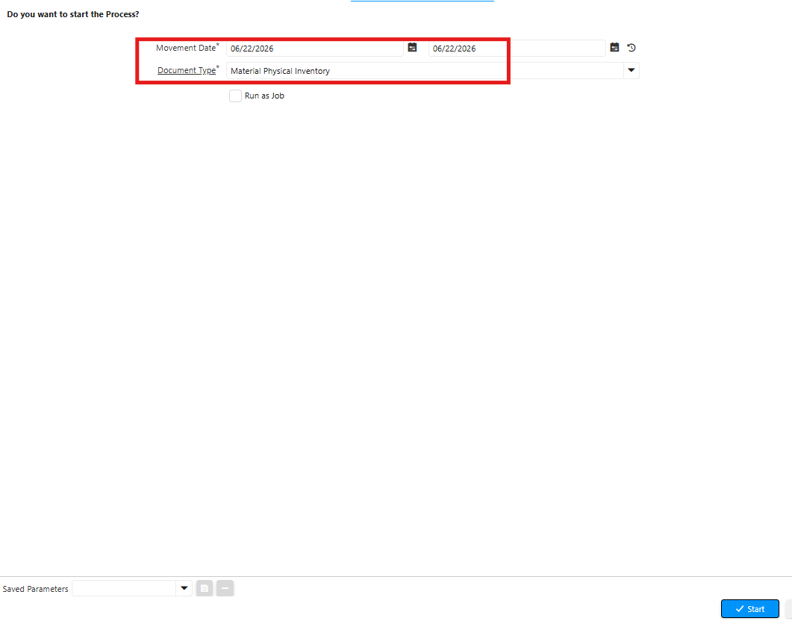{#Figure107}

4. Klik ok

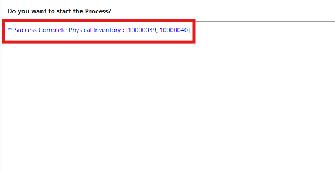 {#Figure108}

Sistem otomatis meng-complete seluruh dokumen dalam rentang waktu yang dikonfigurasi.
### Delete

Jika perlu menghapus dokumen Physical Inventory yang tidak diperlukan atau merupakan duplikat, gunakan tools **SIS Delete Physical Inventory**. Ikuti langkah berikut:

1. Buka menu **SIS Delete Physical Inventory**
2. Input **Movement Date**
3. Pilih **Document Type**

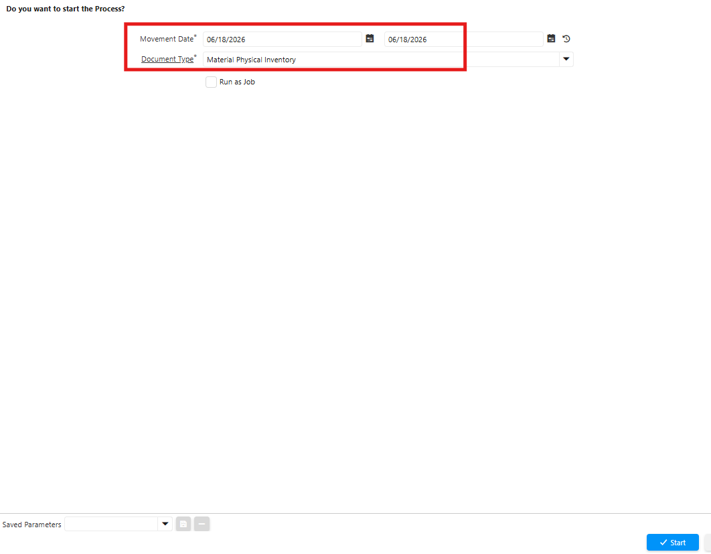 {#Figure109}

4. Klik **ok**

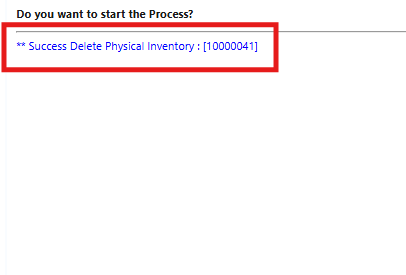 {#Figure110}

Sistem otomatis menghapus seluruh dokumen dalam rentang waktu yang dikonfigurasi.

>**Catatan:** Proses Delete hanya dapat dilakukan pada dokumen Physical Inventory yang berstatus **Draft**.

## Invoice
### Complete

Fitur SIS Complete Invoice digunakan untuk meng-complete dokumen invoice dalam jumlah banyak — bahkan hingga puluhan — sekaligus. Proses complete mengeksekusi logika bisnis, memperbarui stok, dan menghasilkan jurnal akuntansi secara otomatis.

Ikuti langkah berikut untuk meng-complete dokumen invoice:

1. Buka menu **SIS Complete Invoice**.
2. Input **Date Invoice**.
3. Pilih **Document Type**.
4. Pilih **Business Partner**.

 {#Figure111}

5. Klik **OK**.

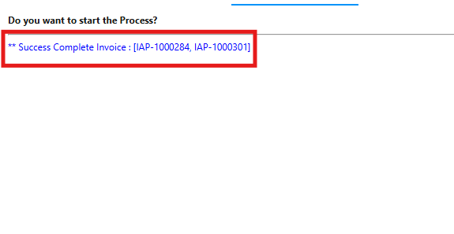 {#Figure112}

Sistem otomatis meng-complete seluruh dokumen dalam rentang waktu yang dikonfigurasi. Setelah dokumen di-complete, nominal invoice tidak dapat diubah dan invoice resmi masuk ke dalam daftar piutang/utang bisnis, serta siap diproses Payment/Receipt.

>**Catatan:** Proses Complete hanya dapat dilakukan pada dokumen Invoice yang berstatus **Draft**.
### Delete

Fitur SIS Delete Invoice digunakan untuk menghapus baris atau seluruh dokumen invoice yang masih berstatus Draft atau In Progress. Gunakan fitur ini untuk menghapus tagihan yang salah input atau salah nominal sebelum terjurnal, serta membersihkan antrean dokumen dari modul Accounts Receivable atau Accounts Payable.

Ikuti langkah berikut untuk menghapus dokumen invoice:

1. Buka menu **SIS Delete Invoice**.
2. Input **Date Invoice**.
3. Pilih **Document Type**.
4. Pilih **Business Partner**.

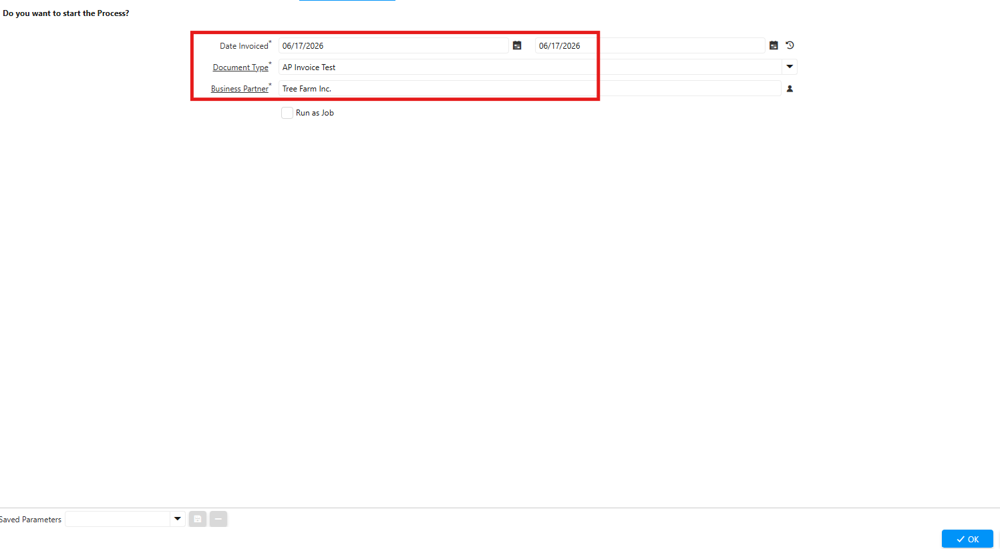 {#Figure113}

5. Klik **OK**.

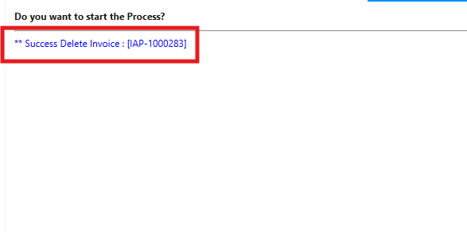 {#Figure114}

Sistem otomatis menghapus seluruh dokumen dalam rentang waktu yang dikonfigurasi.

>**Catatan:** Proses Delete hanya dapat dilakukan pada dokumen Invoice yang berstatus **Draft**.

## Asset

### Generate GL Journal Depreciation

Fitur **Generate GL Journal Depreciation** digunakan untuk men-generate depresiasi pada seluruh aset sesuai periode depresiasi masing-masing secara sekaligus. Dengan fitur ini, user tidak perlu men-generate depresiasi satu per satu — mengingat aset perusahaan bisa mencapai puluhan bahkan ratusan.

Ikuti langkah berikut untuk men-generate GL Journal Depreciation:

1. Buka menu **SIS Generate GL Journal Depreciation**.
2. Pilih **Organization**.
3. Pilih **Periode Depresiasi** dengan menginput **Depreciation Date**
4. Pilih **Document Type**.

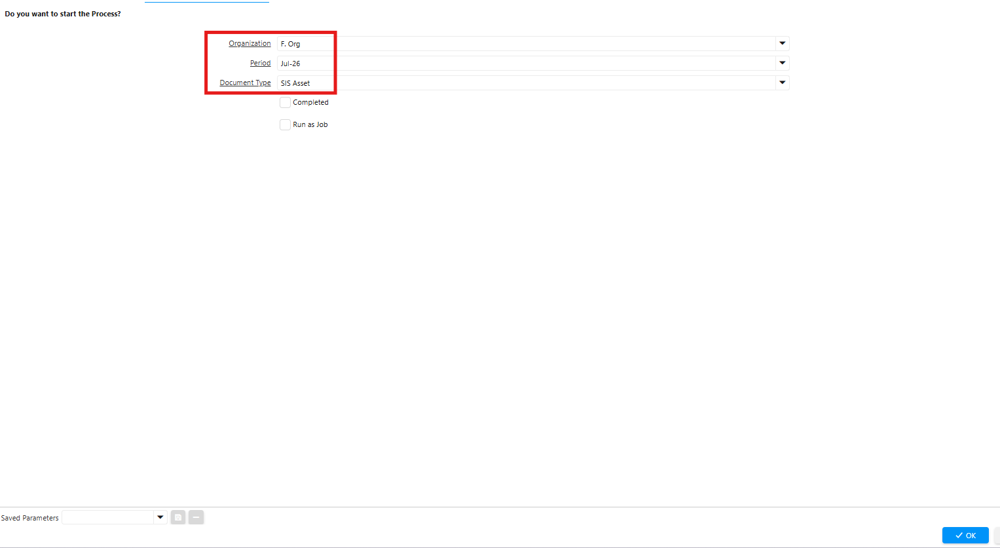 {#Figure126}

5. Klik **OK**.

Sistem otomatis memproses depresiasi pada seluruh aset di periode yang telah dikonfigurasi.
## Contract Management

### Generate AP Invoice

Fitur **Generate AP Invoice** digunakan untuk men-generate invoice dari beberapa dokumen kontrak manajemen yang memiliki tanggal jatuh tempo yang sama sekaligus. Dengan fitur ini, user tidak perlu men-generate invoice satu per satu per kontrak — mengingat kontrak perusahaan bisa mencapai puluhan bahkan ratusan.

Ikuti langkah berikut untuk men-generate AP Invoice:

1. Buka menu **SIS Generate AP Invoice Contract Management**.
2. Pilih **Organization**.
3. Pilih **Document Type**.

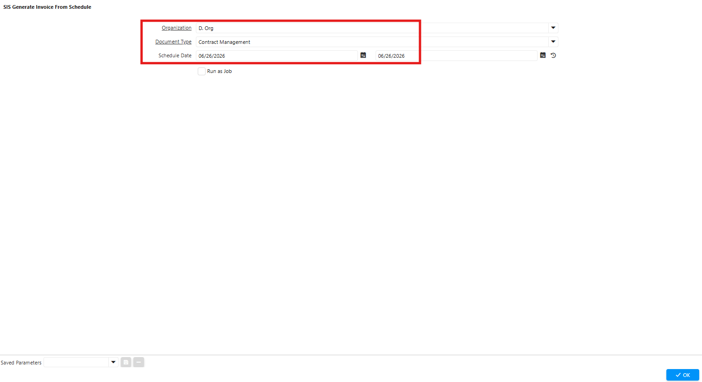 {#Figure127}

4. Klik **OK**.

Sistem otomatis men-generate invoice atas seluruh kontrak dengan periode yang telah dikonfigurasi. Setelah invoice ter-generate, tim payment dapat segera melakukan pembayaran atas kontrak-kontrak tersebut.
### Generate GL Journal Depreciation

Fitur **Generate GL Journal Depreciation** pada Contract Management digunakan untuk men-generate jurnal amortisasi pada seluruh kontrak sesuai periode masing-masing secara sekaligus. Dengan fitur ini, user tidak perlu men-generate amortisasi satu per satu per kontrak.

Ikuti langkah berikut untuk men-generate GL Journal Depreciation:

1. Buka menu **SIS Generate GL Journal Depreciation Contract Management**.
2. Pilih **Organization**.
3. Pilih **Document Type**.
4. Pilih **Schedule Date** depresiasi.

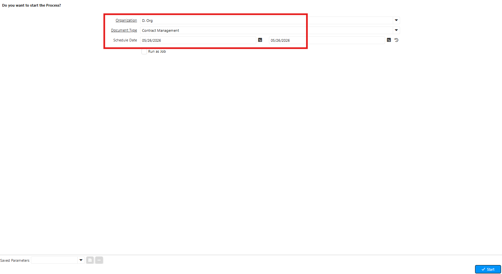 {#Figure128}

5. Klik **OK**.

Sistem otomatis memproses amortisasi pada masing-masing kontrak manajemen di periode yang telah dikonfigurasi