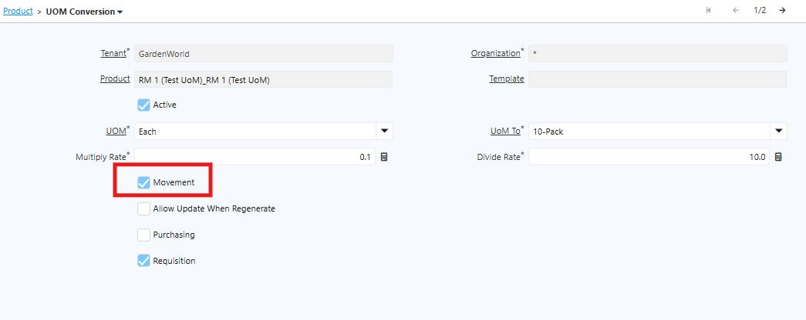
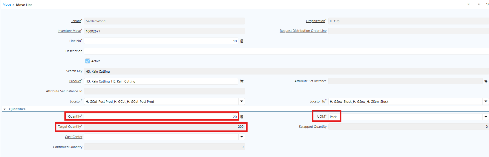
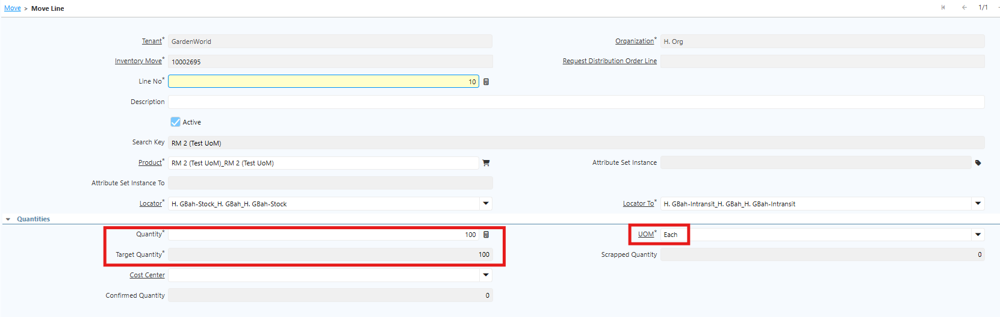

# Implementasi di Movement
## Penerimaan Barang & Konfigurasi UoM

Setelah produk jadi diterima, perpindahan stok (antar gudang, antar lokasi) dicatat melalui Inventory Move. Sistem mencatat quantity berdasarkan konfigurasi UoM yang diatur di level Product. Konfigurasi ini tersedia di tab **"UoM Conversion"** pada halaman Product.
## Field "Movement"

 {#Figure13}

Field **Movement** menentukan bagaimana sistem mencatat quantity saat penerimaan barang:

- **Jika Movement dicentang (✓)** — Sistem mencatat quantity dalam satuan UoM Conversion (hasil konversi dari Base UoM).
- **Jika Movement tidak dicentang** — Sistem mencatat quantity langsung menggunakan satuan Base UoM.

## Implementasi UoM Conversion di Movement

 {#Figure14}

UoM yang digunakan di level Movement mengikuti konfigurasi UoM Conversion pada level Product. Jika field Is Movement dicentang, sistem akan mencatat transaksi movement dalam satuan UoM Conversion, termasuk quantity yang digunakan.
Berikut field pada movement line yang perlu dipahami:

1. Quantity — Menampilkan jumlah produk dalam satuan UoM Conversion.
2. Target Quantity — Menampilkan jumlah produk dalam satuan Base UoM. Contoh: jika Base UoM adalah each dan UoM Conversion adalah pack, maka 1 pack = 10 each.
3. UoM — Menampilkan UoM sesuai konfigurasi di level Product.

**Contoh: Movement Menggunakan Base UoM**

Konfigurasi di level Product

 {#Figure15}

Di level Movement

 {#Figure16}

Karena field **Movement** tidak dicentang, sistem mencatat movement dalam satuan Base UoM.