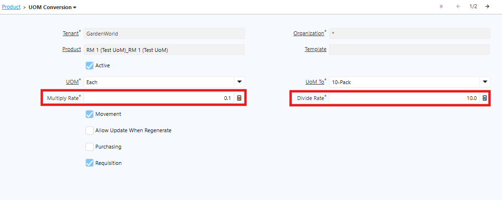

# UoM Conversion

Unit of Measure (UoM) Conversion adalah mekanisme yang digunakan untuk mengonversi satu satuan pengukuran ke satuan lain untuk produk yang sama. Contohnya, produk dibeli dalam satuan karton (10 pcs), disimpan dalam satuan pcs, dan dikeluarkan juga dalam satuan pcs. Dalam kondisi ini, sistem harus memahami hubungan antar satuan tersebut.

UoM Conversion terdiri dari beberapa komponen utama:

- Base UoM, yaitu satuan dasar yang menjadi acuan utama, biasanya satuan terkecil seperti pcs, kg, atau meter.
- Alternate UoM, yaitu satuan lain yang digunakan dalam transaksi, seperti karton, lusin, atau dus.
- Conversion Factor, yaitu nilai pengali antar satuan. Contoh: 1 karton = 10 pcs, sehingga faktor konversinya adalah 10.

Setiap produk memiliki Base UoM sebagai referensi utama seluruh konversi. Sistem mendefinisikan konversi menggunakan multiply rate dan divide rate. Karena itu, Base UoM harus menjadi satuan terkecil dari seluruh skema konversi yang digunakan, dan nilai divide rate harus lebih besar atau sama dengan 1.

 {#Figure9}

UoM Conversion diterapkan di Requisition, Purchase Order, dan Movement. Karena itu, pastikan konfigurasi UoM di level Product sudah selesai sebelum memulai transaksi di ketiga modul tersebut.

> [Tim PSI merekomendasikan untuk menetapkan standarisasi UoM pada proses Movement, Requisition dan Purchasing dengan tujuan untuk meminimalkan potensi kesalahan input UoM serta memastikan akurasi dalam penentuan harga] Catatan

 